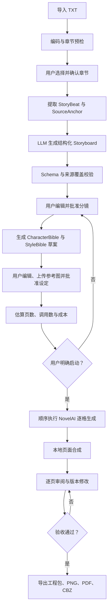
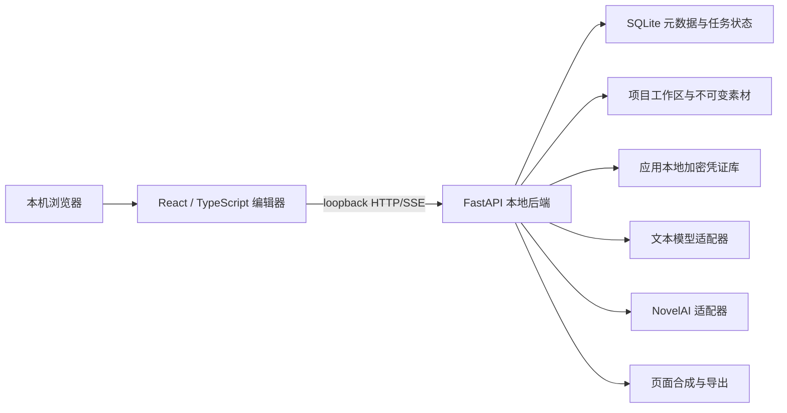

# Manga Maker 产品需求文档

| 项目 | 内容 |
|---|---|
| 文档版本 | v0.1 |
| 日期 | 2026-08-09 |
| 产品状态 | P0 早期开发阶段；导入、来源追溯、分镜/设定审批、NovelAI 契约与有界队列、逐格图像执行、素材版本和本地页面合成已通过离线 Mock 验收；真实付费调用、reroll/inpaint、导出和完整漫画闭环尚未验收 |
| 产品形态 | 本机单用户、本地 Web 应用 |
| P0 验收单位 | 一个 TXT 小说章节的完整漫画化闭环 |
| 默认成品 | 黑白分页漫画，2:3 竖版，左到右、从上到下，简体中文横排 |
| 文本改编 | 可配置的结构化输出 LLM |
| 图像生成 | NovelAI Image Generation API |

项目入口和简明范围见 [README.md](README.md)，技术实现边界见 [TECHNICAL_ARCHITECTURE.md](TECHNICAL_ARCHITECTURE.md)。

## 1. 一页结论

Manga Maker 把“把小说交给模型生成几张图”改造成一个可审阅、可修改、可恢复的漫画生产流程。

P0 从一个 TXT 章节开始。系统先保留原文结构和字符位置，再让可配置 LLM 生成带来源锚点的场景、页和分格脚本。用户确认分镜、角色设定、黑白画风、页数和预计成本后，系统才调用 NovelAI 逐格生成无文字画面。本地排版器负责格框、对白、旁白、音效和页码。任意页面可以修改，整页、单格或局部区域可以重新生成，旧版本始终可恢复。

P0 的核心不是“一次生成看起来像漫画的图片”，而是建立以下可验证闭环：

1. 原文不会在分章、改编或压缩时静默丢失。
2. 角色和画风在批量出图前先被明确并由用户确认。
3. 每一次付费生成都能追溯到用户动作、提示词、参考图和成本预算。
4. 修改局部内容不会破坏已经确认的其他页面。
5. 中断、失败或误操作不会覆盖已接受的版本。
6. 最终成果既能继续编辑，也能以通用漫画格式离开 Manga Maker。

本 PRD 定义产品目标和验收基线，不代表所有功能已经交付。实际完成范围以 [README.md](README.md) 的“当前可用范围”和 [WORK_ITEMS.md](WORK_ITEMS.md) 为准。

## 2. 背景与问题

把小说改造成漫画并不是单次文生图任务，而是五种问题的组合：

1. **改编问题**：小说的内心活动、叙述和长对话需要改造成可见动作、镜头和有限对白。
2. **分页问题**：信息必须在页与格之间分配，形成节奏、悬念和翻页点。
3. **一致性问题**：角色脸型、服装、年龄、道具和场景必须跨格、跨页保持稳定。
4. **文字问题**：图像模型难以稳定生成可读中文，且生成后的文字难以编辑。
5. **返工问题**：一格有问题不应该迫使用户重做整章；重做也不能覆盖之前可用的版本。

如果直接让图像模型生成完整漫画页，通常会出现格框不可控、对白乱码、角色漂移、无法局部修改和历史结果丢失。Manga Maker 因此采用“结构化改编、逐格生成、本地排版、不可变版本”的方案。

## 3. 产品愿景与原则

### 3.1 产品愿景

让个人创作者可以把自己拥有权利的小说章节，稳定地改编为一组可读、可编辑、可迁移的漫画页面，而不需要手工管理几十个提示词、种子、参考图和散落的生成结果。

### 3.2 产品原则

1. **先审脚本，再花生成成本**：分镜、角色、风格、页数和成本先确认，之后才出图。
2. **逐格生成，确定性排版**：模型负责画面，本地系统负责文字、格框和阅读顺序。
3. **默认本地，明确外发**：源小说和工程默认留在本机；调用云模型前展示将发送的内容。
4. **生成即版本化**：任何 reroll 或 inpaint 都创建新版本，不覆盖已有素材。
5. **目标修改，最小影响**：改单格不重做整页，改文字不重新出图，改布局不改变素材版本。
6. **来源可追溯**：每个剧情节拍和页面都能回到原文章节及字符范围。
7. **成本可见**：调用前显示预计次数和成本上限，完成后记录实际调用与失败重试。
8. **用户动作可追溯**：所有外部生成请求必须来自可审计的用户操作，不运行无人值守生成计划。
9. **供应商可替换**：文本改编通过适配层接入；NovelAI 具体参数不污染核心分镜模型。
10. **不伪装交付**：文档、模拟测试和真实 API 验收分别报告，不能把其中一项替代另一项。

## 4. 目标与非目标

### 4.1 P0 产品目标

1. 导入 TXT 小说，可靠识别或手工修正章节。
2. 选择一个章节，生成结构化、可编辑、有来源锚点的漫画分镜。
3. 自动草拟角色设定表和黑白漫画风格板，并允许用户上传参考图。
4. 用户确认分镜、设定、页数和成本后，调用 NovelAI 逐格生成。
5. 将面板画面与本地文字、格框合成为完整漫画页。
6. 支持修改任意页面的分镜、提示词、对白、旁白、音效和布局。
7. 支持整页 reroll、单格 reroll 和蒙版局部重绘。
8. 保存完整版本历史、中断状态、生成参数和审计记录。
9. 导出可恢复工程包、PNG、PDF 和 CBZ。
10. 在一个代表性章节上完成真实端到端验收。

### 4.2 P0 非目标

- 整本长篇小说一键生成；P1 才处理跨章节状态和全书预算。
- 彩色漫画、竖向条漫或右到左日漫阅读顺序。
- 多人协作、云同步、公开 SaaS、远程账户和租户隔离。
- 自动抓取公共小说、付费内容或未授权参考图。
- 自动发布、版权授权、发行、印刷出血或商业平台对接。
- 直接使用 NovelAI 生成带完整中文对白和格框的成品页。
- EPUB、PDF、DOCX、扫描件和网页小说导入。
- 自动训练角色 LoRA、模型微调或本地扩散模型管理。
- 无限并发、无限重试、定时生成或服务端无人值守生产。
- 移动端原生应用。

## 5. 用户与核心场景

### 5.1 目标用户

P0 仅服务一名本机创作者。用户：

- 使用 macOS；
- 拥有或获准改编输入小说及参考图；
- 能配置自己的文本模型和 NovelAI 凭证；
- 希望通过可视化编辑完成一章漫画，而不是编写脚本或手工整理图片；
- 接受在关键生成节点进行人工审阅和确认。

### 5.2 核心场景

1. **章节试作**：从长篇 TXT 中选择一个章节，验证它适合多少页和怎样的画风。
2. **分镜审稿**：在产生图像成本前，调整删改、对白、镜头和翻页点。
3. **角色定稿**：生成并修正角色设定表，上传已有角色参考图，锁定主要外观。
4. **受控出图**：确认成本后生成整章，随时暂停，失败后只处理未完成项。
5. **逐页精修**：改单格构图、局部手部或表情、对白位置，不影响其他页面。
6. **版本比较**：比较同一格或同一页的多个候选，恢复旧版本而不重新付费。
7. **交付与备份**：导出阅读文件，并保存一个可以在新机器恢复的可编辑工程包。

## 6. 关键术语

| 术语 | 定义 |
|---|---|
| Project | 一次漫画改编工程，包含源文件、章节、设定、分镜、素材、版本和导出 |
| SourceChapter | 从 TXT 中识别并由用户确认的章节及字符范围 |
| SourceAnchor | 指向源章节版本、起止字符和摘录哈希的来源锚点 |
| StoryBeat | 必须在改编中处理的剧情信息单位，例如动作、发现、转折或关键对白 |
| Storyboard | 一个章节的场景、页面、分格、对白和视觉要求集合 |
| CharacterBible | 角色身份、外观、服装、道具、关系、表情范围和参考图集合 |
| StyleBible | 线条、网点、光影、背景、镜头、禁用元素和负面提示词规则 |
| Page | 一张逻辑漫画页，由布局、面板和文字图层组成 |
| Panel | 页面中的一格，包含剧情目的、镜头、角色、提示词和当前素材版本 |
| GenerationSpec | 一次图像生成所需的模型、参数、提示词、参考图、seed 和目标尺寸 |
| AssetVersion | 某一面板图像的不可变版本 |
| PageVersion | 某一页面布局、面板选择和文字图层的不可变快照 |
| Reroll | 使用同一目标和新的 seed 或参数重新生成整页或单格 |
| Inpaint | 使用原图和蒙版重绘指定区域 |
| GenerationJob | 用户触发的一组有界生成工作及其状态、预算和审计信息 |
| ExportRevision | 对一组已确认 PageVersion 的导出快照 |

## 7. 端到端流程

### 7.1 主流程



### 7.2 审批门禁

以下三项审批互相独立，后续变更会使相关审批失效：

1. **分镜审批**：确认剧情覆盖、页数、分格、对白和镜头。
2. **设定审批**：确认角色与画风，以及将发送给 NovelAI 的参考图。
3. **生成审批**：确认预计调用数、成本上限、模型和任务范围。

如果用户在生成前修改分镜或设定，系统必须重新计算受影响面板、调用数和成本，并要求重新确认生成审批。

### 7.3 任务状态

```text
draft
  → awaiting_approval
  → queued
  → running
  ↔ paused
  → needs_review | failed | completed | canceled
```

- `draft`：可以自由编辑，不允许外部生成。
- `awaiting_approval`：等待用户确认范围和预算。
- `queued`：已确认但尚未发出下一请求。
- `running`：至少一个请求正在执行。
- `paused`：不再领取新请求；正在执行的请求完成后保存结果。
- `needs_review`：崩溃或超时后无法判断远端请求是否已计费，必须人工决定是否重试。
- `failed`：确定失败且不允许自动重试，或重试上限已用尽。
- `completed`：所有目标面板已有可用版本，但不等于用户已经验收页面。
- `canceled`：停止领取新请求，保留全部已完成结果和审计记录。

## 8. 信息架构与主要界面

### 8.1 项目首页

- 展示本地项目、最近修改、当前阶段、已确认页面数和未处理失败项。
- 创建项目时选择 TXT，展示本地保存位置和云模型数据边界。
- 不提供注册、登录或远程分享入口。

### 8.2 导入与章节页

- 展示检测到的编码、文件哈希、字符数、章节数和异常。
- 左侧显示章节列表，右侧显示原文预览和字符范围。
- 支持改名、拆分、合并、调整边界和“整篇作为一个章节”。
- 用户确认后创建不可变 `SourceChapter` 版本；后续重新切分会创建新版本。

### 8.3 改编工作台

- 三栏布局：原文与 StoryBeat、页面/分格树、当前分格编辑器。
- 显示每个 StoryBeat 的处理结果：`represented`、`condensed`、`omitted`、`unresolved`。
- 支持调整页数、移动页面/分格、合并或拆分分格、编辑对白和镜头。
- 未解决剧情信息、无来源锚点的关键情节和对白超量必须可见。

### 8.4 角色与风格页

- 角色卡展示固定特征、可变特征、禁止变化、服装、道具和参考图。
- 风格板展示黑白线条、网点、背景密度、光影、镜头习惯和负面提示词。
- 上传参考图时记录本地路径、哈希、来源说明和用户授权确认。
- 每个设定版本有独立批准状态；修改后不得沿用旧批准。

### 8.5 生成队列

- 展示章节、页数、面板数、预计调用数、预计成本、模型和生成参数摘要。
- 用户点击“开始生成”后创建不可变任务范围。
- 提供暂停、继续、取消和仅重试失败项。
- 默认一次只执行一个 NovelAI 请求，不提供隐藏并发开关。

### 8.6 页面编辑器

- 左侧页面缩略图，中间页面画布，右侧图层、分格和版本面板。
- 画布图层至少包括：背景、格框、面板图像、气泡、对白、旁白、音效、页码。
- 支持拖动格框、裁切素材、编辑文字、移动气泡、改变阅读顺序和选择页面模板。
- 提供整页 reroll、单格 reroll、蒙版重绘、版本比较和恢复。

### 8.7 导出页

- 选择已确认页面版本及顺序，生成新的 `ExportRevision`。
- 在导出前报告缺页、未验收页、低分辨率素材、溢出文字和断裂阅读顺序。
- 分别导出工程包、PNG、PDF 和 CBZ；失败不会污染上一次成功导出。

## 9. 概念数据模型

### 9.1 核心对象

| 对象 | 稳定标识 | 关键字段 | 权威来源 |
|---|---|---|---|
| Project | `project_id` | 标题、创建时间、当前阶段、默认阅读方向 | SQLite |
| SourceChapter | `chapter_id` + `version` | 文件哈希、编码、起止字符、正文哈希 | SQLite + 本地文件 |
| Storyboard | `storyboard_id` + `version` | StoryBeat、Scene、Page、Panel、审批状态 | SQLite + JSON 快照 |
| CharacterBible | `character_bible_id` + `version` | 角色字段、参考图、审批状态 | SQLite + JSON/图片 |
| StyleBible | `style_bible_id` + `version` | 画风字段、负面词、参考图、审批状态 | SQLite + JSON/图片 |
| Page | `page_id` | 序号、阅读方向、当前 PageVersion | SQLite |
| Panel | `panel_id` | Page 归属、剧情目的、当前 AssetVersion | SQLite |
| AssetVersion | `asset_version_id` | 图片路径、哈希、GenerationSpec、父版本 | SQLite + 图片 |
| PageVersion | `page_version_id` | 布局、素材选择、文字图层、父版本 | SQLite + JSON/预览图 |
| GenerationJob | `job_id` | 用户动作、范围、预算、状态、重试 | SQLite |
| ExportRevision | `export_revision_id` | 页面版本清单、格式、哈希、结果 | SQLite + 导出文件 |

### 9.2 身份与版本规则

- 所有稳定 ID 使用 UUIDv7；文件名、页码和标题不是主键。
- 版本对象一旦创建不可原地修改；编辑产生新版本。
- `Page.current_version_id` 和 `Panel.current_asset_version_id` 是可切换指针。
- 恢复旧版本只更新当前指针并记录审计事件，不复制或删除文件。
- 删除默认进入可恢复状态；物理清理不属于 P0 用户流程。
- PageVersion 必须记录使用的每个 AssetVersion，确保导出可重复。

### 9.3 单一真源

| 数据 | 权威来源 | 派生物 |
|---|---|---|
| 源小说正文 | 项目内只读源文件 | 章节预览、来源摘录 |
| 结构化元数据和当前指针 | SQLite | 列表、状态、统计 |
| 分镜和设定版本 | JSON 快照 + SQLite 索引 | 编辑器视图、提示词 |
| 生成图片 | 不可变本地素材文件 | 缩略图、合成页 |
| 页面布局与文字 | PageVersion JSON | PNG/PDF/CBZ 页面 |
| 密钥 | 应用本地加密凭证库 | 解锁后的运行时短期凭证 |
| 审计 | 追加式本地记录 | 成本与运行报告 |

## 10. 功能需求

### FR-01：项目创建与本地边界

- 创建项目时复制源 TXT 到项目工作区，并计算 SHA-256。
- 项目工作区不得位于临时目录；位置不可用时停止创建。
- 应用只允许监听 `127.0.0.1`、`::1` 或 `localhost`。
- 不得把源文件、参考图或生成结果上传到 Manga Maker 自有服务器。
- 项目首页明确显示“本地工程”和当前外部模型配置。

### FR-02：TXT 预检与章节识别

- 支持 UTF-8、UTF-8 BOM；支持识别 GB18030/GBK 等常见中文编码候选。
- 解码置信度不足或出现替换字符时必须预览并要求用户选择，禁止静默丢字。
- 识别常见章节标题，并报告未匹配前言、过长章节、空章节和异常换行。
- 支持手工拆分、合并、重命名和调整章节边界。
- 章节确认前不得调用任何文本或图像模型。

### FR-03：来源解析与覆盖账本

- 把所选章节拆成可追踪的 StoryBeat，并保存 SourceAnchor。
- SourceAnchor 至少包含 `chapter_version`、`start_offset`、`end_offset` 和摘录哈希。
- 每个 StoryBeat 必须得到 `represented`、`condensed`、`omitted` 或 `unresolved` 结果。
- `omitted` 必须包含理由；`unresolved` 会阻止分镜审批。
- 页面和场景必须能反查其覆盖的 StoryBeat。

### FR-04：文本模型配置

- P0 提供 OpenAI-compatible 文本模型适配器，配置 `base_url`、`model` 和可选参数。
- API Key 存入 Manga Maker 应用数据目录中的本地加密凭证库；界面只显示已配置状态和末四位指纹，不回显完整密钥。
- 测试环境可用显式环境变量注入，不读取项目目录中的明文配置。
- 模型输入只包含所选章节、必要设定和结构化指令，不发送整本 TXT。
- 记录模型、端点主机、提示词模板版本、输入/输出 token 和耗时，不记录完整密钥。

### FR-05：结构化改编

- 模型先输出场景和 StoryBeat 映射，再输出页面和分格，避免直接生成不可审计提示词列表。
- 输出必须通过版本化 JSON Schema 校验。
- 对可修复的格式错误最多进行两次结构修复；仍失败则保留原始错误摘要并停止。
- 每格必须包含剧情目的、镜头、角色状态、环境、对白/旁白/音效和视觉提示词。
- 对白必须适合气泡显示；超长文本应告警而不是自动缩小到不可读。

### FR-06：分镜编辑与审批

- 用户可以增删、复制、移动、合并或拆分页面和分格。
- 用户可以编辑对白、旁白、音效、镜头、角色状态、提示词和负面提示词。
- 改变 StoryBeat 映射时实时更新来源覆盖报告。
- 分镜审批需要：无 `unresolved` StoryBeat、无无来源关键情节、无超出用户页数上限。
- 审批生成不可变 Storyboard 版本；后续编辑创建新版本并使旧生成审批失效。

### FR-07：角色设定表

- 从章节提取主要角色、次要角色和只出现一次的人物。
- 每个主要角色至少记录：年龄段、脸型、发型、体型、服装、标志物、禁止变化、情绪范围。
- 允许上传全身、面部和服装参考图；每张图保存哈希和授权确认。
- 自动生成角色 reference sheet 的计划必须单独计入成本并由用户触发。
- 角色设定修改后，系统标记受影响面板并要求重新确认。

### FR-08：风格板

- P0 默认黑白漫画，包含线条粗细、网点、阴影、背景密度、留白和镜头语言。
- 默认禁止图像中出现对白、气泡、页码、水印和随机文字。
- 支持用户上传一张或多张有使用权的风格参考图。
- StyleBible 必须生成可供人阅读的摘要和供模型使用的提示词片段。
- 风格板审批和角色设定审批均完成后才能进入生成审批。

### FR-09：NovelAI 凭证与供应商配置

- 使用用户自己的 NovelAI Persistent API Token，并存入 Manga Maker 自己管理的本地加密凭证库。
- 凭证库独立于项目工作区和 SQLite；用户设置的主密码经 Argon2id 派生加密密钥，主密码和派生密钥均不落盘。
- 凭证库使用带认证的加密算法，目录权限为仅当前用户可访问；应用关闭后清除内存中的解锁密钥。
- 用户忘记主密码时不提供后门恢复，只能重置凭证库并重新录入供应商密钥；重置不得删除项目数据。
- Token 不写入 SQLite、工程包、日志、崩溃报告或前端持久存储。
- 前端只把生成操作提交给本地后端，不直接持有 Token。
- 产品标签与 NovelAI 原始模型 ID 分离；默认推荐当前 V4.5 Full，但运行时必须校验当前官方能力。
- 不得静默切换模型、降低质量、移除参考图或改用其他供应商。
- 接口或条款变化导致能力不确定时，停止真实调用并提示重新核对官方文档。
- 已实现边界：固定 `https://image.novelai.net/docs/doc.json` 的审计哈希和映射版本；项目只保存模型 ID、vault profile 引用和非敏感连接状态。连接测试只调用标签建议接口；出图路径仅在有界 Job 进入 `running` 后、用户再次明确确认时调度。当前仅完成离线 Mock 验收，尚未执行真实付费调用。

### FR-10：生成预算与人工触发

- 在启动前展示页数、面板数、参考图附加成本、预计请求数和成本区间。
- 用户设置本次任务的最大面板数、最大请求数和成本上限。
- 点击“开始生成”创建一个有范围、有预算的 GenerationJob，并记录用户动作时间。
- 每个外部请求必须关联该 GenerationJob 和原始用户动作。
- P0 不提供定时生成、应用启动后自动继续付费调用或无上限重试。
- 实现前必须以最新 NovelAI 文档确认“一次人工确认启动有界章节队列”的允许边界；若最新规则要求逐请求操作，则降级为逐页确认，不绕过限制。
- MM-012 已实现的边界：本地预检冻结精确 Storyboard、CharacterBible、StyleBible、NovelAI 配置版本和有序 panel 清单；用户确认每格保守成本预留、最大调用数和总成本上限后才能创建队列。预留值明确不是供应商实际扣费预测，创建和状态控制均不发出图像请求。

### FR-11：逐格生成队列

- 默认串行执行，一个请求完成并落盘后才领取下一面板。
- 每格请求包含固定设定、当前分镜、负面提示词、参考图和明确 seed。
- 生成结果先写临时位置，校验格式、尺寸和哈希后原子登记为 AssetVersion。
- 暂停后不领取新任务；取消保留已经完成的素材。
- 对网络超时和 5xx 最多自动重试两次，并使用退避；401、403、余额不足、参数错误和内容拒绝不自动重试。
- 进程在请求发出后、响应登记前崩溃时，把该项标记为 `needs_review`，不得盲目重发造成重复计费。
- MM-013 已实现全局单在途执行、乐观 revision、暂停/恢复/取消、发送前上限消耗、最多两次有界临时错误重试和启动 reconciliation。每次供应商请求前保存不可变 GenerationSpec；成功响应经严格 JSON/base64/PNG/尺寸校验后原子登记 `original.png`、provenance 和 AssetVersion。发送后超时/断线或响应损坏转 `needs_review` 且不重放；应用重启也不会自动产生付费请求。

### FR-12：多角色与参考图策略

- P0 优先使用 NovelAI V4.5 Precise Reference 维持单个主要角色和画风。
- 不把多个角色参考直接合并为一个 Precise Reference 请求，以避免特征融合。
- 多角色面板优先使用多角色提示区域；仍不稳定时允许分步生成并局部重绘。
- 每格记录实际使用的参考图、Strength、Fidelity 和提示词。
- 角色参考更新后只标记相关角色出现的面板，不使无关页面失效。

### FR-13：本地页面合成

- NovelAI 面板图默认不包含对白、气泡、旁白框和页码。
- 本地排版器按 PageVersion 放置格框、图像裁切、气泡、文字、音效和页码。
- 默认画布 2048 × 3072 px、2:3 竖版、左到右、从上到下。
- P0 支持 1–6 格页面模板，并允许用户拖动格框和改变模板。
- 简体中文横排必须使用随应用合法分发或由用户提供的字体。
- 修改文字、气泡或布局只创建新 PageVersion，不产生图像 API 调用。

当前实现说明：P0 macOS 基线已提供六种固定模板、格框坐标、素材裁切焦点/缩放、三类文字图层和页码编辑；后端以固定 Pillow 渲染版本和字体文件哈希输出 2048 × 3072 黑白 PNG。保存使用乐观锁并创建不可变 PageVersion，旧版本文件不覆盖；接口审计固定记录 `external_requests_started = 0`。字体随应用分发方案仍属于发布前工作，开发版只选择受操作系统授权管理的本机 CJK 字体。

### FR-14：页面修改、reroll 与 inpaint

- 整页 reroll 会为该页的全部面板创建新生成项，完成后生成新 PageVersion。
- 单格 reroll 只为目标 Panel 创建新 AssetVersion，并基于当前页面创建新 PageVersion。
- reroll 默认保持分镜、角色设定和画风，只更换 seed；用户可以显式修改参数。
- inpaint 需要用户提供蒙版、修改说明和成本确认；原素材不被覆盖。
- 修改分镜后只使受影响的素材标记为过期，不自动删除或重新生成。
- 页面缩略图必须区分“已确认”“有新版本未确认”“素材过期”“生成失败”。

### FR-15：不可变版本与审计

- 所有 Storyboard、Bible、Asset 和 Page 版本不可原地覆盖。
- 每次版本变更记录操作者、时间、父版本、原因和受影响对象。
- 恢复旧版本不删除分支；用户可以再次切回新版本。
- 审计记录包含请求 ID、相关版本、模型、参数摘要、耗时、结果和成本，不包含密钥或完整正文。
- 本地单写者锁保证任务登记、版本指针和成本记录不会被并发写坏。

### FR-16：工程包导出与恢复

- 可编辑工程包采用 ZIP 容器，计划扩展名为 `.manga-maker.zip`。
- 工程包包含 manifest、源章节、分镜、设定、素材、版本图、审计摘要和哈希清单。
- 工程包不包含任何 LLM 或 NovelAI 凭证。
- 导入工程包时先 dry-run 校验 schema 版本、哈希、缺失文件和磁盘空间，再由用户确认恢复。
- 恢复不得覆盖现有项目 ID；冲突时创建新的本地实例 ID，并保留原项目 ID 作为来源。

### FR-17：成品导出

- PNG：按阅读顺序零填充编号，默认 2048 × 3072 px。
- PDF：页面顺序与 PNG 一致，尽可能保留矢量文字和元数据。
- CBZ：复用最终 PNG，包含标题、章节、作者和页序元数据。
- 每次导出绑定确定的 PageVersion 清单，生成 ExportRevision 和 SHA-256 清单。
- 成品导出不包含原小说、参考图原件、提示词、密钥、日志或废弃版本。
- 导出失败写入新临时目录；只有全部格式校验通过后才登记成功版本。

### FR-18：成本、进度与报告

- 生成前显示估算区间，完成后显示真实请求数、成功数、失败数、重试数和墙钟时间。
- 把文本模型 token 与 NovelAI 图像调用/Anlas 分开报告，不混为单一“AI 成本”。
- 只有供应商响应或官方接口可验证的扣费才能标记为实际成本；其余本地规则计算值必须标记为估算，不得伪装成账户实际扣费。
- 进度以完成面板数和已合成页面数为准，不使用无法核验的百分比。
- 取消、暂停和失败后仍可查看已经产生的成本。
- 一次成功生成不能被称为完整稳定性验收；报告必须列出未完成的真实测试。

### FR-19：版权、隐私与使用确认

- 创建项目时要求用户确认拥有或获准处理小说和参考图。
- 用户必须满足文本模型与 NovelAI 当前的年龄、账户、订阅和使用条款。
- 首次调用每个云端供应商前，展示发送数据类别和官方条款链接。
- 产品不提供公共小说搜索、抓取、Cookie 导入或访问控制绕过。
- 产品不自动发布生成内容，不替用户判断作品是否可商业发行。
- 用户删除项目时默认使用可恢复方式；永久清除必须是独立的明确操作。

## 11. 接口与数据契约

以下接口是实现阶段必须遵守的内部契约，不代表当前已有代码。

### 11.1 文本模型适配器

```typescript
interface TextModelProvider {
  validateConfiguration(): Promise<ProviderValidationResult>;
  generateStoryboard(input: StoryboardRequest): Promise<StoryboardCandidate>;
  repairStructuredOutput(input: RepairRequest): Promise<StoryboardCandidate>;
}
```

`StoryboardRequest` 必须包含：

- `schema_version`
- `chapter_id` 与 `chapter_version`
- `chapter_text`
- `story_beats` 与来源锚点
- `page_budget`
- `reading_direction`
- `language`
- 已确认的改编偏好

适配器返回模型原始响应的哈希、解析结果、token 使用量和错误；原始完整响应是否落盘由本地隐私设置决定，默认只保留结构化结果与错误摘要。

### 11.2 Storyboard 最小结构

```json
{
  "schema_version": "1.0",
  "storyboard_id": "UUIDv7",
  "chapter_version": 1,
  "pages": [
    {
      "page_id": "UUIDv7",
      "page_number": 1,
      "turning_point": "本页的叙事功能",
      "panels": [
        {
          "panel_id": "UUIDv7",
          "order": 1,
          "purpose": "这一格必须传达的信息",
          "shot": "medium shot",
          "characters": ["character_id"],
          "dialogue": [],
          "narration": [],
          "sfx": [],
          "visual_prompt": "black and white manga, no text",
          "negative_prompt": "watermark, text, logo",
          "source_anchor_ids": ["anchor_id"]
        }
      ]
    }
  ]
}
```

示例仅展示字段形态，不是可直接发送给 NovelAI 的请求，也不包含任何真实凭证。

### 11.3 NovelAI 适配器

```typescript
interface ImageGenerationProvider {
  validateLocalConfiguration(): ProviderValidationResult;
  estimate(specs: GenerationSpec[]): CostEstimate;
  generatePanel(spec: GenerationSpec, userActionId: string): Promise<GeneratedAsset>;
  inpaintPanel(spec: InpaintSpec, userActionId: string): Promise<GeneratedAsset>;
  upscale(assetVersionId: string, userActionId: string): Promise<GeneratedAsset>;
}
```

约束：

- `userActionId` 必须指向未撤销、范围匹配且未超过预算的用户动作。
- Token 只在本地后端准备请求时从已解锁的应用凭证库读取。
- 适配器负责供应商字段映射、响应解包、图片校验和错误归类。
- 核心数据模型不保存供应商原始请求体；保存版本化 `GenerationSpec` 和映射器版本。
- 接口模型 ID、参数范围和费用以实现时最新官方文档为准。

### 11.4 GenerationSpec

| 字段 | 含义 |
|---|---|
| `spec_version` | 内部生成契约版本 |
| `provider` | P0 固定为 `novelai` |
| `model_label` | 用户可读的模型名称 |
| `provider_model_id` | 当前官方接口使用的模型 ID |
| `prompt` / `negative_prompt` | 已合并的分镜、角色和风格提示词 |
| `seed` | 明确整数；reroll 默认生成新 seed |
| `width` / `height` | 目标面板尺寸 |
| `steps` / `scale` / `sampler` | 经适配器校验的生成参数 |
| `reference_assets` | 参考图版本、用途、Strength 和 Fidelity |
| `parent_asset_version_id` | reroll 或 inpaint 的父素材版本 |
| `mask_asset_id` | 仅 inpaint 使用 |
| `mapping_version` | 内部字段到供应商请求的映射版本 |

### 11.5 统一错误结构

```json
{
  "error_code": "PROVIDER_UNAUTHORIZED",
  "retryable": false,
  "user_message": "NovelAI 凭证无效或已失效。",
  "provider_status": 401,
  "correlation_id": "redacted-safe-id",
  "job_id": "UUIDv7",
  "panel_id": "UUIDv7"
}
```

错误必须区分：输入校验、未审批、超预算、未授权、余额不足、限流、临时网络、供应商 5xx、响应损坏、本地磁盘、版本冲突和未知计费状态。

## 12. 推荐技术架构

### 12.1 结论

P0 采用 Python/FastAPI 本地后端、SQLite 元数据、React/TypeScript 前端和本地不可变文件存储。该基线已经建立；当前完成范围仍以 README 与工单状态为准。



### 12.2 组件职责

| 组件 | 责任 |
|---|---|
| FastAPI | loopback API、SSE 进度、输入校验、审批和任务命令 |
| SQLite | 项目、版本指针、任务、成本、审批和审计元数据 |
| 单写者编排器 | 顺序领取任务、状态迁移、暂停/取消、重试和崩溃恢复 |
| React/TypeScript | 导入、分镜、设定、队列、画布编辑和版本比较 |
| Canvas 编辑器 | 图层、格框、裁切、气泡、文字和蒙版交互 |
| 文本模型适配器 | 结构化改编、修复、token 和错误归一化 |
| NovelAI 适配器 | 请求映射、凭证读取、生成、inpaint、响应和费用记录 |
| 合成器 | 服务器端稳定渲染 PNG/PDF/CBZ，避免只依赖浏览器截图 |

### 12.3 规划目录

```text
workspace/projects/<project_id>/
├── manifest.json
├── source/
│   ├── original.txt
│   └── chapters/
├── storyboard/
│   └── versions/
├── bibles/
│   ├── characters/
│   └── styles/
├── assets/
│   ├── references/
│   ├── panels/<panel_id>/versions/
│   └── masks/
├── pages/<page_id>/versions/
├── exports/<export_revision_id>/
└── audit/
```

SQLite 与文件写入由同一个本地写者协调。数据库先登记预备记录，文件校验后提交当前版本指针；异常恢复可以识别未完成临时文件而不把它们当作正式版本。

### 12.4 安全边界

- 服务默认随机选择可用 loopback 端口，并使用每次启动的本地会话令牌防止跨站请求。
- 所有改变项目状态的请求需要 CSRF 防护和会话令牌。
- 前端静态资源不加载第三方脚本、字体或分析代码。
- 参考图和源文本通过受控文件接口读取，禁止任意路径遍历。
- 日志字段白名单化；请求头、凭证库明文和完整正文不得进入日志。
- 工程包导入抵御 Zip Slip、超大解压和符号链接逃逸。

## 13. 非功能需求

### NFR-01：可靠性

- 应用重启后恢复项目、已完成素材、版本指针和任务状态。
- 已确认版本不得因失败重试、取消或导出失败而丢失。
- 每个生成结果完成哈希和解码校验后才成为正式 AssetVersion。
- 崩溃后不确定是否已计费的请求进入 `needs_review`，不自动重复调用。

### NFR-02：性能

- 5 MB TXT 的本地读取、编码候选和章节扫描目标在 3 秒内完成。
- 常规页面编辑操作目标在 100 ms 内提供视觉反馈。
- 本地元数据保存目标在 500 ms 内完成，并显示保存状态。
- 页面合成不得阻塞编辑器；任务进度通过 SSE 或等价机制更新。
- 外部模型耗时单独统计，不计入本地交互性能目标。

### NFR-03：安全与隐私

- 真实密钥只存在于应用本地加密凭证库和解锁后的短期进程内存。
- 本地凭证库不得位于项目工作区、同步目录、工程包或版本库中；主密码不落盘。
- 默认日志不包含正文、完整提示词、参考图内容或凭证。
- 仅绑定 loopback，不提供关闭该限制的 P0 配置。
- 工程包和成品导出在写出前执行秘密扫描和清单检查。

### NFR-04：可恢复性

- 项目每个关键写入均可检测完整或未完成状态。
- 工程包在新空工作区可恢复到相同页面、版本和当前指针。
- 恢复演练必须比较对象数量、文件哈希、页面预览和导出页序。

### NFR-05：可观察性

- 任务报告包含墙钟、LLM token、图像请求数、重试、成本、失败类型和用户审阅结果。
- 日志使用 correlation ID 串联前端动作、本地任务和供应商响应。
- 不把模拟请求的成功计入真实 API 成功率。

### NFR-06：兼容性

- P0 支持当前 macOS 和最新版 Safari/Chrome。
- 工程包、Storyboard 和 GenerationSpec 均有独立 schema 版本。
- 供应商字段映射版本化，NovelAI 参数变化不要求迁移旧素材。

## 14. 错误与边界处理

| 场景 | 系统行为 |
|---|---|
| TXT 编码不确定 | 展示多个预览，用户选择前不继续 |
| 未识别出章节 | 允许整篇作为一章或手工添加边界 |
| 章节过长 | 展示 token/页数风险，要求缩小范围或分段改编 |
| LLM 返回无效 JSON | 最多修复两次，仍失败则保留错误摘要并停止 |
| 来源覆盖不完整 | 标出 unresolved StoryBeat，禁止审批 |
| 凭证库未配置或未解锁 | 可以编辑分镜，不允许创建图像任务 |
| NovelAI 401/403 | 立即停止队列，不自动重试，提示更新凭证/权限 |
| 余额或成本不足 | 暂停队列，保留已完成素材并要求新预算确认 |
| 429/限流 | 尊重服务返回的等待信息；有界退避，不提高并发 |
| 网络或 5xx | 最多自动重试两次，随后失败或人工处理 |
| 响应压缩包/图片损坏 | 不登记正式版本，保存安全错误摘要 |
| 发出请求后本机崩溃 | 标记 `needs_review`，禁止自动重复计费 |
| 暂停 | 当前请求收尾并保存，不领取下一项 |
| 取消 | 停止新请求，保留完成结果和成本记录 |
| 磁盘空间不足 | 在请求前阻止新任务；写入中失败不更新当前指针 |
| inpaint 蒙版为空 | 本地校验失败，不调用 API |
| 多角色参考导致融合 | 回退多角色提示或分步生成，交给用户选择版本 |
| 字体缺失 | 阻止正式导出，提示选择合法字体 |
| 文字溢出气泡 | 标记页面未验收，不自动缩到不可读 |
| 工程包哈希不符 | dry-run 失败，不写入项目库 |

## 15. 指标与质量评估

### 15.1 改编完整性

- StoryBeat 覆盖率：`represented + condensed + omitted` 占全部 StoryBeat 的比例必须为 100%。
- `unresolved` 数量在分镜审批时必须为 0。
- 所有 `omitted` StoryBeat 必须有用户可见理由。
- 金标章节由用户人工检查关键转折、人物动机和因果关系是否保留。

### 15.2 视觉一致性

- 主要角色按脸型、发型、服装、年龄感、标志物五项逐格抽检。
- 每页至少检查角色身份错误、左右手/道具、场景连续和随机文字。
- 一致性是人工加规则验收，不以单一模型分数替代用户判断。

### 15.3 生产效率

- 记录从导入到分镜批准、从批准到首格、从开始到全章候选、从候选到验收的时间。
- 记录每个已验收页面的生成请求数和 reroll 次数。
- 分别报告文本 token、NovelAI 调用/Anlas、墙钟和人工操作次数。

### 15.4 安全指标

- 未经审批发出的真实生成请求必须为 0。
- 凭证进入日志、工程包或成品导出的数量必须为 0。
- 取消后新发出的请求必须为 0。
- 崩溃恢复后的重复计费请求必须为 0；不确定项进入人工审阅。

## 16. 测试计划

### 16.1 单元测试

- UTF-8、UTF-8 BOM、GB18030、错误字节和混合换行解析。
- 中文章节识别、手工边界、空章和超长章。
- SourceAnchor 偏移、哈希和版本一致性。
- Storyboard JSON Schema、修复次数和错误分类。
- 角色/风格审批失效规则。
- GenerationJob 状态机、预算、暂停、取消和重试上限。
- PageVersion/AssetVersion 创建、恢复和分支。
- PNG/PDF/CBZ 页序、尺寸、元数据和哈希。
- 工程包 Zip Slip、符号链接、缺失文件和哈希错误。
- 日志脱敏和密钥扫描。

### 16.2 契约测试

- 使用本地 mock 覆盖 NovelAI 成功、401、403、余额不足、429、5xx、超时、损坏响应和不确定计费。
- 使用 mock 验证暂停/取消后不再领取请求。
- 验证 LLM 适配器对合法、缺字段、错类型、截断和非 JSON 输出的处理。
- 验证供应商字段映射不改变核心 GenerationSpec。

### 16.3 端到端测试

- 导入一个 3,000–8,000 中文字符的授权测试章节。
- 生成 6–12 页、每页 1–6 格的完整 Storyboard，并达到 100% StoryBeat 处理率。
- 审批角色、风格、分镜和成本，使用 mock 完成全章生成、暂停、重启和继续。
- 对一页执行文字修改、单格 reroll、整页 reroll 和蒙版重绘，验证其他页面未变化且历史可恢复。
- 导出工程包、PNG、PDF、CBZ，检查页数、顺序、尺寸和秘密扫描。
- 在新空工作区恢复工程包，重新导出并比较页面哈希或可解释的渲染差异。

### 16.4 真实服务验收

真实服务测试必须由用户单独确认，并控制成本：

1. 使用用户 Token 触发一次最小图像生成 smoke test。
2. 确认请求、响应、文件落盘、参数和成本记录完整。
3. 选择一个小型真实章节完成全章生成。
4. 记录角色一致性、失败率、P50/P95 耗时、请求数，以及可验证实际成本或明确标注的估算成本。
5. 测试 401/余额不足等异常优先使用 mock，不故意破坏真实账户或浪费额度。

模拟测试通过不能替代真实调用；一次真实调用成功也不能替代完整章节验收。

## 17. P0 验收标准

### AC-01：文档与边界

- README、PRD 与技术架构文档对 P0、非目标、状态和术语描述一致。
- 文档明确区分已实现、开发中和未实现，不宣称已接通 NovelAI。
- 文档不包含真实密钥、用户小说正文或未授权参考图。

### AC-02：导入与来源

- 代表性中文 TXT 可预检、纠错、选章和确认。
- 每个已审批页面可回溯到 SourceAnchor。
- StoryBeat 处理率为 100%，审批时 `unresolved = 0`。

### AC-03：分镜与设定

- 用户能在出图前修改页面、分格、对白、镜头和提示词。
- CharacterBible 与 StyleBible 经过独立审批。
- 修改已审批内容会正确使生成审批失效并重算成本。

### AC-04：人工触发与队列

- 未经用户明确启动，不产生 NovelAI 图像请求。
- 队列默认串行，暂停/取消后不领取新请求。
- 401/403/余额/参数错误不自动重试；临时错误最多重试两次。
- 崩溃后的不确定请求进入 `needs_review`，不自动重发。

### AC-05：页面生产与修改

- 全章每个目标面板都有可用 AssetVersion，所有页面都能稳定合成。
- 修改文字或布局不产生图像调用。
- 单格 reroll 不改变其他格；整页 reroll 不改变其他页。
- inpaint 保留父素材、蒙版和新版本。
- 任一历史 PageVersion 可以恢复且不会删除新版本。

### AC-06：导出与恢复

- 工程包、PNG、PDF、CBZ 均成功导出并通过页数、顺序和哈希检查。
- 成品导出不包含原小说、密钥、提示词或调试日志。
- 工程包不包含凭证，并能在空工作区恢复版本和当前指针。

### AC-07：真实闭环

- 完成至少一次用户确认的 NovelAI 最小真实调用。
- 完成一个代表性章节的真实端到端生产与人工抽检。
- 报告 token、图像调用、成本、墙钟、失败、reroll 和一致性结果。
- 所有未完成验收项必须显式列出，不得以文档或 mock 结果代替。

## 18. 实施阶段

### Phase 0：文档基线

- 创建 README、PRD 与技术架构文档。
- 核对官方接口、条款、人类触发要求、模型和费用。
- 选定授权测试章节和金标检查表。

### Phase 1：本地项目与 TXT 导入

- 建立 FastAPI、SQLite、React 和本地工作区骨架。
- 完成项目创建、编码预检、章节修正和 SourceAnchor。
- 建立 loopback、CSRF、本地加密凭证库和日志脱敏基线。

### Phase 2：结构化改编

- 实现文本模型适配器、Storyboard Schema 和结构修复。
- 完成 StoryBeat 覆盖账本、改编工作台和分镜审批。

### Phase 3：角色与风格

- 实现 CharacterBible、StyleBible、参考图管理和审批失效。
- 建立黑白漫画默认提示和多角色生成策略。

### Phase 4：NovelAI 与任务队列

- 根据最新官方文档实现 Persistent API Token 和图像请求映射。
- 完成预算确认、串行任务、暂停/取消、重试和崩溃恢复。
- 先通过 mock，再执行用户批准的低成本 smoke test。

### Phase 5：页面编辑与版本

- 实现格框、裁切、气泡、文字、蒙版和服务器端合成。
- 完成 AssetVersion、PageVersion、整页/单格 reroll 和恢复。

### Phase 6：导出与单章验收

- 实现工程包、PNG、PDF、CBZ 和恢复演练。
- 完成 mock 破坏测试、真实章节生成、人工质量抽检和成本报告。
- 所有 AC 通过后才把 P0 标记为完成。

## 19. P1 与 P2 方向

### P1：整本小说

- 建立跨章节角色、服装、道具、场景和剧情状态账本。
- 支持全书页数和成本规划、按章确认、断点续跑和失败章节重试。
- 变更角色设定时计算跨章节影响范围。
- 导出多章节目录、卷和整本 CBZ/PDF。

### P2：高级创作

- 彩色分页、右到左阅读和竖向条漫。
- 更多页面模板、镜头库、角色库和场景库。
- 人工批注、团队审稿和可选发布辅助。
- 重新核对 NovelAI 条款和性能证据后评估受控并发。

## 20. 风险与缓解

| 风险 | 影响 | 缓解 |
|---|---|---|
| 小说改编丢失关键因果 | 漫画剧情不成立 | StoryBeat 覆盖账本、SourceAnchor、人工审批 |
| 角色跨页漂移 | 阅读者无法识别角色 | CharacterBible、Precise Reference、逐页抽检、局部重绘 |
| 多角色参考融合 | 人物外观混合 | 不直接堆叠多个角色参考；多角色提示或分步生成 |
| 图像中文字乱码 | 成品不可读 | 逐格无文字生成，本地排版中文 |
| 成本失控 | 浪费额度 | 页数/调用/成本上限、串行队列、有界重试 |
| 崩溃造成重复计费 | 用户无法判断是否重试 | `needs_review` 状态、请求审计、人工决策 |
| 供应商 API 或条款变化 | 集成失效或不合规 | 适配层、运行前版本核对、停止而非猜测 |
| Token 泄露 | 账户和内容风险 | 本地加密凭证库、主密码解锁、后端持有、日志白名单、导出扫描 |
| 未授权小说或参考图 | 版权风险 | 用户确认、无抓取、无自动发布、保留来源说明 |
| 浏览器画布与导出差异 | 编辑预览不可信 | 服务器端规范合成、黄金页面回归测试 |
| 工程包损坏或恶意归档 | 数据丢失或路径逃逸 | 哈希清单、dry-run、Zip Slip/符号链接防护 |

## 21. Definition of Done

P0 只有同时满足以下条件才能完成：

1. README、PRD 与技术架构文档已通过文档一致性和敏感信息检查。
2. Phase 1–6 的代码、迁移、测试和恢复路径均完成。
3. 自动化测试覆盖主要成功路径、错误路径、状态机和导出恢复。
4. 用户批准的 NovelAI 最小真实调用通过。
5. 一个代表性授权章节完成从 TXT 到工程包/PNG/PDF/CBZ 的真实闭环。
6. 任意页的脚本、整页、单格和局部重绘均完成版本化验证。
7. 崩溃恢复、暂停、取消和不确定计费路径有持久证据。
8. 报告真实 token、图像调用、可验证实际成本或明确标注的估算成本、墙钟、质量和安全结果。
9. 没有真实凭证进入项目、日志或导出。
10. 未通过项明确列出；不得用方向性结果、短 smoke test 或文档完成代替。

## 22. 官方参考

- [NovelAI Scripting Introduction](https://docs.novelai.net/en/scripting/introduction/)
- [NovelAI Scripting Generation API](https://docs.novelai.net/en/scripting/generation-api/)
- [NovelAI Primary API](https://api.novelai.net/docs)
- [NovelAI Image Generation API](https://image.novelai.net/docs/index.html)
- [NovelAI Text Generation API](https://text.novelai.net/docs/index.html)
- [NovelAI Image Generation](https://docs.novelai.net/en/image/)
- [NovelAI Image Generation Models](https://docs.novelai.net/en/image/models/)
- [NovelAI Multi-Character Prompting](https://docs.novelai.net/en/image/multiplecharacters/)
- [NovelAI Precise Reference](https://docs.novelai.net/en/image/precisereference/)
- [NovelAI Inpaint](https://docs.novelai.net/en/image/inpaint/)
- [NovelAI Image2Image](https://docs.novelai.net/en/image/controltools/)
- [NovelAI Terms of Service](https://novelai.net/terms)

## 23. 文档边界

- 本文中的接口、对象和技术栈主要是目标契约；已实现范围以 README 和开发工单为准。
- NovelAI 的模型名称、原始模型 ID、参数、价格和限流可能变化；开发前必须重新读取官方 Swagger 与条款。
- 本文不是版权或法律意见。用户需要对输入、参考图、生成内容和发布行为负责。
- 当前仓库已初始化 Git，已使用仓库本地身份完成初始提交，并存在代码、测试和本地运行结构；未写入任何真实密钥，也未执行真实模型调用。
