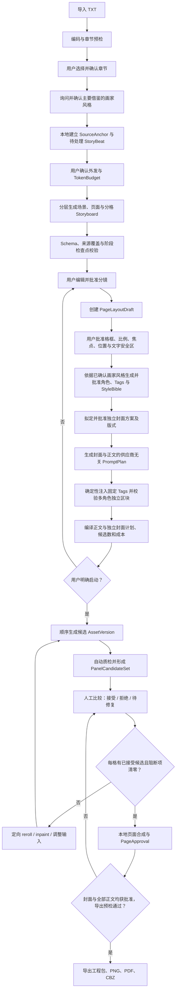
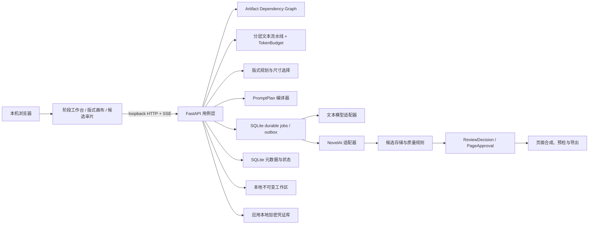

# Manga Maker 产品需求文档

| 项目 | 内容 |
|---|---|
| 文档版本 | v0.3 |
| 日期 | 2026-09-06 |
| 本次需求补充 | FR-25 / AC-14：必备封面；FR-26 / AC-15：生产启动前询问主要借鉴的画家风格。新增需求待实现，见第 26 节 |
| 上下文恢复交付 | FR-24 / AC-13 的本地检查点、预算策略、失败交接、脚本/API/UI 已实现；宿主集成与整书验收分别记录于 MM-078，见第 25 节 |
| 产品状态 | v0.2 离线 Mock 单章闭环及扩展能力已实现；v0.3 架构底座、版式先行、PromptPlan/PromptPackage v2、NovelAI 多角色映射、审批冻结和 Prompt Inspector 已完成 Mock 验收，候选—质检—接受闭环、迁移发布门禁和分层 Token 流水线尚未完成；授权《沙王》已完成真实 NovelAI V5 Full 零 Anlas 12 页代表性生产，真实文本模型与付费 Anlas 路径仍未验收 |
| 产品形态 | 本机单用户、本地 Web 应用 |
| P0 验收单位 | 一个 TXT 小说章节的完整漫画化闭环 |
| 默认成品 | 一张正式封面 + 完整正文；黑白分页漫画，2:3 竖版，左到右、从上到下，简体中文横排。必备封面为新增待实现要求 |
| 文本模型配置 | 备注名称（可选）、URL、Key/Password、Request Model；配置仅在本机保存 |
| 文本模型职责 | 结构化改编、NovelAI 输入 Prompt、角色固定 Tags 及相关结构化文本任务 |
| 图像生成 | NovelAI Image Generation API |

项目入口和简明范围见 [README.md](README.md)，技术实现边界见 [TECHNICAL_ARCHITECTURE.md](TECHNICAL_ARCHITECTURE.md)，分层验收证据见 [P0_ACCEPTANCE_REPORT.md](P0_ACCEPTANCE_REPORT.md)。

## 1. 一页结论

Manga Maker 把“把小说交给模型生成几张图”改造成一个可审阅、可修改、可恢复的漫画生产流程。

P0 从一个 TXT 章节开始。用户先在本地设置表单中填写备注名称（可选）、URL、Key/Password 和 Request Model。系统使用这一已保存的文本模型配置，以可恢复的“章节 → 场景 → 页面 → 分格”阶段生成带来源锚点的改编方案。文本模型必须为每一页生成完整分镜并自动标注 `page_type`：普通页使用 3–6 格，封面、通页大场面等特殊页可使用 1–6 格，任何页面都不得为空。用户先批准分镜和 `PageLayoutDraft`，冻结每格比例、阅读顺序、焦点与文字安全区；系统随后草拟角色固定 Tags，并为每格生成供应商无关的结构化 `PromptPlan`。本地编译器必须逐字注入已批准固定 Tags，并把多个角色映射为彼此隔离的正负提示区块。用户确认设定、Prompt、页数、候选数和预计成本后，系统才调用 NovelAI。每次结果先进入候选集，经规则质检与人工选择后才能成为已接受素材；本地排版器再负责格框、裁切、对白、旁白、音效和页码。页面只有在全部目标格已接受、质量阻断项清零并由用户批准后才能进入最终导出。

P0 的核心不是“一次生成看起来像漫画的图片”，而是建立以下可验证闭环：

1. 原文不会在分章、改编或压缩时静默丢失。
2. 生产启动前先询问用户主要借鉴哪位画家的风格并保存确认；角色和具体风格板在批量出图前再分别批准。
3. 每一次付费生成都能追溯到用户动作、提示词、参考图和成本预算。
4. 修改局部内容不会破坏已经确认的其他页面。
5. 中断、失败或误操作不会覆盖已接受的版本。
6. 最终成果既能继续编辑，也能以通用漫画格式离开 Manga Maker。
7. 同一角色在所有相关 NovelAI Prompt 中使用同一组已批准 Tags，除非用户显式创建并批准新版本。
8. 图像尺寸和构图约束来自出图前已批准的页面版式，不再先生成统一竖图再被动裁切。
9. 图像生成成功不等于素材被接受；候选必须经过质检、比较和明确选择。
10. 文本模型调用有阶段边界、Token 预算、截断证据和可恢复检查点，不依赖一次超长请求完成整章。
11. 每一页都有可审阅的分镜；普通页保持 3–6 格，特殊页由文本模型自动分类后才可使用 1–2 格布局。
12. 每部正式漫画必须包含一张封面，封面与正文分别预算、审阅和计数；封面默认不占用已约定的正文页数。

本 PRD 定义产品目标和验收基线，不代表所有功能已经交付。实际完成范围以 [README.md](README.md) 的“当前可用范围”和 [WORK_ITEMS.md](WORK_ITEMS.md) 为准。

### 2026-09-06 分镜修复交付顺序

本轮按以下顺序实现；每项必须建立用户用例、复现旧行为并通过对应回归，才能继续下一项。证据记录在 [分镜修复用户用例](docs/storyboard-repair-cases.md)。文档中的目标不得代替已完成状态。

1. **批准版式用于正式拼页**：新建页面直接使用已批准 PageLayoutDraft 的画布、叶子格框、阅读顺序、焦点和文字安全区。不得按格数回退到默认模板。明确重新拼页时，新的批准版式派生新 PageVersion，保留旧版本与素材，不调用 NovelAI；同版式重复请求保持幂等。未批准或过期版式应在本地阻止新拼页。
2. **分镜约束进入最终提示**：确定性编译景别、焦点、人物位置、裁切保护与文字留白；保留独立自然语言画面描述，校验分镜覆盖。相同 seed、尺寸下修改视觉约束必须改变最终请求中的对应语义，不能仅改变内部哈希。
3. **独立整页生成模式**：用户在逐格拼页与 V5 整页多格生成之间明确选择。整页模式按页面冻结布局叙述、阅读顺序、各格画面、角色和文字策略，预览最终 Prompt 后沿用有界执行、成本限制和不可变版本；不得把一页 Prompt 当作每格 Prompt 重复执行。逐格模式由本地绘制格框与文字；整页模式保留模型格框，并分别支持本地文字与模型文字，避免正负提示冲突。
4. **真实多格验收**：新增含普通多格页的代表性日式漫画用例，覆盖不等宽格框、由右向左阅读、特写/插入镜头、角色连续性、文字位置、预览到执行一致性、重试与导出。原有单幅通页样本继续作为通页用例，不作为多格能力通过证据。离线测试、真实服务请求和人工成图检查分别记录。

## 2. 背景与问题

把小说改造成漫画并不是单次文生图任务，而是五种问题的组合：

1. **改编问题**：小说的内心活动、叙述和长对话需要改造成可见动作、镜头和有限对白。
2. **分页问题**：信息必须在页与格之间分配，形成节奏、悬念和翻页点。
3. **一致性问题**：角色脸型、服装、年龄、道具和场景必须跨格、跨页保持稳定。
4. **文字问题**：图像模型难以稳定生成可读中文，且生成后的文字难以编辑。
5. **返工问题**：一格有问题不应该迫使用户重做整章；重做也不能覆盖之前可用的版本。

整页生成仍有格数、对白与角色连续性偏差，不能把提示中的坐标当作硬约束。Manga Maker 默认采用“结构化改编、逐格生成、本地排版、不可变版本”，另提供 V5 Full 整页多格模式，由作者检查格框、内容与文字后采用成图。

## 3. 产品愿景与原则

### 3.1 产品愿景

让个人创作者可以把自己拥有权利的小说章节，稳定地改编为一组可读、可编辑、可迁移的漫画页面，而不需要手工管理几十个提示词、种子、参考图和散落的生成结果。

### 3.2 产品原则

1. **先审脚本，再花生成成本**：分镜、角色、风格、页数和成本先确认，之后才出图。
2. **明确两种生成模式**：逐格模式由本地系统确定性绘制文字、格框与顺序；V5 Full 整页模式由模型绘制格框，本地保留批准版式作为审阅参照，文字可选本地叠加或模型生成。
3. **默认本地，明确外发**：源小说和工程默认留在本机；调用云模型前展示将发送的内容。
4. **生成即版本化**：任何 reroll 或 inpaint 都创建新版本，不覆盖已有素材。
5. **目标修改，最小影响**：逐格模式改单格不重做整页，本地文字可独立编辑；整页模型文字已画入图片，修改这类文字或模型格框须重新生成整页并保留旧版本。
6. **来源可追溯**：每个剧情节拍和页面都能回到原文章节及字符范围。
7. **成本可见**：调用前显示预计次数和成本上限，完成后记录实际调用与失败重试。
8. **用户动作可追溯**：所有外部生成请求必须来自可审计的用户操作，不运行无人值守生成计划。
9. **供应商可替换但配置唯一**：文本任务通过适配层接入，并统一使用当前激活的本地文本模型配置；不得在任务之间静默切换服务商、模型或密钥。
10. **不伪装交付**：文档、模拟测试和真实 API 验收分别报告，不能把其中一项替代另一项。
11. **角色 Tags 确定性注入**：文本模型可以提出 Tags 草案，但审批后的固定 Tags 由本地编译器原样注入，不依赖模型重复生成来维持一致性。
12. **先定版式，再定生成规格**：每格的比例、阅读顺序、焦点和文字安全区在付费生成前确认，并进入生成审批哈希。
13. **候选不等于成品**：供应商响应只创建候选素材；自动规则不能替代人工接受，人工接受也不能隐去未解决的阻断项。
14. **结构化角色不扁平化**：基础画面与每个角色的正向、负向、位置和动作语义在内部契约及供应商映射中保持分离。
15. **Token 预算可解释**：文本输入、输出和 Schema 都计入阶段预算；任何裁剪都必须按公开优先级执行并留下记录，禁止静默截断关键事实。
16. **逐页分镜，格数有界**：文本模型为每一页设计分镜并自动判断页面类型；普通页使用 3–6 格，只有封面、通页大场面等特殊页可少于 3 格，所有页面最多 6 格。

## 4. 目标与非目标

### 4.1 P0 产品目标

1. 导入 TXT 小说，可靠识别或手工修正章节。
2. 选择一个章节，使用本地配置的文本大模型为每一页生成结构化、可编辑、有来源锚点的漫画分镜，并自动区分普通页与特殊页；普通页使用 3–6 格，任何页面都至少包含一格。
3. 使用同一文本大模型自动草拟角色设定表、角色固定 Tags、黑白漫画风格板和逐格 NovelAI Prompt，并允许用户编辑和上传参考图。
4. 用户确认分镜、设定、固定 Tags、Prompt、页数和成本后，调用 NovelAI 逐格生成或使用 V5 Full 整页多格模式。
5. 将面板画面与本地文字、格框合成为完整漫画页。
6. 支持修改任意页面的分镜、提示词、对白、旁白、音效和布局。
7. 支持整页 reroll、单格 reroll 和蒙版局部重绘。
8. 保存完整版本历史、中断状态、生成参数和审计记录。
9. 导出可恢复工程包、PNG、PDF 和 CBZ。
10. 在一个代表性章节上完成真实端到端验收。
11. 在任何 PromptPackage 或 GenerationSpec 创建前批准页面版式，并按格子比例生成目标尺寸。
12. 将多角色 `PromptPlan` 无损映射为 NovelAI 的基础提示和独立角色提示区块，并用双人/三人契约样例验收。
13. 为每格建立候选集、质量发现、人工接受和页面批准状态；未接受页面或未解决阻断项不得进入最终导出。

### 4.2 P0 非目标

- 整本长篇小说一键生成；P1 才处理跨章节状态和全书预算。
- 印刷级色彩管理与竖排文字出版；现有彩色、条漫与 RTL 页面仍保留。
- 多人协作、云同步、公开 SaaS、远程账户和租户隔离。
- 自动抓取公共小说、付费内容或未授权参考图。
- 自动发布、版权授权、发行、印刷出血或商业平台对接。
- 无需审阅即可保证格数、角色连续性与完整中文对白完全正确的整页成品。
- EPUB、PDF、DOCX、扫描件和网页小说导入。
- 自动训练角色 LoRA、模型微调或本地扩散模型管理。
- 无限并发、无限重试、定时生成或服务端无人值守生产。
- 移动端原生应用。

### 4.3 v0.3 新增优先项目

本节的 P0/P1 表示 **v0.3 实施优先级**，不改变本文既有“P0 单章 / P1 整本”的产品范围命名。

| 编号 | 优先级 | 项目 | 用户结果 | 实现状态 |
|---|---|---|---|---|
| V03-P0-01 | P0 / Blocker | 把版式放到生成之前 | 出图前即可确认页面节奏、格子比例、焦点和文字安全区；不再依赖统一竖图事后裁切 | 已实现（Mock 验收） |
| V03-P0-02 | P0 / Blocker | 修复多角色生成契约 | 同一格中的角色拥有独立正负提示、位置与动作语义，固定 Tags 不串角色、不被扁平化 | 已实现（Mock 验收；真实双角色 smoke 待 MM-046） |
| V03-P0-03 | P0 / Blocker | 建立候选—质检—接受闭环 | 生成结果先作为候选，经自动规则和人工比较后才进入页面；导出只使用已批准页面 | 未实现 |
| V03-P1-01 | P1 / High | 改成分层、Token 感知的文本模型调用 | 长章节按可恢复阶段处理；Token 预算、裁剪、重试和模型来源可解释 | 未实现 |

四项需求的强制依赖顺序为：`分层改编 → Storyboard → PageLayoutDraft 审批 → PromptPlan/多角色映射 → 候选生成 → 质检与接受 → PageApproval → 导出预检`。后三个 P0 项不得绕过此顺序独立接入旧的“先生成、后排版”路径。

## 5. 用户与核心场景

### 5.1 目标用户

P0 仅服务一名本机创作者。用户：

- 使用 macOS；
- 拥有或获准改编输入小说及参考图；
- 能配置自己的文本模型和 NovelAI 凭证；
- 希望通过可视化编辑完成一章漫画，而不是编写脚本或手工整理图片；
- 接受在关键生成节点进行人工审阅和确认。

### 5.2 核心场景

1. **章节试作**：从长篇 TXT 中选择一个章节，验证它适合多少页和怎样的画风。
2. **分镜审稿**：在产生图像成本前，调整删改、对白、镜头和翻页点。
3. **角色定稿**：生成并修正角色设定表，上传已有角色参考图，锁定主要外观。
4. **受控出图**：确认成本后生成整章，随时暂停，失败后只处理未完成项。
5. **逐页精修**：改单格构图、局部手部或表情、对白位置，不影响其他页面。
6. **版本比较**：比较同一格或同一页的多个候选，恢复旧版本而不重新付费。
7. **交付与备份**：导出阅读文件，并保存一个可以在新机器恢复的可编辑工程包。

## 6. 关键术语

| 术语 | 定义 |
|---|---|
| Project | 一次漫画改编工程，包含源文件、章节、设定、分镜、素材、版本和导出 |
| SourceChapter | 从 TXT 中识别并由用户确认的章节及字符范围 |
| SourceAnchor | 指向源章节版本、起止字符和摘录哈希的来源锚点 |
| StoryBeat | 必须在改编中处理的剧情信息单位，例如动作、发现、转折或关键对白 |
| Storyboard | 一个章节的场景、页面、分格、对白和视觉要求集合 |
| PageLayoutDraft | 出图前冻结的页面版式版本，包含格框比例、阅读顺序、焦点、人物粗略位置和文字安全区 |
| TextModelProfile | 一个本地文本模型配置版本；用户输入为备注名称（可选）、URL、Key/Password 和 Request Model，持久化时 Key/Password 与非敏感字段分离保存 |
| ModelCapabilitySnapshot | 某一文本模型配置在一次显式能力探测后记录的上下文、输出、结构化输出与 Token 计量能力快照 |
| TextStageRun | 一次有明确输入版本、TokenBudget、输出 Schema、检查点和结果状态的文本模型阶段调用 |
| TokenBudget | 某阶段的输入、Schema、预留输出和安全余量预算，以及超限时的确定性裁剪记录 |
| CharacterBible | 角色身份、外观、服装、道具、关系、表情范围和参考图集合 |
| CharacterTagSet | CharacterBible 中某一角色或已批准造型版本的固定 NovelAI Tags，包含有序正向 Tags、必要负向 Tags、版本和哈希 |
| StyleBible | 线条、网点、光影、背景、镜头、禁用元素和负面提示词规则 |
| PromptPlan | 供应商无关的分格提示结构，保留基础画面、风格、连续性及每个角色独立正负提示、顺序和粗略位置 |
| PromptPackage | 文本大模型为一个 Panel 生成、经 Schema 校验并由本地编译器注入固定角色 Tags 后形成的已审批 PromptPlan 版本 |
| Page | 一张逻辑漫画页，由布局、面板和文字图层组成 |
| Panel | 页面中的一格，包含剧情目的、镜头、角色、提示词和当前素材版本 |
| GenerationSpec | 一次图像生成所需的模型、参数、提示词、参考图、seed 和目标尺寸 |
| AssetVersion | 某一面板图像的不可变版本 |
| PanelCandidateSet | 针对同一 Panel 与 GenerationSpec 目标形成的一组候选 AssetVersion 及其比较状态 |
| QualityFinding | 自动规则或人工审阅记录的质量问题，包含严重级别、区域、证据、状态和人工处置 |
| ReviewDecision | 对候选作出的接受、拒绝或待修复决定，绑定精确候选版本和审阅者动作 |
| PageApproval | 对精确 PageVersion 及其全部已接受面板和质量状态的页面批准快照 |
| PageVersion | 某一页面布局、面板选择和文字图层的不可变快照 |
| Reroll | 使用同一目标和新的 seed 或参数重新生成整页或单格 |
| Inpaint | 使用原图和蒙版重绘指定区域 |
| GenerationJob | 用户触发的一组有界生成工作及其状态、预算和审计信息 |
| ExportRevision | 对一组已确认 PageVersion 的导出快照 |

## 7. 端到端流程

### 7.1 主流程



### 7.2 审批门禁

生产启动前须先完成 FR-26 的画家风格意图确认；它不替代任何成本或生成审批。以下五项审批互相独立，并按依赖顺序生效；后续变更会使下游相关审批失效：

1. **分镜审批**：确认剧情覆盖、页数、每页 `page_type`、分格数量、对白和镜头；任何页面不得为空，普通页必须为 3–6 格，特殊页必须为 1–6 格。
2. **版式审批**：确认精确 PageLayoutDraft、阅读顺序、每格比例、焦点、角色粗略位置和文字安全区。
3. **设定审批**：确认角色、固定 Tags 与画风，以及将发送给 NovelAI 的参考图。
4. **生成审批**：确认逐格结构化 PromptPlan、多角色映射预览、目标尺寸、候选数、预计调用数、成本上限、模型和任务范围。
5. **页面审批**：确认精确 PageVersion、每格已接受候选及所有阻断级 QualityFinding 已解决或有明确人工豁免。

Storyboard 变化使相关版式及其全部下游审批失效；PageLayoutDraft 变化使相关 PromptPackage、GenerationSpec、候选接受状态和 PageApproval 失效，但保留旧素材分支；角色/风格、CharacterTagSet 或 PromptPackage 变化使相关生成审批和候选接受状态失效。系统必须展示影响范围，重新计算目标尺寸、候选数、调用数和成本，禁止静默沿用旧批准。

### 7.3 任务状态

```text
draft
  → awaiting_approval
  → queued
  → running
  ↔ paused
  → needs_review | failed | completed | canceled
```

- `draft`：可以自由编辑，不允许外部生成。
- `awaiting_approval`：等待用户确认范围和预算。
- `queued`：已确认但尚未发出下一请求。
- `running`：至少一个请求正在执行。
- `paused`：不再领取新请求；正在执行的请求完成后保存结果。
- `needs_review`：崩溃或超时后无法判断远端请求是否已计费，必须人工决定是否重试。
- `failed`：确定失败且不允许自动重试，或重试上限已用尽。
- `completed`：所有目标面板已有可用版本，但不等于用户已经验收页面。
- `canceled`：停止领取新请求，保留全部已完成结果和审计记录。

GenerationJob 状态只描述外部任务执行，不承载素材质量。候选使用 `generated → qc_pending → review_required → accepted | rejected | needs_fix`；页面使用 `draft → ready_for_review → approved | changes_requested`。`completed` Job 不能自动把候选或页面标记为 accepted/approved。

## 8. 信息架构与主要界面

### 8.1 项目首页

- 展示本地项目、最近修改、当前阶段、已确认页面数和未处理失败项。
- 创建项目时选择 TXT，展示本地保存位置和云模型数据边界。
- 不提供注册、登录或远程分享入口。

### 8.2 导入与章节页

- 展示检测到的编码、文件哈希、字符数、章节数和异常。
- 左侧显示章节列表，右侧显示原文预览和字符范围。
- 支持改名、拆分、合并、调整边界和“整篇作为一个章节”。
- 用户确认后创建不可变 `SourceChapter` 版本；后续重新切分会创建新版本。

### 8.3 改编工作台

- 三栏布局：原文与 StoryBeat、页面/分格树、当前分格编辑器。
- 显示每个 StoryBeat 的处理结果：`represented`、`condensed`、`omitted`、`unresolved`。
- 页面/分格树显示文本模型自动判定的 `page_type`、当前分镜数量和格数异常；特殊页分类随 Storyboard 一起审批，不要求用户另行标记或填写理由。
- 支持调整页数、移动页面/分格、合并或拆分分格、编辑对白和镜头。
- 未解决剧情信息、无来源锚点的关键情节和对白超量必须可见。
- 显示章节、场景、页面和分格四级 TextStageRun，包含 Token 预算、已用量、裁剪记录、失败位置和从检查点重试入口。

### 8.4 角色与风格页

- 在启动生产入口先询问“本次漫画主要借鉴哪位画家的风格？”，展示待确认状态；具体选择、取消和恢复规则见第 26 节。
- 角色与风格页持续展示主要参考画家或用户明确选择的“不指定画家”、用户补充说明及当前确认版本；封面与正文共用该意图。
- 角色卡展示固定特征、可变特征、禁止变化、服装、道具和参考图。
- 每张角色卡展示由当前文本模型生成的固定正向/负向 Tags、适用造型版本、审批状态和实际注入预览。
- 固定 Tags 与姿势、动作、表情、镜头等逐格可变 Tags 分区显示；固定 Tags 的任何修改都会创建新版本并使相关审批失效。
- 风格板展示黑白线条、网点、背景密度、光影、镜头习惯和负面提示词。
- 上传参考图时记录本地路径、哈希、来源说明和用户授权确认。
- 每个设定版本有独立批准状态；修改后不得沿用旧批准。

### 8.5 版式工作台

- 在任何逐格 PromptPackage 或图像 GenerationSpec 创建前，以页面缩略图和画布编辑 `PageLayoutDraft`。
- 普通页使用 3–6 格模板起步；1–2 格模板只用于文本模型标注为 `cover`、`splash` 或 `special` 的特殊页。所有页面仍支持增删、拆分、合并、拖拽和缩放格框，每格显示实际宽高比和推荐生成尺寸。
- 每格可编辑阅读顺序、焦点、人物粗略位置、景别、气泡/旁白安全区和裁切保护区。
- 版式审批展示将影响的 Prompt、目标尺寸、候选与预计成本；修改后保留旧版本并明确标记下游状态失效。

### 8.6 生成队列

- 展示章节、页数、面板数、每格尺寸、候选数、预计调用数、预计成本、模型和生成参数摘要。
- 用户点击“开始生成”后创建不可变任务范围。
- 提供暂停、继续、取消和仅重试失败项。
- 默认一次只执行一个 NovelAI 请求，不提供隐藏并发开关。

### 8.7 候选审片台

- 每格以联系表和并排视图展示同一目标下的全部候选，不自动覆盖当前已接受素材。
- 展示 PromptPlan、模型、seed、参考图、成本、自动 QualityFinding 及候选间差异摘要。
- 用户可接受、拒绝、标记待修复、填写备注，或以选中候选为父版本执行 reroll/inpaint。
- “接受”必须绑定精确 AssetVersion；新的候选不会自动撤销旧接受决定，输入依赖失效除外。

### 8.8 页面编辑器

- 左侧页面缩略图，中间页面画布，右侧图层、分格和版本面板。
- 画布图层至少包括：背景、格框、面板图像、气泡、对白、旁白、音效、页码。
- 支持拖动格框、裁切素材、编辑文字、移动气泡、改变阅读顺序和选择页面模板。
- 提供整页 reroll、单格 reroll、蒙版重绘、候选/版本并排比较和恢复。
- 页面缩略图区分“缺少候选”“待质检”“待接受”“有阻断项”“可审批”“已审批”和“上游已失效”。

### 8.9 导出页

- 只允许选择已 PageApproval 的页面版本及顺序，生成新的 `ExportRevision`。
- 在导出前报告缺页、未验收页、低分辨率素材、溢出文字和断裂阅读顺序。
- 阻断级 QualityFinding 未关闭、候选未接受或 PageApproval 失效时禁止正式导出；工程备份仍可导出，但必须标记为未完成工程。
- 分别导出工程包、PNG、PDF 和 CBZ；失败不会污染上一次成功导出。

### 8.10 文本模型设置

- 使用一个设置表单展示四个字段：`备注名称（可选）`、`URL`、`Key/Password`、`Request Model`。
- 首次保存要求 URL、Key/Password 和 Request Model；备注名称可空。备注名称、URL 与 Request Model 保存在应用本地设置中，Key/Password 写入应用本地加密凭证库。
- Key/Password 为只写字段；保存后仅展示“已配置”和脱敏指纹，不回显、复制或写入浏览器持久存储。已有配置更新其他字段时可留空保留原 Key/Password。
- “保存配置”只执行本地写入；“测试连接”是独立的显式动作，并清楚提示会向所填服务商发出最小测试请求。
- 页面展示当前配置版本、最后一次连接测试结果，以及该配置将承担的任务：结构化改编、角色 Tags 草拟、NovelAI Prompt 生成和结构修复。
- 显示最近一次显式能力探测形成的 ModelCapabilitySnapshot，以及各阶段输入、Schema、预留输出和安全余量的 TokenBudget；无法可靠计量时必须标记估算口径。

## 9. 概念数据模型

### 9.1 核心对象

| 对象 | 稳定标识 | 关键字段 | 权威来源 |
|---|---|---|---|
| Project | `project_id` | 标题、创建时间、当前阶段、默认阅读方向 | SQLite |
| TextModelProfile | `text_model_profile_id` + `version` | 备注名称、URL、Request Model、凭证引用、连接状态 | 应用本地设置 + 本地加密凭证库 |
| SourceChapter | `chapter_id` + `version` | 文件哈希、编码、起止字符、正文哈希 | SQLite + 本地文件 |
| Storyboard | `storyboard_id` + `version` | StoryBeat、Scene、Page、Panel、审批状态 | SQLite + JSON 快照 |
| PageLayoutDraft | `page_layout_draft_id` + `version` | 页面尺寸、格框、阅读顺序、焦点、位置、文字安全区、审批状态 | SQLite + JSON 快照 |
| ModelCapabilitySnapshot | `capability_snapshot_id` | 配置版本、探测时间、上下文/输出能力、结构化输出方言、计量口径 | SQLite + JSON 快照 |
| TextStageRun | `text_stage_run_id` | 阶段、输入版本、TokenBudget、检查点、状态、模型用量与错误 | SQLite + JSON 快照 |
| CharacterBible | `character_bible_id` + `version` | 角色字段、CharacterTagSet、参考图、审批状态 | SQLite + JSON/图片 |
| CharacterTagSet | `character_tag_set_id` + `version` | 角色/造型版本、有序固定 Tags、负向 Tags、哈希、审批状态 | SQLite + JSON 快照 |
| PromptPackage | `prompt_package_id` + `version` | PromptPlan、固定角色 Tags 引用、多角色区块、文本模型来源、审批状态 | SQLite + JSON 快照 |
| StyleBible | `style_bible_id` + `version` | 画风字段、负面词、参考图、审批状态 | SQLite + JSON/图片 |
| ArtistStyleIntent（待实现） | `style_intent_id` + `version` | 项目级主要参考画家或明确不指定、特征说明、确认状态/哈希；早于分镜创建 | SQLite + JSON 快照 |
| CoverBrief（待实现） | `cover_id` + `version` | 封面语义、标题、主体/构图、来源引用、风格意图与设定引用、审批状态 | SQLite + JSON 快照 |
| BookComposition（待实现） | `book_composition_id` + `version` | 唯一正面封面引用、有序正文引用、分别计数与预算口径 | SQLite + JSON 快照 |
| Page | `page_id` | 序号、阅读方向、当前 PageVersion | SQLite |
| Panel | `panel_id` | Page 归属、剧情目的、当前 AssetVersion | SQLite |
| AssetVersion | `asset_version_id` | 图片路径、哈希、GenerationSpec、父版本 | SQLite + 图片 |
| PanelCandidateSet | `candidate_set_id` | Panel、目标规格哈希、候选清单、比较状态 | SQLite + JSON 快照 |
| QualityFinding | `quality_finding_id` | 候选/页面、规则、严重度、区域、证据、处置状态 | SQLite + JSON 快照 |
| ReviewDecision | `review_decision_id` | 候选版本、决定、理由、用户动作、依赖哈希 | SQLite |
| PageVersion | `page_version_id` | 布局、素材选择、文字图层、父版本 | SQLite + JSON/预览图 |
| PageApproval | `page_approval_id` | PageVersion、已接受候选、质量摘要、审批哈希 | SQLite |
| GenerationJob | `job_id` | 用户动作、范围、预算、状态、重试 | SQLite |
| ExportRevision | `export_revision_id` | 页面版本清单、格式、哈希、结果 | SQLite + 导出文件 |
| ContinuityLedger | `continuity_ledger_id` + `version` | 角色、服装、道具、场景、剧情状态、来源与影响分析 | SQLite + JSON 快照 |

### 9.2 身份与版本规则

- 所有稳定 ID 使用 UUIDv7；文件名、页码和标题不是主键。
- 版本对象一旦创建不可原地修改；编辑产生新版本。
- `Page.current_version_id` 和 `Panel.current_asset_version_id` 是可切换指针。
- 恢复旧版本只更新当前指针并记录审计事件，不复制或删除文件。
- 删除默认进入可恢复状态；物理清理不属于 P0 用户流程。
- PageVersion 必须记录使用的每个 AssetVersion，确保导出可重复。
- PageLayoutDraft、PromptPackage、GenerationSpec、ReviewDecision 与 PageApproval 必须保存完整依赖哈希；任一上游版本变化只使受影响下游失效，不删除旧分支。
- AssetVersion 的 `ready` 只表示文件可靠落盘；只有有效 ReviewDecision 指向它时才表示 `accepted`。
- PageApproval 必须绑定精确 PageVersion、全部已接受 AssetVersion 和当时的 QualityFinding 集合，不能由“任务 completed”推导。

### 9.3 单一真源

| 数据 | 权威来源 | 派生物 |
|---|---|---|
| 源小说正文 | 项目内只读源文件 | 章节预览、来源摘录 |
| 结构化元数据和当前指针 | SQLite | 列表、状态、统计 |
| 分镜、版式、设定、角色 Tags 与 PromptPlan 版本 | JSON 快照 + SQLite 索引 | 编辑器视图、供应商执行规格、影响范围 |
| 生成图片 | 不可变本地素材文件 | 缩略图、合成页 |
| 候选、质检、接受和页面审批 | SQLite + JSON 快照 | 审片台、导出预检、质量指标 |
| 页面布局与文字 | PageLayoutDraft + PageVersion JSON | PNG/PDF/CBZ 页面 |
| 文本模型非敏感配置 | 应用本地设置 | 备注名称、URL、Request Model、版本和端点主机 |
| 文本模型与 NovelAI 密钥 | 应用本地加密凭证库 | 解锁后的运行时短期凭证 |
| 审计 | 追加式本地记录 | 成本与运行报告 |

## 10. 功能需求

### FR-01：项目创建与本地边界

- 创建项目时复制源 TXT 到项目工作区，并计算 SHA-256。
- 项目工作区不得位于临时目录；位置不可用时停止创建。
- 应用只允许监听 `127.0.0.1`、`::1` 或 `localhost`。
- 不得把源文件、参考图或生成结果上传到 Manga Maker 自有服务器。
- 项目首页明确显示“本地工程”和当前外部模型配置。

### FR-02：TXT 预检与章节识别

- 支持 UTF-8、UTF-8 BOM；支持识别 GB18030/GBK 等常见中文编码候选。
- 解码置信度不足或出现替换字符时必须预览并要求用户选择，禁止静默丢字。
- 识别常见章节标题，并报告未匹配前言、过长章节、空章节和异常换行。
- 支持手工拆分、合并、重命名和调整章节边界。
- 章节确认前不得调用任何文本或图像模型。

### FR-03：来源解析与覆盖账本

- 把所选章节拆成可追踪的 StoryBeat，并保存 SourceAnchor。
- SourceAnchor 至少包含 `chapter_version`、`start_offset`、`end_offset` 和摘录哈希。
- 每个 StoryBeat 必须得到 `represented`、`condensed`、`omitted` 或 `unresolved` 结果。
- `omitted` 必须包含理由；`unresolved` 会阻止分镜审批。
- 页面和场景必须能反查其覆盖的 StoryBeat。

### FR-04：文本模型配置

- P0 提供 OpenAI-compatible 文本模型适配器。面向用户的配置表单固定为四个字段：`备注名称（可选）`（`remark_name`）、`URL`（`url`）、`Key/Password`（`key_password`）和 `Request Model`（`request_model`）。首次保存时后三项必填；已有配置更新备注、URL 或 Request Model 时可省略 Key/Password。超时、温度等运行参数使用产品定义的有界默认值，不作为首版配置字段。
- 四字段配置全部在本机处理：备注名称、URL、Request Model 和配置版本保存在应用本地设置中；Key/Password 存入 Manga Maker 应用数据目录中的本地加密凭证库，并以不含秘密的凭证引用关联配置。
- 配置必须在应用重启后仍可用，且不得由 Manga Maker 自动同步或上传。备注名称、URL 与 Request Model 可以作为可移植来源信息进入用户显式导出的工程包；Key/Password 不得进入工程包、成品导出、日志、崩溃报告、源码、浏览器 `localStorage` 或任何 Manga Maker 云端服务，凭证引用在恢复时必须替换为“需要重新录入”。
- Key/Password 字段只写；界面只显示已配置状态和末四位指纹，不回显完整秘密。更新秘密必须显式重新输入，留空则保留当前凭证。
- “保存配置”只做本地校验与持久化，不发出模型请求；“测试连接”必须由用户另行点击，并在发出最小请求前展示端点主机和模型名称。
- 当前激活的 TextModelProfile 是全部文本模型任务的唯一配置来源，至少包括：基于 StoryBeat/SourceAnchor 的结构化改编、Storyboard 生成与结构修复、CharacterBible/StyleBible 草拟、角色固定 Tags 草拟，以及 NovelAI 逐格 PromptPackage 生成。
- 每个模型产物记录 TextModelProfile ID 与版本、端点主机、模型名称、提示词模板版本、输入/输出 token 和耗时，但不记录密钥或包含密钥的原始请求头。
- 配置缺失、凭证库锁定、连接失败或配置版本在执行期间变化时，相关任务停止并给出可恢复错误；不得静默切换到默认模型、其他服务商或旧密钥。
- 修改配置不会原地改写已有分镜、Tags 或 PromptPackage；用户重新生成时创建带新配置来源的新版本。
- 测试环境可用显式环境变量注入，不读取项目目录中的明文配置。
- 模型输入只包含所选章节、必要设定和结构化指令，不发送整本 TXT。

当前实现说明：文本模型设置已采用备注名称（可选）、URL、Key/Password、Request Model 四字段契约；非敏感配置与 Key/Password 分别保存在应用本地设置和加密凭证库中，已有配置更新非秘密字段时无需重发秘密。同一配置修订用于结构化 Storyboard、CharacterBible/StyleBible、角色固定 Tags 与 NovelAI PromptPackage，并通过版本、审批、哈希和生成门禁防止静默切换。真实外部文本模型仍未验收；《沙王》代表性验收使用本地确定性改编器和真实 NovelAI V5 Full 图像接口完成 12 页零 Anlas 生产，因此只证明图像生成、重绘、排版与导出链路，不证明外部文本模型或付费 Anlas 路径。

### FR-05：结构化改编

- 当前激活的文本模型按“章节规划 → 场景 → 页面 → 分格”执行有检查点的 TextStageRun，先输出场景和 StoryBeat 映射，再输出页面和分格，避免单次长调用直接生成不可审计提示词列表。
- 输出必须通过版本化 JSON Schema 校验。
- 对可修复的格式错误最多进行两次结构修复；仍失败则保留原始错误摘要并停止。
- 文本模型必须为每一页输出非空 `panels`，并自动输出 `page_type = standard | cover | splash | special`。`standard` 页面必须有 3–6 格；其他类型可有 1–6 格，用于封面、通页大场面或其他非典型叙事页。
- 缺失或未知 `page_type`、空 `panels`、普通页少于 3 格或任何页面超过 6 格都属于可修复的结构错误；两次结构修复后仍不合法时停止该阶段，不得进入分镜审批。特殊页分类不要求用户手工标记或填写例外理由。
- 每格必须包含剧情目的、镜头、角色状态、环境、对白/旁白/音效和视觉提示词。
- 对白必须适合气泡显示；超长文本应告警而不是自动缩小到不可读。
- 同一文本模型必须基于已批准 Storyboard、CharacterBible 和 StyleBible 为每格生成结构化 Prompt 草案，至少区分基础画面、角色区块、场景可变 Tags、风格 Tags 和负向 Prompt。
- Prompt 草案通过 Schema、禁用词、长度、角色覆盖和冲突校验后才能生成 PromptPackage；校验失败按同一有界结构修复规则处理。
- 文本模型只负责提出草案。最终发送给 NovelAI 的 Prompt 由本地确定性编译器构建，并强制注入已批准 CharacterTagSet，避免跨格漂移。
- 每个 TextStageRun 必须在调用前通过 TokenBudget 预检；输入裁剪、输出截断、`finish_reason` 异常或上下文超限不得进入下一阶段，详细规则见 FR-23。

### FR-06：分镜编辑与审批

- 用户可以增删、复制、移动、合并或拆分页面和分格。
- 用户可以编辑对白、旁白、音效、镜头、角色状态、提示词和负面提示词。
- 改变 StoryBeat 映射时实时更新来源覆盖报告。
- 分镜审批需要：无 `unresolved` StoryBeat、无无来源关键情节、无超出用户页数上限；每一页都有合法 `page_type` 和至少一个 Panel，普通页为 3–6 格，特殊页为 1–6 格。
- `page_type` 由文本模型在页面规划阶段自动确定并随 Storyboard 一起审批，不新增独立的例外确认步骤。用户可继续编辑分镜，但不满足对应格数约束时不得批准。
- 审批生成不可变 Storyboard 版本；后续编辑创建新版本并使旧生成审批失效。
- Storyboard 审批后必须先创建并批准 PageLayoutDraft；未批准版式时不得创建逐格 PromptPackage 或 GenerationSpec。

### FR-07：角色设定表

- 从章节提取主要角色、次要角色和只出现一次的人物。
- 每个主要角色至少记录：年龄段、脸型、发型、体型、服装、标志物、禁止变化、情绪范围。
- 当前激活的文本模型必须为每个需要保持一致的角色草拟 CharacterTagSet，至少包含有序正向 Tags、必要负向 Tags、适用的角色/造型版本和自然语言说明。
- CharacterTagSet 明确分为“固定 Tags”和“逐格可变 Tags”：身份、年龄感、脸型、发型、体型、标志物及已选服装版本属于固定 Tags；姿势、动作、表情、镜头和临时状态属于逐格可变 Tags。
- 用户可以编辑并独立批准 CharacterTagSet。批准后其 Tags 顺序、权重和规范化文本被冻结并计算哈希；任何变更都创建新版本，不原地覆盖。
- 本地 Prompt 编译器必须向每个相关角色区块原样注入对应的已批准固定 Tags。文本模型、分镜自由文本或逐格变量不得改写、翻译、重排、省略或加入与固定 Tags 冲突的内容。
- 同一角色存在换装、年龄阶段或剧情形态变化时，必须显式建立并批准新的造型版本；每格引用一个明确版本，不允许模型自行猜测切换。
- 允许上传全身、面部和服装参考图；每张图保存哈希和授权确认。
- 自动生成角色 reference sheet 的计划必须单独计入成本并由用户触发。
- 角色设定或 CharacterTagSet 修改后，系统只标记引用该角色/造型版本的面板和 PromptPackage 过期，并要求重新生成和确认。

### FR-08：风格板

- 风格板必须消费启动前确认的 ArtistStyleIntent，保留主要参考画家和可执行的风格特征；不得在生成分镜或图片后才补问，或由模型静默替换、混入其他画家。
- P0 默认黑白漫画，包含线条粗细、网点、阴影、背景密度、留白和镜头语言。
- 默认禁止图像中出现对白、气泡、页码、水印和随机文字。
- 支持用户上传一张或多张有使用权的风格参考图。
- StyleBible 必须生成可供人阅读的摘要和供模型使用的提示词片段。
- 风格板审批和角色设定审批均完成后才能进入生成审批。

### FR-09：NovelAI 凭证与供应商配置

- 使用用户自己的 NovelAI Persistent API Token，并存入 Manga Maker 自己管理的本地加密凭证库。
- 凭证库独立于项目工作区和 SQLite；用户设置的主密码经 Argon2id 派生加密密钥，主密码和派生密钥均不落盘。
- 凭证库使用带认证的加密算法，目录权限为仅当前用户可访问；应用关闭后清除内存中的解锁密钥。
- 用户忘记主密码时不提供后门恢复，只能重置凭证库并重新录入供应商密钥；重置不得删除项目数据。
- Token 不写入 SQLite、工程包、日志、崩溃报告或前端持久存储。
- 前端只把生成操作提交给本地后端，不直接持有 Token。
- 产品标签与 NovelAI 原始模型 ID 分离；默认且推荐 `nai-diffusion-5-full`，运行时必须校验当前官方能力。
- 不得静默切换模型、降低质量、移除参考图或改用其他供应商。
- 接口或条款变化导致能力不确定时，停止真实调用并提示重新核对官方文档。
- 已实现边界：固定 `https://image.novelai.net/docs/doc.json` 的审计哈希和映射版本；项目只保存模型 ID、vault profile 引用和非敏感连接状态。连接测试只调用标签建议与订阅接口，不出图；出图路径仅在有界 Job 进入 `running` 后、用户再次明确确认时调度。2026-08-29 的《沙王》验收已执行真实 V5 Full 连接、12 页初版与失败页零 Anlas 重绘；付费 Anlas、V5 Curated 和 inpaint 真实路径尚未验收。

### FR-10：生成预算与人工触发

- 在启动前展示页数、面板数、出图调用数、订阅核验调用数、外部请求总数、参考图附加成本和成本区间。
- 用户设置本次任务的最大面板数、最大请求数和成本上限。
- Opus 零 Anlas 模式中的 `0` 是本地资格载荷与成本预留，不是外部账户账单保证；确认前必须明确提示实际扣费可能无法由接口核实。
- 点击“开始生成”创建一个有范围、有预算的 GenerationJob，并记录用户动作时间。
- 每个外部请求必须关联该 GenerationJob 和原始用户动作。
- P0 不提供定时生成、应用启动后自动继续付费调用或无上限重试。
- 实现前必须以最新 NovelAI 文档确认“一次人工确认启动有界章节队列”的允许边界；若最新规则要求逐请求操作，则降级为逐页确认，不绕过限制。
- 创建图像任务前必须冻结精确 Storyboard、CharacterBible、CharacterTagSet、StyleBible、逐格 PromptPackage、文本模型来源版本、NovelAI 配置版本和有序 panel 清单。冻结的是密钥引用及配置版本，不复制任何密钥字节。
- 创建图像任务前还必须冻结 PageLayoutDraft、每格目标尺寸、结构化 PromptPlan、多角色供应商映射预览、每格候选数和质量规则版本。
- 用户必须能在生成审批中逐格查看 PromptPlan 与供应商映射预览，并确认固定角色 Tags 已注入且各角色保持独立，再确认候选数、每格保守成本预留、最大调用数和总成本上限。
- v0.3 当前已在 GenerationApproval/Job/Item 中原子冻结 Storyboard、CharacterBible、CharacterTagSet、StyleBible、PageLayoutDraft/frame、PromptPackage/PromptPlan、ProviderExecutionSpec/payload、文本模型与 NovelAI 配置、seed、参考图来源、mapping/rule 版本和有序 panel 清单。每格候选数当前固定为 1；多候选及质量闭环仍由 V03-P0-03 实现。预留值明确不是供应商实际扣费预测，预览、创建和状态控制均不发出图像请求。

### FR-10B：V5 Full 整页多格生成（2026-09-06）

- 在逐格与整页模式之间显式切换；读取同一批准分镜、版式、角色固定 Tags 与风格。整页单位为一页一图，不能重复作为每个分格的图像输入。
- 预览逐格景别、事件、外观、版式坐标和阅读顺序；模型仅把坐标作为参考。`generation_scope=full_page` 使用 base caption 和空角色 captions，角色坐标框不作为分格边界。逐格模式继续使用隔离的多角色区块。
- 整页 Prompt 必须先把批准格框转换为可读的行列关系（如上排左右两格、下排通栏一格），逐格标题包含位置；不能只罗列百分比坐标。每格只描绘一个瞬间，不能把同一格的道具与动作拆成额外插入格。默认中心焦点、全幅裁切区不重复占用提示预算；非默认约束仍保留。
- 每页显式携带出场角色已批准的年龄、外观、服装与稳定特征，不能仅写“服装保持一致”却漏掉具体服装。角色固定 Tags 原样保留；手部/物件特写不得因为重复外观描述而要求补画人物面部。
- 本地文字策略输出留白、保留可编辑图层；模型文字策略把所有实际文字放在提示末尾的 `Text:` 后，并禁止重复叠加本地文字。V5 整页关闭自动质量标签；V5 两种模式使用显式负向提示，避免预设抑制网点和多视图。
- 模型文字还需在所属分格描述中重复实际字符串并注明显示位置，不能只靠编号关联末尾列表；画面标题使用方位名称，避免格号/文字条目号被画入漫画。日语音效、对白的逐格归属须在真实成图检查中分别核对。
- 模型文字在全页布局后增加方位与实际字符串的对应表，逐格仍保留内联文字。若成图仍串格或重复文字，不能标记精确文字验收成功；使用本地文字策略交付可校订版本。
- 默认推荐本地文字。模型文字标为实验能力，并在选择时直接说明串格、重复、漏字风险；本地文字采用后需依据真实格框检查和调整文字框，不能默认模型几何与批准版式完全相同。
- 本地对白图层只绘制对白原文，说话人单独存为元数据；不能自动加上“角色名: ”前缀，也不能把不同说话人的多句对白合并成一个气泡。作者已编辑的历史图层保持不变。
- 每份预览冻结输入与配置修订、最终请求及哈希、seed 和本页预算预留；编辑后重新预览确认。每份审批最多一次图像调用，无自动重试；与逐格/重绘队列共用全局单在途边界。零 Anlas 模式先核验 Opus 和可用额度，资格核验不是账单回执，预算预留不是供应商扣费保证。
- 成图先待审阅，确认格数、顺序、人物与文字后采用。整图只绘制一次，不重复裁进每格，不重画模型已有格框；旧素材、页面版本与审批历史保留。工程恢复保留成图及本地可编辑层，但不重放旧生成审批。
- 新提示采用保守字符上限和 V5 Full 模型文字 750 字符上限；当前未接入官方 Token 计数器，不把字符数宣传为 Token 数。

### FR-11：逐格生成队列

- 默认串行执行，一个请求完成并落盘后才领取下一面板。
- 每格请求包含已冻结 PageLayoutDraft、PromptPackage/PromptPlan、已批准固定角色 Tags 的版本与哈希、当前分镜、各角色正负区块、参考图、目标尺寸和明确 seed。
- 执行器只能发送本地编译器输出并通过审批的最终 Prompt；不得在发送 NovelAI 前临时再次请求文本模型自由改写 Prompt，也不得从未批准的角色描述重新生成 Tags。
- 若 PromptPackage 缺失、过期、角色 Tag 哈希不匹配或出现固定/可变 Tags 冲突，面板在本地预检失败，不产生 NovelAI 请求。
- 生成结果先写临时位置，校验格式、尺寸和哈希后原子登记为 AssetVersion。
- AssetVersion 登记成功后只进入 PanelCandidateSet 的 `qc_pending` 状态，不自动切换为 Panel 当前接受素材；质检完成后进入人工审阅。
- 暂停后不领取新任务；取消保留已经完成的素材。
- 对网络超时和 5xx 最多自动重试两次，并使用退避；401、403、余额不足、参数错误和内容拒绝不自动重试。
- 进程在请求发出后、响应登记前崩溃时，把该项标记为 `needs_review`，不得盲目重发造成重复计费。
- MM-013 已实现全局单在途执行、乐观 revision、暂停/恢复/取消、发送前上限消耗、最多两次有界临时错误重试和启动 reconciliation。每次供应商请求前保存不可变 GenerationSpec；成功响应经严格 200/201、JSON/base64 或安全 ZIP、PNG/尺寸校验后原子登记 `original.png`、provenance 和 AssetVersion。ZIP 未提供可验证的响应 seed 时，provenance 把请求 seed 标为 `effective_seed`/`seed_source=request`，不会冒充 `response_seed`。发送后超时/断线或响应损坏转 `needs_review` 且不重放；应用重启也不会自动产生付费请求。

### FR-12：多角色与参考图策略

- V5 当前不启用 Precise Reference 或 Vibe Transfer；P0 用已批准固定 Tags、角色独立区块、冻结 seed 和人工抽检维持主要角色与画风。
- 旧 V4.5 Precise Reference 只作为历史工作流兼容能力保留，不得被自动带入 V5 请求。
- 多角色面板优先使用多角色提示区域；仍不稳定时允许分步生成并局部重绘。
- 多角色 Prompt 为每个角色建立独立的正向和负向区块；每个区块分别原样注入对应 CharacterTagSet，并保存角色顺序、粗略中心位置、与其他角色的动作/关系语义，不把多个角色的固定 Tags 混成共享列表或扁平字符串。
- 逐格供应商映射器必须把 base、角色正向区块和角色负向区块分别映射到 NovelAI V5 结构化字段；当前线协议字段仍名为 `v4_prompt` / `v4_negative_prompt`。角色顺序及正负区块一一对应，禁止生成空 `char_captions` 后回退到扁平 Prompt；显式整页模式的 base-only 契约见 FR-10B。
- 若当前 capability profile 不支持目标角色数、位置或负向角色区块，预检必须失败并提供拆格或分步 inpaint 方案，不得静默降级。
- 每格记录实际使用的参考图、Strength、Fidelity 和提示词。
- 角色参考更新后只标记相关角色出现的面板，不使无关页面失效。

### FR-13：本地页面合成

- NovelAI 面板图默认不包含对白、气泡、旁白框和页码。
- 本地排版器按 PageVersion 放置格框、图像裁切、气泡、文字、音效和页码。
- 默认画布 2048 × 3072 px、2:3 竖版、左到右、从上到下。
- P0 支持 1–6 格页面模板，但普通页只允许使用 3–6 格，1–2 格只服务于已在 Storyboard 中自动分类为 `cover`、`splash` 或 `special` 的特殊页；用户可在生成前拖动格框和改变合法模板，每个 GenerationSpec 的目标宽高比必须来自已批准 PageLayoutDraft。
- 版式中的焦点、角色粗略位置、文字安全区和裁切保护区必须进入 PromptPlan/GenerationSpec，供构图提示、尺寸选择和后续裁切校验使用。
- 简体中文横排必须使用随应用合法分发或由用户提供的字体。
- 修改文字、气泡或布局只创建新 PageVersion，不产生图像 API 调用。

当前实现说明：P0 兼容基线保留六种固定 2048 × 3072 黑白模板；PageDocument v2 已扩展为 16 种分页/条漫模板、黑白/彩色、LTR/RTL/从上到下和有界动态画布。格框坐标、素材裁切焦点/缩放、三类文字图层和页码仍由固定 Pillow renderer 与字体文件哈希确定。保存使用乐观锁并创建不可变 PageVersion，旧版本文件不覆盖；接口审计固定记录 `external_requests_started = 0`。字体随应用分发方案仍属于发布前工作，开发版只选择受操作系统授权管理的本机 CJK 字体。

### FR-14：页面修改、reroll 与 inpaint

- 整页 reroll 会为该页的全部面板创建新生成项，完成后生成新 PageVersion。
- 单格 reroll 只为目标 Panel 创建新 AssetVersion，并基于当前页面创建新 PageVersion。
- reroll 默认保持分镜、角色设定和画风，只更换 seed；用户可以显式修改参数。
- inpaint 需要用户提供蒙版、修改说明和成本确认；原素材不被覆盖。
- 修改分镜后只使受影响的素材标记为过期，不自动删除或重新生成。
- 页面缩略图必须区分“已确认”“有新版本未确认”“素材过期”“生成失败”。
- reroll 或 inpaint 结果必须回到同一目标的 PanelCandidateSet，经质检和人工接受后才能替换页面使用的已接受候选。
- 新候选、QualityFinding 或依赖失效不会删除旧 ReviewDecision，但会使依赖旧规格的决定标记为 stale，禁止其进入新的 PageApproval。

当前实现说明：单格和整页 reroll 会冻结当前 PageVersion 中精确的父 AssetVersion；inpaint 额外冻结与父图同尺寸、非空且非全图的黑白 PNG MaskAsset、局部提示词和强度。三种操作都先显示固定目标、最多调用数和用户成本预留，再经“创建任务”和“执行任务”两次人工确认；结果追加 AssetVersion，并从冻结父页派生 PageVersion。若任务期间当前页已变化，结果保留为非当前分支而不覆盖用户编辑。页面和素材历史激活只切换当前指针，审计固定记录外部请求数为 0；Focused Inpainting 未纳入 P0 稳定契约。

### FR-15：不可变版本与审计

- 所有 TextModelProfile 来源记录、Storyboard、Bible、CharacterTagSet、PromptPackage、Asset 和 Page 版本不可原地覆盖。
- 每次版本变更记录操作者、时间、父版本、原因和受影响对象。
- 恢复旧版本不删除分支；用户可以再次切回新版本。
- 审计记录包含请求 ID、相关版本、文本模型配置版本、PromptPackage、角色 Tag 哈希、模型、参数摘要、耗时、结果和成本，不包含密钥或完整正文。
- 本地单写者锁保证任务登记、版本指针和成本记录不会被并发写坏。

### FR-16：工程包导出与恢复

- 可编辑工程包采用 ZIP 容器，计划扩展名为 `.manga-maker.zip`。
- 工程包包含 manifest、源章节、分镜、设定、素材、版本图、审计摘要和哈希清单。
- 工程包不包含任何 LLM 或 NovelAI 凭证。
- 导入工程包时先 dry-run 校验 schema 版本、哈希、缺失文件和磁盘空间，再由用户确认恢复。
- 恢复不得覆盖现有项目 ID；冲突时创建新的本地实例 ID，并保留原项目 ID 作为来源。

当前实现采用 `records.json` + 内容文件 + 版本化 `manifest.json`。凭证库从不进入项目扫描范围，工程记录中的原凭证 profile 引用会替换为仅表示“恢复后需重新配置”的非秘密占位符；源机器绝对工作区路径会替换为可移植根。dry-run 不创建项目，用户确认后才写入新工作区和 SQLite；发生 ID 冲突时会连同 JSON 文档中的对象引用一起整体重映射。

### FR-17：成品导出

- PNG：按阅读顺序零填充编号，默认 2048 × 3072 px。
- PDF：页面顺序与 PNG 一致，尽可能保留矢量文字和元数据。
- CBZ：复用最终 PNG，包含标题、章节、作者和页序元数据。
- 每次正式导出绑定确定的 PageVersion 与 PageApproval 清单，生成 ExportRevision 和 SHA-256 清单。
- 成品导出不包含原小说、参考图原件、提示词、密钥、日志或废弃版本。
- 导出失败写入新临时目录；只有全部格式校验通过后才登记成功版本。
- 导出预检必须实际计算 blocker/warning，至少覆盖：缺页、未批准页面、候选未接受、stale 接受决定、未解决阻断级 QualityFinding、低分辨率、危险裁切、文字溢出/重叠和阅读顺序断裂；blocker 非零时不得发布正式格式。

当前实现将完整章节页序和每个 `PageVersion` 的渲染哈希、尺寸、颜色模式与阅读方向写入 `ExportRevision`。逐页 PNG 保留冻结页面的真实尺寸，PDF 使用同一批 PNG 合成，CBZ 包含零填充 PNG、`ComicInfo.xml` 与 RTL 元数据；四种结果全部通过打开、页数、页序、逐页尺寸和哈希检查后才发布。

### FR-18：成本、进度与报告

- 生成前显示估算区间，完成后显示真实请求数、成功数、失败数、重试数和墙钟时间。
- 把结构化改编、角色 Tags、NovelAI Prompt 和结构修复各类文本模型 token 与 NovelAI 图像调用/Anlas 分开报告，不混为单一“AI 成本”。
- 只有供应商响应或官方接口可验证的扣费才能标记为实际成本；其余本地规则计算值必须标记为估算，不得伪装成账户实际扣费。
- Opus 订阅资格核验只能证明请求前满足零 Anlas 资格，不能证明逐次实际扣费；供应商未回传扣费时必须保留为未核实。
- 进度以完成面板数和已合成页面数为准，不使用无法核验的百分比。
- 取消、暂停和失败后仍可查看已经产生的成本。
- 一次成功生成不能被称为完整稳定性验收；报告必须列出未完成的真实测试。
- 质量与效率报告必须包含首轮候选接受率、每个已接受格的候选/重抽次数、每页人工修复次数、每页成本、每页墙钟以及阻断/告警级问题密度。

### FR-19：版权、隐私与使用确认

- 创建项目时要求用户确认拥有或获准处理小说和参考图。
- 用户必须满足文本模型与 NovelAI 当前的年龄、账户、订阅和使用条款。
- 首次调用每个云端供应商前，展示发送数据类别和官方条款链接；文本模型任务需分别说明可能发送章节片段、分镜、角色设定、角色 Tags、风格设定和 Prompt 草案。
- 产品不提供公共小说搜索、抓取、Cookie 导入或访问控制绕过。
- 产品不自动发布生成内容，不替用户判断作品是否可商业发行。
- 用户删除项目时默认使用可恢复方式；永久清除必须是独立的明确操作。

### FR-20（V03-P0-01）：把版式放到生成之前

- Storyboard 审批后，系统必须为每页建立版本化 `PageLayoutDraft`；它是 PromptPackage、GenerationSpec 和 PageVersion 的上游输入，不是生成后的展示偏好。
- PageLayoutDraft 至少包含页面尺寸/profile、格框规范化坐标、格子层级、阅读顺序、每格宽高比、焦点、角色粗略位置、景别、气泡/旁白安全区和裁切保护区。
- 版式编辑必须支持模板起步及增删、拆分、合并、移动和缩放分格；任何格框不得越界、重叠到非法区域或形成断裂阅读顺序。
- 版式审批前显示每格推荐生成尺寸、可能裁切范围、候选数和估算成本。审批绑定精确文档哈希；未审批或已失效时，本地预检必须阻止文本 Prompt 和图像请求。
- 尺寸选择器在供应商 capability profile 的合法尺寸中，按格子宽高比、目标像素和成本选择确定结果；选择原因及预期裁切比例进入 GenerationSpec。
- 修改版式后只使受影响格子的 PromptPackage、GenerationSpec、候选接受和 PageApproval 失效；旧素材与页面版本继续可见、可恢复，不自动重新生成。

### FR-21（V03-P0-02）：修复多角色生成契约

- 内部 `PromptPlan` 必须分离 `base`、`characters[]`、`style`、`continuity` 和 `negative_base`；`characters[]` 中每个角色拥有稳定 `character_id`、正向 Tags、负向 Tags、顺序、粗略位置、动作及与其他角色的关系。
- 本地编译器只从已批准 CharacterTagSet 注入固定 Tags，并校验角色覆盖、重复 ID、顺序、位置范围、正负冲突和固定 Tags 哈希；任一失败均不得构造供应商请求。
- NovelAI 映射器必须把 base prompt、`char_captions[]`、负向角色区块及坐标按同一角色顺序生成；ProviderExecutionSpec 保存结构化 payload 哈希和 mapping version，以便离线复现。
- 双人对话、三人互动、角色交叉动作和单角色回归 fixture 必须验证：无角色遗漏、无固定 Tags 串扰、无空角色数组、正负区块数量一致、坐标确定且相同输入哈希可复现。
- 真实验收至少包含一个双人全身/半身互动格和一个三人或遮挡高风险格；若结果不稳定，应保持契约正确并转入分步生成/inpaint，不允许退回扁平 Prompt 冒充支持。

### FR-22（V03-P0-03）：建立候选—质检—接受闭环

- 每个 Panel 的一次已批准生成目标创建 `PanelCandidateSet`；候选数量是预算的一部分，同一目标下的 AssetVersion 保持不可变且可并排比较。
- 供应商成功只表示候选已生成。候选必须依次经过文件/尺寸校验、自动质量规则和人工 ReviewDecision，才能成为 accepted AssetVersion。
- QualityFinding 至少记录对象、规则版本、严重级别 `blocker/warning/info`、页面区域、证据、置信度、状态、人工备注和豁免理由。自动规则不得直接接受或删除候选。
- P0 规则集至少检查空白/损坏、尺寸与版式不符、疑似随机文字、重复候选、目标角色数量、固定服装/道具可见性、危险裁切和页面文字溢出；主观画面质量保留人工判断。
- 用户可以接受、拒绝或标记待修复；接受动作绑定候选、目标规格和依赖哈希。上游依赖变化、候选被替换或 blocker 重开时，相应决定失效。
- PageApproval 只有在每个目标格都有有效 accepted AssetVersion、当前 PageVersion 可重现且所有 blocker 关闭或被用户明确豁免时创建。正式导出必须以 PageApproval 为硬门禁。

### FR-23（V03-P1-01）：改成分层、Token 感知的文本模型调用

- 文本流水线拆为 `chapter_plan → scene_plan → page_plan → panel_plan → bible/tag → prompt_plan`，每个阶段都是可独立重试、可审计且可缓存的 TextStageRun；后续阶段只读取已校验的上游结构化结果。
- 每次调用前建立 `TokenBudget`：模型上下文上限、输入 Token、指令/Schema Token、预留输出、重试余量和安全余量。Token 计数器应优先使用服务商/模型匹配的 tokenizer；无法匹配时使用保守估算并标记精度。
- 超限时按确定优先级压缩：不得删除 SourceAnchor、must-retain StoryBeat、已批准角色身份/造型、PageLayoutDraft 硬约束和输出 Schema；可先移除重复摘录、低优先背景和可由 ID 引用的已知全文。所有删除/摘要项进入 `TruncationReport`。
- 每个阶段显式设置输出上限；`finish_reason` 截断、空 content、上下文超限、Schema 不完整和证据失败必须分类处理。只有可修复格式错误允许最多两次结构修复；预算不足必须重新分片而不是反复请求同一超限输入。
- 长章节按场景/页面小批执行并保存检查点，失败后从最小未完成阶段恢复。禁止一次请求生成整章全部页面或上千个 PromptPackage。
- 当前 TextModelProfile 必须关联一次显式、低成本的 ModelCapabilitySnapshot；无法确认上下文、输出或结构化能力时使用保守默认值，并在真实生产前要求用户批准能力探测。
- Token 报告按阶段显示估算/供应商返回值、裁剪、重试、缓存复用和成本；不同配置修订、模板版本或上游哈希不得命中同一缓存结果。

### FR-24：长任务上下文管理与检查点恢复（2026-09-06）

- 将分析、修复、规划、生成、审片和整书验收拆成有界工作单元，完整目标、已批准约束和验收范围贯穿各单元。
- 在 FR-23 的单次文本请求预算之外，对工具返回、图片审阅和累计任务上下文设置独立预算；阈值、输出预留及统计口径见[第 25 节](#long-task-context-recovery)。
- 每个工作单元保存可验证的检查点，恢复摘要只引用领域产物及其版本，不复制另一套生产或审批状态。
- 连续两次上下文压缩失败后停止同一恢复尝试的自动重试，提供可用交接材料；恢复前核对在途请求、清单版本及执行权。
- 生成、排版、视觉验收和最终导出分别报告进度；上下文节省不能降低逐页验收覆盖或把 `ready` 视为成品完成。
- 应用只保证自身执行路径可恢复。Codex 的强制压缩、历史替换和新任务创建由宿主能力及用户授权决定，不能作为 Manga Maker 已有接口或交付承诺。

### FR-25：每部漫画必须有封面（新增，待实现）

- 每部正式漫画必须包含且只包含一张当前正面封面；封面有独立计划、素材、文字图层、版本和验收状态，不能用正文第一页或空白占位自动替代。
- 默认在完整正文之外增加封面：100 页正文 + 1 张封面 = 101 张导出页面；分别展示页数、候选数、请求和成本。用户明确要求总页数包含封面时，启动前确认拆分结果，不能静默减少正文。
- 封面包含与内容相关的主视觉及可读、准确的书名；副标题与署名按项目元数据或用户输入，可选且不编造。书名等文字默认使用可编辑本地图层。
- 封面沿用本项目已确认的主要参考画家、批准的角色设定与风格板。单独生成、重绘或编辑封面不覆盖正文，修改后只失效相应封面/导出审批。
- 正式整书 PDF/CBZ/顺序 PNG 的第一张为封面，正文内部页码继续从 1 开始；工程包保留独立封面及其可编辑结构。缺少合格封面时不得报告正式漫画完成；正文预览/部分导出和工程备份须明确标记未完成成品。

### FR-26：生产启动前询问主要借鉴的画家风格（新增，待实现）

- “启动前”指首次开始改编、封面设计、角色/风格设定、Prompt 或图像生产之前；本地导入、阅读、项目恢复和健康检查不必等待该回答，也不在每次打开应用时重复询问。
- 必须询问“本次漫画主要借鉴哪位画家的风格？”。用户可填写一位主要画家并补充特征，或明确选择“不指定画家”并确认已有/自述风格；空白、关闭、取消或“需要推荐”均不视为确认。
- 用户输入画家名和说明可本地保存；确认后的意图作为全书共同约束传给分镜/设定、封面和正文 Prompt，并展示实际采用的风格说明。模型不能擅自选人。
- 同项目同一有效确认版本在断点恢复时复用；新项目可建议沿用旧偏好，但仍须用户确认。历史项目没有该记录时，下一次生产前补问，不能从旧 Prompt 推断为用户已确认。
- 变更主要画家或影响画面的风格特征创建新版本，并使依赖它的设定、Prompt、生成和审查/导出批准失效；保留历史图片与证据，重新预览和审批后再继续。
- UI、API、CLI、恢复入口和批量执行均须验证同一确认版本；确认偏好本身不发起文本或图像请求，也不替代外发/成本审批。

## 11. 接口与数据契约

以下接口是实现阶段必须遵守的内部契约，不代表当前已有代码。

### 11.1 文本模型适配器

```typescript
interface TextModelConfigurationInput {
  remark_name?: string;
  url: string;
  key_password?: string;
  request_model: string;
}

interface StoredTextModelProfile {
  text_model_profile_id: string;
  version: number;
  remark_name?: string;
  url: string;
  request_model: string;
  credential_ref: string;
}

interface TextModelProvider {
  validateConfiguration(): Promise<ProviderValidationResult>;
  probeCapabilities(input: CapabilityProbeRequest): Promise<ModelCapabilitySnapshot>;
  executeStage<T>(input: TextStageRequest<T>): Promise<TextStageResult<T>>;
  repairStructuredOutput(input: RepairRequest): Promise<StructuredOutputCandidate>;
}
```

`TextModelConfigurationInput` 对应用户看到的四字段设置表单。`key_password` 在首次保存时必填，已有配置更新其他字段时可省略。保存成功后，后端必须把 `key_password` 写入本地加密凭证库，只返回 `StoredTextModelProfile` 与脱敏凭证状态；任何读取配置的接口都不得返回 `key_password`。旧 `provider_api_url`/`base_url`、`model_name`/`model`、`api_key` 只作为兼容请求别名，不再由新界面发送。

`StoryboardRequest` 必须包含：

- `schema_version`
- `chapter_id` 与 `chapter_version`
- `chapter_text`
- `story_beats` 与来源锚点
- `page_budget`
- `reading_direction`
- `language`
- 已确认的改编偏好
- `stage`、`parent_stage_run_ids` 与输入版本哈希
- `capability_snapshot_id`、`token_budget` 和所需输出 Schema 版本

`CharacterTagRequest` 必须包含已确认的章节内角色事实、角色/造型版本、CharacterBible 字段、StyleBible 约束和目标 NovelAI 模型能力，不允许模型凭空补充与来源冲突的永久外观。

`NovelAIPromptRequest` 必须包含已批准的 Storyboard、PageLayoutDraft、CharacterBible、CharacterTagSet 和 StyleBible 版本，以及目标 Panel、NovelAI 模型能力与 Prompt Schema 版本。适配器输出供应商无关的结构化 PromptPlan 草案，不直接发起 NovelAI 请求，也不生成供应商 `char_captions` 字段。

`TextStageRequest<T>` 必须携带阶段枚举、精确上游版本、TokenBudget、模板/Schema 版本和幂等键；`TextStageResult<T>` 返回检查点、文本模型配置版本、模型原始响应哈希、解析结果、供应商 token、估算 token、TruncationReport、`finish_reason`、耗时和归一化错误。原始完整响应是否落盘由本地隐私设置决定，默认只保留结构化结果与错误摘要。

### 11.2 Storyboard 最小结构

```json
{
  "schema_version": "1.1",
  "storyboard_id": "UUIDv7",
  "chapter_version": 1,
  "pages": [
    {
      "page_id": "UUIDv7",
      "page_number": 1,
      "page_type": "splash",
      "turning_point": "本页的叙事功能",
      "panels": [
        {
          "panel_id": "UUIDv7",
          "order": 1,
          "purpose": "这一格必须传达的信息",
          "shot": "medium shot",
          "characters": ["character_id"],
          "focal_subject": "character_id",
          "character_positions": [{"character_id": "character_id", "x": 0.35, "y": 0.55}],
          "balloon_intents": [{"kind": "dialogue", "preferred_zone": "top-right"}],
          "dialogue": [],
          "narration": [],
          "sfx": [],
          "visual_prompt": "black and white manga, no text",
          "negative_prompt": "watermark, text, logo",
          "source_anchor_ids": ["anchor_id"]
        }
      ]
    }
  ]
}
```

`page_type` 由文本模型在页面规划阶段自动生成：`standard` 表示普通叙事页，必须有 3–6 个 Panel；`cover` 表示封面，`splash` 表示全页或以单一主画面为核心的大场面，`special` 表示其他非典型叙事页，三种特殊页均可有 1–6 个 Panel。任何页面都不得为空或超过 6 格；缺失或未知 `page_type` 以及格数违规均按结构错误进入最多两次修复，仍失败则阻止分镜审批。用户在改编工作台中可见并随 Storyboard 审批该自动分类，但无需另行标记或填写理由。

示例中的 `visual_prompt` 与 `negative_prompt` 只是分镜阶段的语义草案，不可直接发送给 NovelAI，也不包含任何真实凭证。最终请求必须来自已校验和批准的 PromptPackage。

### 11.3 PageLayoutDraft 最小结构

```json
{
  "schema_version": "1.0",
  "page_layout_draft_id": "UUIDv7",
  "version": 1,
  "page_id": "UUIDv7",
  "canvas": {"width": 2048, "height": 3072},
  "reading_direction": "ltr_ttb",
  "frames": [
    {
      "panel_id": "UUIDv7",
      "order": 1,
      "rect": {"x": 0.04, "y": 0.04, "width": 0.92, "height": 0.42},
      "aspect_ratio": 1.46,
      "focal_point": {"x": 0.42, "y": 0.50},
      "character_positions": [{"character_id": "UUIDv7", "x": 0.35, "y": 0.58}],
      "text_safe_zones": [{"kind": "dialogue", "x": 0.62, "y": 0.06, "width": 0.30, "height": 0.24}],
      "crop_safe_rect": {"x": 0.08, "y": 0.06, "width": 0.84, "height": 0.86}
    }
  ],
  "approved_content_sha256": "sha256"
}
```

约束：坐标均以页面或格子内部的 0–1 规范化空间表达；`frames[].panel_id` 必须与已批准 Storyboard 一一对应；格框合法性、阅读顺序和安全区先本地校验再允许审批。GenerationSpec 必须记录从 `aspect_ratio` 到供应商合法尺寸的确定性选择及预计裁切比例。

### 11.4 PromptPlan 与 PromptPackage 最小结构

```json
{
  "schema_version": "2.0",
  "prompt_package_id": "UUIDv7",
  "version": 1,
  "panel_id": "UUIDv7",
  "page_layout_draft_version_id": "UUIDv7",
  "text_model_source": {
    "text_model_profile_id": "UUIDv7",
    "profile_version": 3,
    "model_name": "user-configured-model",
    "prompt_template_version": "panel-plan-v2",
    "text_stage_run_id": "UUIDv7"
  },
  "prompt_plan": {
    "base": {
      "positive_tags": ["2girls", "night street", "medium shot"],
      "negative_tags": ["text", "watermark", "logo"],
      "relationship_action": "character-a hands a key to character-b"
    },
    "characters": [
      {
        "character_id": "character-a",
        "character_tag_set_version_id": "UUIDv7",
        "fixed_tags": ["approved tag 1", "approved tag 2"],
        "variable_positive_tags": ["left side", "offering a key"],
        "negative_tags": ["wrong outfit"],
        "order": 0,
        "center": {"x": 0.30, "y": 0.56}
      },
      {
        "character_id": "character-b",
        "character_tag_set_version_id": "UUIDv7",
        "fixed_tags": ["approved tag 3", "approved tag 4"],
        "variable_positive_tags": ["right side", "receiving a key"],
        "negative_tags": ["wrong hair color"],
        "order": 1,
        "center": {"x": 0.70, "y": 0.56}
      }
    ],
    "style_tags": ["approved style tag"],
    "continuity_tags": ["same key prop"],
    "layout_constraints": {
      "aspect_ratio": 1.46,
      "focal_point": {"x": 0.50, "y": 0.52},
      "reserved_text_zones": ["top-right"]
    }
  },
  "prompt_plan_sha256": "sha256",
  "approved_content_sha256": "sha256"
}
```

约束：

- `fixed_tags` 必须与引用 CharacterTagSet 的有序 Tags 和哈希完全一致；模型输出不一致时由本地编译器替换为批准值并记录校验结果。
- 每个角色必须恰好出现一次，`order` 连续且唯一，`center` 落在 0–1 范围；角色正向/负向区块不得与其他角色合并。
- `variable_positive_tags` 与角色负向 Tags 不得和固定 Tags、角色禁用变化或当前连续性状态冲突。
- PromptPlan 是领域真源。供应商映射器从它生成 NovelAI base、正向 `char_captions[]`、负向角色区块和坐标；不得先扁平化再反向猜测角色。
- 相同输入版本必须得到相同 PromptPlan 哈希和 ProviderExecutionSpec payload 哈希。
- PromptPackage 不包含文本模型密钥、NovelAI Token、HTTP 请求头或完整源章节。
- 只有状态为“已批准”且所有引用版本仍有效的 PromptPackage 才能进入 GenerationJob。

### 11.5 NovelAI 适配器

```typescript
interface ImageGenerationProvider {
  validateLocalConfiguration(): ProviderValidationResult;
  estimate(specs: GenerationSpec[]): CostEstimate;
  generatePanel(spec: GenerationSpec, userActionId: string): Promise<GeneratedAsset>;
  inpaintPanel(spec: InpaintSpec, userActionId: string): Promise<GeneratedAsset>;
  upscale(assetVersionId: string, userActionId: string): Promise<GeneratedAsset>;
}
```

约束：

- `userActionId` 必须指向未撤销、范围匹配且未超过预算的用户动作。
- Token 只在本地后端准备请求时从已解锁的应用凭证库读取。
- 适配器负责供应商字段映射、响应解包、图片校验和错误归类。
- 核心数据模型不保存供应商原始请求体；保存版本化 `GenerationSpec` 和映射器版本。
- 接口模型 ID、参数范围和费用以实现时最新官方文档为准。

### 11.6 ImageIntent、GenerationSpec 与 ProviderExecutionSpec

| 字段 | 含义 |
|---|---|
| `spec_version` | 内部生成契约版本 |
| `provider` | P0 固定为 `novelai` |
| `model_label` | 用户可读的模型名称 |
| `provider_model_id` | 当前官方接口使用的模型 ID |
| `image_intent_version` | 供应商无关的画面目标契约版本 |
| `page_layout_draft_id` / `version` | 已批准版式及目标 frame 哈希 |
| `prompt_package_id` / `version` | 已批准并冻结的 PromptPackage 版本 |
| `character_tag_sets` | 各角色/造型的 CharacterTagSet 版本与哈希 |
| `text_model_source` | 生成 Prompt 草案所用的 TextModelProfile 版本、模型名称和模板版本，不含密钥 |
| `prompt_plan` / `prompt_plan_sha256` | 保留 base、独立角色正负区块、风格、连续性和布局约束的领域真源 |
| `seed` | 明确整数；reroll 默认生成新 seed |
| `width` / `height` | 从已批准 frame 比例和 capability profile 确定选择的目标尺寸 |
| `expected_crop_ratio` | 版式 frame 与生成尺寸之间的预计裁切比例 |
| `steps` / `scale` / `sampler` | 经适配器校验的生成参数 |
| `reference_assets` | 参考图版本、用途、Strength 和 Fidelity |
| `parent_asset_version_id` | reroll 或 inpaint 的父素材版本 |
| `mask_asset_id` | 仅 inpaint 使用 |
| `mapping_version` | 内部字段到供应商请求的映射版本 |
| `provider_execution_spec_sha256` | 最终结构化供应商执行载荷的规范化哈希 |

`ImageIntent` 只表达画面、角色、版式和连续性目标；`GenerationSpec` 冻结模型、参数、尺寸、参考图和父版本；`ProviderExecutionSpec` 是适配器根据 mapping version 生成的 NovelAI 专用结构，包含 base caption、正负角色 captions 与坐标。三者不得合并为一个可由前端任意注入字段的 DTO。

### 11.7 候选、质检与接受最小结构

```json
{
  "candidate_set_id": "UUIDv7",
  "panel_id": "UUIDv7",
  "generation_target_sha256": "sha256",
  "candidate_asset_version_ids": ["UUIDv7", "UUIDv7"],
  "quality_findings": [
    {
      "quality_finding_id": "UUIDv7",
      "rule_id": "LAYOUT_CROP_SAFE_ZONE",
      "rule_version": "1.0",
      "severity": "blocker",
      "region": {"x": 0.72, "y": 0.04, "width": 0.24, "height": 0.30},
      "confidence": 1.0,
      "status": "open"
    }
  ],
  "review_decision": {
    "asset_version_id": "UUIDv7",
    "decision": "accepted",
    "dependency_sha256": "sha256",
    "user_action_id": "UUIDv7"
  }
}
```

规则检查只能创建/关闭 QualityFinding，不能代替用户创建 accepted ReviewDecision。PageApproval 必须验证每格 accepted 决定仍匹配当前依赖哈希，并冻结当时所有 finding 的状态与豁免理由。

### 11.8 统一错误结构

```json
{
  "error_code": "PROVIDER_UNAUTHORIZED",
  "retryable": false,
  "user_message": "NovelAI 凭证无效或已失效。",
  "provider_status": 401,
  "correlation_id": "redacted-safe-id",
  "job_id": "UUIDv7",
  "panel_id": "UUIDv7"
}
```

错误必须区分：输入校验、版式未审批/失效、Token 预算不足、上下文超限、输出截断、结构化输出失败、多角色映射不完整、候选质检阻断、页面未批准、超预算、未授权、余额不足、限流、临时网络、供应商 5xx、响应损坏、本地磁盘、版本冲突和未知计费状态。

## 12. 推荐技术架构

### 12.1 结论

继续采用 Python/FastAPI 本地模块化单体、SQLite 元数据、React/TypeScript 前端和本地不可变文件存储。v0.3 不引入微服务或外部消息队列，而是在单进程边界内增加分层文本流水线、版式规划、结构化 Prompt 编译、候选审片和统一依赖失效图。版式、结构化多角色 Prompt/供应商映射、审批冻结、Inspector 与依赖图底座已完成 Mock 验收；候选审片、迁移发布门禁和 Token 流水线尚未完成，当前完成范围仍以 README 与工单状态为准。



### 12.2 组件职责

| 组件 | 责任 |
|---|---|
| FastAPI | loopback API、SSE 进度、输入校验、审批和任务命令 |
| SQLite | 项目、版本指针、任务、成本、审批和审计元数据 |
| Durable Job / Outbox | 在 SQLite 中持久化文本阶段和图像生成意图；单写者顺序领取、状态迁移、暂停/取消、重试和崩溃恢复 |
| Artifact Dependency Graph | 统一记录 Storyboard → Layout → Bible/Tags → PromptPlan → Spec → Candidate → PageApproval 的依赖与最小失效范围 |
| React/TypeScript | 文本模型设置、分层改编、版式审批、设定、PromptPlan、多角色映射预览、队列、候选审片、画布和导出预检 |
| Canvas 编辑器 | 图层、格框、裁切、气泡、文字和蒙版交互 |
| 文本流水线 | 统一读取 TextModelProfile/CapabilitySnapshot，执行有检查点的 TextStageRun、Token 预算、结构修复、分片和错误归一化 |
| 版式规划器 | 校验 PageLayoutDraft、选择供应商合法尺寸、计算裁切比例并输出布局硬约束 |
| Prompt 编译器 | 校验固定/可变 Tags，确定性注入 CharacterTagSet，保留结构化多角色 PromptPlan 并哈希 |
| NovelAI 适配器 | 把 PromptPlan/GenerationSpec 映射为 ProviderExecutionSpec，读取凭证、生成/inpaint、响应和费用记录 |
| 候选与质量服务 | 创建 PanelCandidateSet、运行版本化规则、保存 QualityFinding 和 ReviewDecision |
| 合成与预检 | 服务器端稳定渲染 PNG/PDF/CBZ；以 PageApproval 和实际 blocker/warning 作为发布门禁 |

### 12.3 规划目录

```text
workspace/projects/<project_id>/
├── manifest.json
├── source/
│   ├── original.txt
│   └── chapters/
├── storyboard/
│   └── versions/
├── layouts/
│   └── versions/
├── bibles/
│   ├── characters/
│   └── styles/
├── prompts/
│   └── versions/
├── text-runs/
│   └── checkpoints/
├── assets/
│   ├── references/
│   ├── panels/<panel_id>/versions/
│   └── masks/
├── quality/
│   ├── candidate-sets/
│   └── findings/
├── pages/<page_id>/versions/
├── exports/<export_revision_id>/
└── audit/
```

SQLite 与文件写入由同一个本地写者协调。数据库先登记预备记录，文件校验后提交当前版本指针；异常恢复可以识别未完成临时文件而不把它们当作正式版本。

### 12.4 安全边界

- 服务默认随机选择可用 loopback 端口，并使用每次启动的本地会话令牌防止跨站请求。
- 所有改变项目状态的请求需要 CSRF 防护和会话令牌。
- 前端静态资源不加载第三方脚本、字体或分析代码。
- 参考图和源文本通过受控文件接口读取，禁止任意路径遍历。
- 日志字段白名单化；请求头、凭证库明文和完整正文不得进入日志。
- 工程包导入抵御 Zip Slip、超大解压和符号链接逃逸。

## 13. 非功能需求

### NFR-01：可靠性

- 应用重启后恢复项目、已完成素材、版本指针和任务状态。
- 已确认版本不得因失败重试、取消或导出失败而丢失。
- 每个生成结果完成哈希和解码校验后才成为正式 AssetVersion。
- 崩溃后不确定是否已计费的请求进入 `needs_review`，不自动重复调用。
- TextStageRun、质量规则运行和审批命令在执行前写入 SQLite durable job/outbox；进程重启后从最后一个已提交检查点恢复，不依赖进程内 task 判断完成状态。
- 生成结果落盘、加入候选集、质量发现写入和接受决定必须分别可重放且幂等，任一步失败都不能把未审候选提升为已接受素材。

### NFR-02：性能

- 5 MB TXT 的本地读取、编码候选和章节扫描目标在 3 秒内完成。
- 常规页面编辑操作目标在 100 ms 内提供视觉反馈。
- 本地元数据保存目标在 500 ms 内完成，并显示保存状态。
- 页面合成不得阻塞编辑器；任务进度通过 SSE 或等价机制更新。
- 外部模型耗时单独统计，不计入本地交互性能目标。
- 50 个候选的缩略图列表应采用懒加载/虚拟化；切换候选目标在本地缓存命中时 200 ms 内提供视觉反馈。
- TokenBudget 预检不得通过再次调用外部模型实现；本地计数或保守估算目标在 500 ms 内完成。

### NFR-03：安全与隐私

- 真实密钥只存在于应用本地加密凭证库和解锁后的短期进程内存。
- 备注名称、URL、Request Model 与 Key/Password 均只在本机处理；其中 Key/Password 必须与非敏感配置分离加密，任何配置读取接口都不得返回秘密原文。
- 本地凭证库不得位于项目工作区、同步目录、工程包或版本库中；主密码不落盘。
- 默认日志不包含正文、完整提示词、参考图内容或凭证。
- 仅绑定 loopback，不提供关闭该限制的 P0 配置。
- 工程包和成品导出在写出前执行秘密扫描和清单检查。

### NFR-04：可恢复性

- 项目每个关键写入均可检测完整或未完成状态。
- 工程包在新空工作区可恢复到相同页面、版本和当前指针。
- 恢复演练必须比较对象数量、文件哈希、页面预览和导出页序。
- 启动检查必须持久记录安全摘要，但不得记录工作区绝对路径、正文、提示词或凭证；检查本身不得发起任何模型请求。

### NFR-05：可观察性

- 任务报告包含墙钟、LLM token、图像请求数、重试、成本、失败类型和用户审阅结果。
- 文本报告按阶段展示输入/Schema/预留输出 Token、裁剪和缓存命中；图像报告区分 generated、qc_pending、accepted、rejected 和 needs_fix。
- 日志使用 correlation ID 串联前端动作、本地任务和供应商响应。
- 不把模拟请求的成功计入真实 API 成功率。

### NFR-06：兼容性

- P0 支持当前 macOS 和最新版 Safari/Chrome。
- 工程包、Storyboard、PageLayoutDraft、CharacterTagSet、PromptPlan/PromptPackage、GenerationSpec、PanelCandidateSet、QualityFinding 和 PageApproval 均有独立 schema 版本。
- 供应商字段映射版本化，NovelAI 参数变化不要求迁移旧素材。

### NFR-07：长任务输入有界与恢复保真

- 工具结果按整次编排调用合计控制；截断必须返回标记、总量、已返回范围和完整证据引用，不得静默丢失失败项。
- 检查点在外部操作前后、工作单元结束及压缩前持久化；模型不可用时仍能读取最后一个有效版本。
- 恢复保留完整目标、授权范围、源文件/产物哈希、待办和在途状态；重复或并发恢复不得覆盖新进度、重发未知请求或重复接受页面。
- 水位优先采用实际运行值，估算和滞后观测须显式标记；不得把累计账单 token、日志字节数或图片块数量当作当前上下文 token。
- 具体预算、能力边界和故障注入验收由[第 25 节](#long-task-context-recovery)及技术架构第 23 节约束。

## 14. 错误与边界处理

| 场景 | 系统行为 |
|---|---|
| TXT 编码不确定 | 展示多个预览，用户选择前不继续 |
| 未识别出章节 | 允许整篇作为一章或手工添加边界 |
| 章节过长 | 展示 token/页数风险，要求缩小范围或分段改编 |
| 文本模型四字段配置缺少当前保存所需字段 | 保留本地编辑能力，阻止全部文本模型任务并定位缺失字段；首次保存缺 Key/Password 时明确提示，已有凭证更新时允许留空 |
| 文本模型凭证库锁定或连接失败 | 不切换供应商或模型；停止当前文本任务，解锁或修正后由用户重试 |
| 文本模型配置在任务期间变化 | 丢弃未登记的旧配置结果并提示按新版本重新生成，不覆盖已有版本 |
| LLM 返回无效 JSON | 最多修复两次，仍失败则保留错误摘要并停止 |
| TokenBudget 无法容纳硬约束与输出 Schema | 不发请求；缩小场景/页面批次并重新估算，禁止静默删除硬约束 |
| LLM `finish_reason` 截断或 content 为空 | 当前阶段失败或按可恢复分片重试；不把不完整 JSON 传给下一阶段 |
| 来源覆盖不完整 | 标出 unresolved StoryBeat，禁止审批 |
| PageLayoutDraft 未批准、越界或阅读顺序断裂 | 阻止 PromptPackage/GenerationSpec；定位非法格框和受影响面板 |
| CharacterTagSet 缺失、过期或冲突 | 阻止相关 PromptPackage 审批和 NovelAI 请求，列出受影响角色与面板 |
| 多角色区块遗漏、顺序/数量不一致或被扁平化 | 映射预检失败，不构造 NovelAI 请求，不降级为共享 Prompt |
| 凭证库未配置或未解锁 | 可以编辑已有内容，不允许创建文本或图像模型任务 |
| NovelAI 401/403 | 立即停止队列，不自动重试，提示更新凭证/权限 |
| 余额或成本不足 | 暂停队列，保留已完成素材并要求新预算确认 |
| 429/限流 | 尊重服务返回的等待信息；有界退避，不提高并发 |
| 网络或 5xx | 最多自动重试两次，随后失败或人工处理 |
| 响应压缩包/图片损坏 | 不登记正式版本，保存安全错误摘要 |
| 发出请求后本机崩溃 | 标记 `needs_review`，禁止自动重复计费 |
| 暂停 | 当前请求收尾并保存，不领取下一项 |
| 取消 | 停止新请求，保留完成结果和成本记录 |
| 磁盘空间不足 | 在请求前阻止新任务；写入中失败不更新当前指针 |
| inpaint 蒙版为空 | 本地校验失败，不调用 API |
| 多角色参考导致融合 | 回退多角色提示或分步生成，交给用户选择版本 |
| 字体缺失 | 阻止正式导出，提示选择合法字体 |
| 文字溢出气泡 | 标记页面未验收，不自动缩到不可读 |
| 候选存在 blocker 或未人工接受 | 保留候选和问题证据，禁止 PageApproval 与正式导出 |
| 接受决定的依赖哈希已失效 | 标记 stale，要求重新质检/接受，不删除旧决定或旧素材 |
| 工程包哈希不符 | dry-run 失败，不写入项目库 |

## 15. 指标与质量评估

### 15.1 改编完整性

- StoryBeat 覆盖率：`represented + condensed + omitted` 占全部 StoryBeat 的比例必须为 100%。
- `unresolved` 数量在分镜审批时必须为 0。
- 所有 `omitted` StoryBeat 必须有用户可见理由。
- 金标章节由用户人工检查关键转折、人物动机和因果关系是否保留。

### 15.2 视觉一致性

- 主要角色按脸型、发型、服装、年龄感、标志物五项逐格抽检。
- 所有包含同一角色/造型版本的最终 Prompt，其固定 Tags 序列与 CharacterTagSet 哈希匹配率必须为 100%。
- 相同批准输入版本重复编译所得 Prompt 哈希一致率必须为 100%。
- 每页至少检查角色身份错误、左右手/道具、场景连续和随机文字。
- 一致性是人工加规则验收，不以单一模型分数替代用户判断。

### 15.3 候选质量与接受效率

- 首轮接受率：每个生成目标的首批候选中获得有效 accepted 决定的比例。
- 记录每个 accepted Panel 的候选数、reroll/inpaint 次数、开放 blocker/warning 数和人工选择时间。
- 记录每页 blocker 密度、人工豁免数、PageApproval 一次通过率和批准后失效率。
- 自动质量规则报告 precision/recall 样本或至少误报/漏报人工审计，不以规则命中数直接代表画面质量。

### 15.4 生产效率

- 记录从导入到分镜批准、从批准到首格、从开始到全章候选、从候选到验收的时间。
- 记录每个已验收页面的生成请求数和 reroll 次数。
- 分别报告文本 token、NovelAI 调用/Anlas、墙钟和人工操作次数。
- 分阶段报告 Token 预算命中率、裁剪率、结构修复率、检查点重跑范围和缓存复用率。
- 每个已批准页面报告总候选成本与人工修复次数，不只报告首次生成成本。

### 15.5 安全指标

- 未经审批发出的真实生成请求必须为 0。
- 凭证进入日志、工程包或成品导出的数量必须为 0。
- 取消后新发出的请求必须为 0。
- 崩溃恢复后的重复计费请求必须为 0；不确定项进入人工审阅。

## 16. 测试计划

### 16.1 单元测试

- 文本模型四字段的首次/更新必填规则、URL/Request Model 格式校验、本地持久化、重启读取和 Key/Password 只写响应。
- UTF-8、UTF-8 BOM、GB18030、错误字节和混合换行解析。
- 中文章节识别、手工边界、空章和超长章。
- SourceAnchor 偏移、哈希和版本一致性。
- Storyboard 1.1 JSON Schema、逐页非空、`page_type` 枚举、普通页 3/6 格合法边界、普通页 1/2/7 格与空页非法边界、特殊页 1/2 格合法边界、修复次数和错误分类。
- CharacterTagSet 的固定/可变字段、版本、排序、权重、哈希和角色/造型引用。
- PromptPackage Schema、固定 Tags 确定性注入、冲突阻断、哈希复现和审批失效规则。
- PageLayoutDraft 的格框边界、阅读顺序、宽高比、焦点/安全区、尺寸选择和最小失效范围。
- PromptPlan 多角色正负区块、角色顺序/坐标、供应商映射哈希及禁止扁平回退。
- TokenBudget 计数、保守估算、硬约束保留、TruncationReport、分片与检查点幂等。
- PanelCandidateSet、QualityFinding、ReviewDecision、PageApproval 状态机与依赖失效。
- 角色/风格审批失效规则。
- GenerationJob 状态机、预算、暂停、取消和重试上限。
- PageVersion/AssetVersion 创建、恢复和分支。
- PNG/PDF/CBZ 页序、尺寸、元数据和哈希。
- 工程包 Zip Slip、符号链接、缺失文件和哈希错误。
- 日志脱敏和密钥扫描。

### 16.2 契约测试

- 使用本地 mock 覆盖 NovelAI 成功、401、403、余额不足、429、5xx、超时、损坏响应和不确定计费。
- 使用 mock 验证暂停/取消后不再领取请求。
- 使用同一 mock TextModelProfile 验证结构化改编、角色 Tags、NovelAI Prompt 和结构修复四类任务，并核对配置版本与 token 分类。
- 验证 LLM 适配器对合法、缺字段、错类型、截断和非 JSON 输出的处理。
- 验证文本模型为每页输出合法 `page_type` 和非空分镜；缺失/未知类型、空页及格数违规进入最多两次结构修复，超过上限后停止且不能审批。
- 验证 NovelAI mock 收到的每个角色区块均包含对应 CharacterTagSet 的完整有序固定 Tags，且无密钥或源章节泄漏。
- 验证双人/三人 fixture 产生非空、数量一致、顺序稳定的正负 `char_captions[]` 与位置，并确认没有角色 Tags 串扰。
- 验证不同格子比例选择确定的合法尺寸；供应商能力变化必须导致 capability/mapping 契约测试失败而非静默改值。
- 验证文本模型对 token 超限、空 content、截断 finish reason、错误用量和检查点恢复的归一化行为。
- 验证供应商字段映射不改变核心 GenerationSpec。

### 16.3 端到端测试

- 在文本模型设置中填写备注名称（可选）、URL、测试 Key/Password 和 Request Model，保存后重启应用，再留空 Key/Password 修改备注或模型，确认非敏感配置与脱敏凭证状态仍可用且任何读取响应不含秘密原文。
- 导入一个 3,000–8,000 中文字符的授权测试章节。
- 使用该配置按阶段生成 6–12 页的 Storyboard，确认每页均有分镜、普通页为 3–6 格，并至少包含一个由文本模型自动判定且使用 1–2 格的 `cover`、`splash` 或 `special` 页面；验证每个 Panel 与 PageLayoutDraft 叶子 Frame 一一对应，批准每页 PageLayoutDraft，再生成 CharacterTagSet 和逐格 PromptPlan，并达到 100% StoryBeat 处理率。
- 审批角色、固定 Tags、风格、版式、PromptPlan、候选数和成本，使用 mock 完成全章候选生成、暂停、重启和继续。
- 对至少一个双人格验证供应商载荷中的独立角色正负区块与位置；对每格运行质检并作出接受/拒绝/待修复决定。
- 对一页执行文字修改、单格 reroll、整页 reroll 和蒙版重绘，验证其他页面未变化且历史可恢复。
- 验证未接受候选、开放 blocker 和失效 PageApproval 都能阻止正式导出；问题关闭后导出工程包、PNG、PDF、CBZ，并检查页数、顺序、尺寸和秘密扫描。
- 在新空工作区恢复工程包，重新导出并比较页面哈希或可解释的渲染差异。

### 16.4 真实服务验收

真实服务测试必须由用户单独确认，并控制成本：

1. 使用用户填写的四字段文本模型配置完成一次最小结构化输出 smoke test，并确认服务商、模型和配置版本来源正确。
2. 使用同一文本模型为最小面板生成角色 Tags 和 NovelAI PromptPackage，确认本地编译结果包含已批准固定 Tags。
3. 使用用户 Token 触发一次最小 NovelAI 图像生成 smoke test。
4. 确认请求、响应、文件落盘、参数和成本记录完整。
5. 选择一个小型真实章节，按版式先行和候选审片流程完成全章生成。
6. 至少真实检查一个双人互动格的独立角色映射，以及一个经过 reroll 或 inpaint 后重新接受的格子。
7. 记录角色一致性、固定 Tags 命中率、首轮接受率、每个 accepted 格的候选数、质量问题密度、失败率、P50/P95 耗时、请求数，以及可验证实际成本或明确标注的估算成本。
8. 测试 401/余额不足等异常优先使用 mock，不故意破坏真实账户或浪费额度。

模拟测试通过不能替代真实调用；一次真实调用成功也不能替代完整章节验收。

2026-08-29 补充证据：《沙王》已满足上列图像侧第 3、4、5 项，并真实检查双人页与
reroll 后页面；最终 12 页、PDF、CBZ 和工程包均通过人工审片及秘密扫描。该运行使用本地
确定性改编器、单候选旧链路和零 Anlas 条件，因此尚未满足真实外部文本模型、多候选接受/
PageApproval、完整质量指标或付费路径要求，不能据此宣称整个 v0.3 P0 完成。

## 17. v0.3 验收标准

AC-01～AC-08 保留既有单章闭环门禁；AC-09～AC-11 是 v0.3 P0 / Blocker，AC-12 是 v0.3 P1 / High。任何自动化通过都不能替代 AC-08、AC-11 的真实视觉和人工接受证据。

### AC-01：文档与边界

- README、PRD 与技术架构文档对 P0、非目标、状态和术语描述一致。
- 文档明确区分已实现、开发中和未实现；真实 NovelAI 结论必须指向可审计验收证据，
  不把零 Anlas 图像链路扩张为外部文本模型、付费路径或整个 v0.3 已完成。
- 文档不包含真实密钥、用户小说正文或未授权参考图。

### AC-02：导入与来源

- 代表性中文 TXT 可预检、纠错、选章和确认。
- 每个已审批页面可回溯到 SourceAnchor。
- StoryBeat 处理率为 100%，审批时 `unresolved = 0`。

### AC-03：文本模型配置与职责

- 设置界面字段固定为备注名称（可选）、URL、Key/Password、Request Model；首次可一次填写并保存，应用重启后配置仍可继续使用，后续修改非秘密字段时 Key/Password 可留空。
- 备注名称、URL 和 Request Model 由本地设置持久化，Key/Password 只存在于本地加密凭证库及解锁后的短期内存；配置读取、日志、工程包和成品导出均不含秘密原文。
- 结构化改编、角色 Tags 草拟、NovelAI Prompt 草拟和结构修复均使用当前激活的同一 TextModelProfile，并记录一致的配置版本来源。
- 配置缺失、凭证锁定或任务期间配置变化时失败关闭，不静默回退到其他服务商、模型或密钥。

### AC-04：分镜、设定与固定 Tags

- 用户能在出图前修改页面、分格、对白、镜头和提示词。
- 每个页面都有非空分镜和合法 `page_type`；普通页为 3–6 格，特殊页为 1–6 格，任何页面超过 6 格均不能审批。
- 封面、通页大场面和其他特殊页由文本模型自动分类，分类在改编工作台中可见并随 Storyboard 审批，不要求用户另行标记或填写例外理由；缺失、未知或格数不合法时结构修复，超过上限后阻止审批。
- CharacterBible、CharacterTagSet 与 StyleBible 经过独立审批。
- 每个相关 PromptPackage 都包含该角色/造型版本完整且顺序一致的固定 Tags；固定 Tags 注入和 Prompt 编译可由相同输入哈希复现。
- 修改已审批分镜、设定、固定 Tags 或 Prompt 会正确使相关 PromptPackage/生成审批失效并重算成本。
- 每个页面在 PromptPackage 创建前都有已批准 PageLayoutDraft；修改分镜或版式会按依赖关系使下游审批失效。

### AC-05：人工触发与队列

- 未经用户明确启动，不产生 NovelAI 图像请求。
- 队列默认串行，暂停/取消后不领取新请求。
- 401/403/余额/参数错误不自动重试；临时错误最多重试两次。
- 崩溃后的不确定请求进入 `needs_review`，不自动重发。

### AC-06：页面生产与修改

- 全章每个目标面板都有候选集和有效 accepted AssetVersion，所有页面都能稳定合成并进入明确的 PageApproval 状态。
- 修改文字或布局不产生图像调用。
- 单格 reroll 不改变其他格；整页 reroll 不改变其他页。
- inpaint 保留父素材、蒙版和新版本。
- 任一历史 PageVersion 可以恢复且不会删除新版本。

### AC-07：导出与恢复

- 工程包、PNG、PDF、CBZ 均成功导出并通过页数、顺序和哈希检查。
- 未接受候选、开放 blocker、未批准或已失效 PageApproval 能实际阻止正式 PNG/PDF/CBZ 发布，预检不得固定返回空结果。
- 成品导出不包含原小说、密钥、提示词或调试日志。
- 工程包不包含凭证，并能在空工作区恢复版本和当前指针。

### AC-08：真实闭环

- 完成至少一次用户确认的真实文本模型结构化改编、CharacterTagSet 和 PromptPackage 调用。
- 完成至少一次用户确认的 NovelAI 最小真实调用。
- 完成一个代表性章节的真实端到端生产与人工抽检。
- 报告 token、图像调用、成本、墙钟、失败、reroll 和一致性结果。
- 所有未完成验收项必须显式列出，不得以文档或 mock 结果代替。

### AC-09（V03-P0-01）：版式先行

- 在创建任何逐格 PromptPackage、GenerationSpec 或 NovelAI 请求之前，全部目标页面已有经过用户批准的 PageLayoutDraft。
- 每格 GenerationSpec 的宽高比、目标尺寸、焦点、角色位置和文字安全区可追溯到版式版本；相同输入产生相同尺寸选择和哈希。
- 修改一个格框只使该格及必要的页面审批失效，不自动改动无关页面、不删除旧候选，也不产生外部请求。
- 测试至少覆盖横格、竖格、近方格及六格页面，生成后的预计裁切不得越过 `crop_safe_rect`；无法满足时在出图前阻断。

### AC-10（V03-P0-02）：多角色生成契约

- 单角色、双角色和三角色 fixture 的 PromptPlan 均通过角色覆盖、顺序、坐标、正负区块和固定 Tags 哈希校验。
- 逐格 NovelAI ProviderExecutionSpec 的正向角色 captions、负向角色 captions 和坐标数量一致、顺序稳定且非空；任何角色遗漏或扁平化回退都会使本地预检失败。显式整页模式使用独立 base-only 契约，不复用逐格映射。
- 相同已批准输入的 PromptPlan 和供应商 payload 哈希可重复；映射器升级产生新的 mapping version，不改写旧 GenerationSpec。
- 真实双人互动格完成人工抽检，报告人物身份串扰、服装/标志物、相对位置和互动动作结果。

### AC-11（V03-P0-03）：候选—质检—接受闭环

- 供应商成功响应只创建候选；自动规则只创建 QualityFinding；只有明确用户动作可以创建 accepted ReviewDecision 和 PageApproval。
- 至少一个目标生成两个以上候选，用户能并排比较、接受一个、拒绝一个，并从接受候选发起局部修复而不覆盖父版本。
- 打开 blocker、stale ReviewDecision、缺少 accepted 候选或未批准页面都能阻止正式导出；关闭问题后同一页面可通过预检。
- 报告首轮接受率、每个 accepted 格候选数、reroll/inpaint 次数、每页成本、人工审片时间及 blocker/warning 密度。

### AC-12（V03-P1-01）：分层、Token 感知文本调用

- 代表性长章节按 chapter/scene/page/panel 阶段运行，每阶段都有 TokenBudget、上游哈希、检查点、用量和结果状态。
- 超限 fixture 证明 must-retain StoryBeat、SourceAnchor、角色固定身份/造型、版式硬约束和 Schema 不被静默裁剪；所有可裁剪内容进入 TruncationReport。
- 空 content、输出截断、上下文超限、错误 JSON 和证据失败分别进入正确错误类别；预算不足通过缩小批次恢复，而非无限结构修复。
- 中途失败后只重跑最小未完成阶段；已校验上游结果和不同页面批次不会重复调用。相同配置/模板/上游哈希可复用缓存，任一版本变化都会失效。

### AC-13：长任务上下文管理与检查点恢复

- 第 25 节 UC-CTX-01～UC-CTX-10 均有可复现结果，证明大输出被控制、压缩失败可交接、恢复保真、未知结果不重发和单写者约束有效。
- 100 页任务在中途压缩、断连、重启后仍可继续，全部页保留来源、分镜、版本与逐页验收证据；最终导出仍通过既有 PageApproval 和完整性门禁。
- 恢复包的增量输入目标不超过 8,000 token，并校验其中事实的新鲜度；平台固定前缀另计，不能用删除用户限制满足预算。
- 宿主不具备上下文替换能力时，必须明确显示交接状态和可用操作；不能把生成恢复包宣称为自动恢复成功。

### AC-14：封面与完整交付

- UC-COVER-01～04 通过：封面必备、独立预算、正确首位、文字可编辑/可读、修改与恢复不损坏正文。
- 100 页正文示例导出为 101 张，四格式使用同一冻结清单；封面与正文数量、顺序、版本和哈希均可核验。
- `page_type=cover` 的旧能力不等同于每部漫画已具备正式封面；缺封面或封面验收未通过，不能标记整书完成。

### AC-15：画家风格的启动前确认

- UC-STYLE-01～04 通过：未确认不启动生产，明确不指定可通过，恢复不重复询问已确认内容，风格修改可追踪并使相关批准失效。
- 封面、正文及批次实际使用的已确认风格版本一致；过期或缺失引用在请求发出前被拒绝，不能仅由前端按钮控制。

## 18. 实施阶段

### Phase 0：文档基线

- 创建 README、PRD 与技术架构文档。
- 核对官方接口、条款、人类触发要求、模型和费用。
- 选定授权测试章节和金标检查表。

### Phase 1：本地项目与 TXT 导入

- 建立 FastAPI、SQLite、React 和本地工作区骨架。
- 完成项目创建、编码预检、章节修正和 SourceAnchor。
- 建立 loopback、CSRF、本地加密凭证库和日志脱敏基线。
- 把文本模型配置收敛为备注名称（可选）、URL、Key/Password、Request Model 四字段流程，并完成本地持久化、秘密只写、更新复用和重启恢复。

### Phase 2：结构化改编

- 实现统一读取当前 TextModelProfile 的文本模型适配器、Storyboard/PromptPackage Schema 和通用结构修复。
- 完成 StoryBeat 覆盖账本、改编工作台和分镜审批。

### Phase 3：角色与风格

- 实现 CharacterBible、CharacterTagSet、StyleBible、参考图管理和审批失效。
- 使用配置的文本模型草拟角色固定 Tags 与逐格 NovelAI Prompt，并实现固定 Tags 确定性编译、冲突检查和多角色分区策略。

### Phase 4：NovelAI 与任务队列

- 根据最新官方文档实现 Persistent API Token 和图像请求映射。
- 完成预算确认、串行任务、暂停/取消、重试和崩溃恢复。
- 在任务预检中冻结 PromptPackage、CharacterTagSet 哈希和文本模型来源版本，阻止执行期自由改写 Prompt。
- 先通过 mock，再执行用户批准的低成本 smoke test。

### Phase 5：页面编辑与版本

- 实现格框、裁切、气泡、文字、蒙版和服务器端合成。
- 完成 AssetVersion、PageVersion、整页/单格 reroll 和恢复。

### Phase 6：导出与单章验收

- 实现工程包、PNG、PDF、CBZ 和恢复演练。
- 完成 mock 破坏测试、真实章节生成、人工质量抽检和成本报告。
- 所有 AC 通过后才把 P0 标记为完成。

### Phase 7：v0.3 P0 版式先行与多角色契约

- 实现 PageLayoutDraft、版式审批、frame 到合法生成尺寸的确定性选择和依赖失效。
- 把 PromptPackage 升级为结构化 PromptPlan；完成 NovelAI base/正负角色 captions/坐标映射和双人、三人契约 fixture。
- 旧 v0.2 工程通过迁移生成“待批准版式”和“待重新编译 Prompt”状态，不把旧统一尺寸结果伪装成已满足新契约。

### Phase 8：v0.3 P0 候选、质检与接受

- 实现 PanelCandidateSet、QualityFinding、ReviewDecision、PageApproval 和候选并排审片台。
- 把 reroll/inpaint 结果接回候选闭环；实现真实导出预检 blocker/warning。
- 完成 mock 破坏测试及用户批准的代表性真实章节验收，AC-09～AC-11 通过后才能称为 v0.3 P0 完成。

### Phase 9：v0.3 P1 分层 Token 流水线

- 实现 ModelCapabilitySnapshot、TokenBudget、TextStageRun、TruncationReport 和阶段检查点。
- 按 chapter/scene/page/panel/bible/prompt 拆分调用，完成长章节分片、缓存、最小重跑和用量报告。
- AC-12 通过后再替换旧的一次性整章文本调用；迁移期间保留显式兼容路径，但真实生产默认关闭旧路径。

## 19. P1 与 P2 方向

### P1：整本小说

- 建立跨章节角色、服装、道具、场景和剧情状态账本（已实现）。
- 支持全书页数和成本规划、按章确认、断点续跑和失败章节重试（已实现有界人工推进）。
- 变更角色设定时计算跨章节影响范围（已实现基础影响定位）。
- 导出多章节目录、卷和整本 CBZ/PDF。

整本计划不是无人值守批处理授权。创建前必须冻结当前章节集、贯穿末章的已批准连续性版本、每章分镜/角色/CharacterTagSet/风格/PromptPackage 版本、文本模型来源版本、预计页数/分格数和全书调用/成本边界；每章再独立批准。启动后一次人工推进最多创建一个已有单章有界任务，图像执行仍需生成控制台再次确认。章节重试必须累计全部历史 Job，并只分配该章节生命周期的剩余调用/成本额度；额度不足时拒绝重建任务。重启只把活动计划暂停或把未知计费章节转 `needs_review`，不得自动创建下一章、重新发送未知请求或突破全书边界。

### P2：高级创作

- 彩色分页、右到左阅读和竖向条漫（已实现）。
- 更多页面模板与项目内角色/道具/场景/面板素材库（已实现）；独立镜头库仍可扩展。
- 人工批注、团队审稿和可选发布辅助。
- 重新核对 NovelAI 条款和性能证据后评估受控并发。

高级页面必须继续遵守不可变版本和本地合成原则。PageDocument v2 可选择黑白或彩色、LTR/RTL/从上到下阅读、分页或有界长画布；格框和文字仍不得依赖图像模型。素材库只引用项目内已经安全落盘的 AssetVersion，保存名称、类型、标签和备注；跨面板复用不复制源文件，归档不破坏已保存页面，恢复不访问外部服务。

## 20. 风险与缓解

| 风险 | 影响 | 缓解 |
|---|---|---|
| 小说改编丢失关键因果 | 漫画剧情不成立 | StoryBeat 覆盖账本、SourceAnchor、人工审批 |
| 统一竖图在后排版时裁掉主体或文字空间 | 重抽增加、构图不可用 | PageLayoutDraft 前置、按 frame 选尺寸、焦点/安全区和裁切预检 |
| 角色跨页漂移 | 阅读者无法识别角色 | CharacterBible、固定 CharacterTagSet 的确定性注入、Precise Reference、逐页抽检、局部重绘 |
| 文本模型在不同面板改写角色 Tags | 同一角色的外观词漂移或互相冲突 | 固定/可变 Tags 分层、版本与哈希、Prompt 编译器原样注入、冲突即阻断 |
| 多角色结构被扁平化或区块错位 | 人物身份、位置和负向约束串扰 | PromptPlan 一等结构、正负区块同序映射、fixture 和 payload 哈希；不支持时阻断或分步生成 |
| 生成成功被误当作已验收素材 | 缺陷进入页面和导出 | CandidateSet、QualityFinding、显式 ReviewDecision、PageApproval 和导出硬门禁 |
| 长章节一次调用超限或被静默截断 | 情节、角色或 Prompt 丢失 | 分层 TextStageRun、TokenBudget、TruncationReport、检查点和最小分片重试 |
| 图像中文字乱码 | 成品不可读 | 逐格无文字生成，本地排版中文 |
| 成本失控 | 浪费额度 | 页数/调用/成本上限、串行队列、有界重试 |
| 崩溃造成重复计费 | 用户无法判断是否重试 | `needs_review` 状态、请求审计、人工决策 |
| 供应商 API 或条款变化 | 集成失效或不合规 | 适配层、运行前版本核对、停止而非猜测 |
| Token 泄露 | 账户和内容风险 | 本地加密凭证库、主密码解锁、后端持有、日志白名单、导出扫描 |
| 未授权小说或参考图 | 版权风险 | 用户确认、无抓取、无自动发布、保留来源说明 |
| 浏览器画布与导出差异 | 编辑预览不可信 | 服务器端规范合成、黄金页面回归测试 |
| 工程包损坏或恶意归档 | 数据丢失或路径逃逸 | 哈希清单、dry-run、Zip Slip/符号链接防护 |

## 21. Definition of Done

v0.3 只有在继承的单章闭环和新增四项能力同时满足以下条件后才能完成：

1. README、PRD 与技术架构文档已通过文档一致性和敏感信息检查。
2. Phase 1–6 的代码、迁移、测试和恢复路径均完成。
3. 自动化测试覆盖主要成功路径、错误路径、状态机和导出恢复。
4. 文本模型四字段配置可本地持久化且 Key/Password 更新复用安全，真实分层结构化改编、CharacterTagSet 与 PromptPlan 最小调用通过。
5. 全部生成目标绑定已批准 PageLayoutDraft；实际尺寸选择、焦点和安全区可追溯。
6. 单/双/三角色结构化契约测试通过，用户批准的 NovelAI 最小真实调用包含正确的独立角色区块与固定 Tags。
7. 候选、质检、接受、页面批准和导出预检状态机完成自动化与人工验证，未审素材不能进入正式导出。
8. 一个代表性授权章节完成从 TXT 到已批准页面及工程包/PNG/PDF/CBZ 的真实闭环。
9. 任意页的脚本、版式、整页、单格和局部重绘均完成版本化与最小失效验证。
10. 长章节的 TokenBudget、分片、截断处理、检查点恢复和最小重跑有持久证据。
11. 崩溃恢复、暂停、取消和不确定计费路径有持久证据。
12. 报告真实/估算 token 口径、图像调用、候选接受率、每页成本、墙钟、人工审片、质量和安全结果。
13. 没有真实凭证进入项目、日志或导出。
14. 未通过项明确列出；不得用方向性结果、短 smoke test、mock 或文档完成代替。
15. 交付 FR-24 时必须通过 AC-13 和 UC-CTX-01～UC-CTX-10；长任务上下文预算、压缩失败处理和恢复保真均有证据，文档补充本身不改变已实现状态。

## 22. 官方参考

- [NovelAI Scripting Introduction](https://docs.novelai.net/en/scripting/introduction/)
- [NovelAI Scripting Generation API](https://docs.novelai.net/en/scripting/generation-api/)
- [NovelAI Primary API](https://api.novelai.net/docs)
- [NovelAI Image Generation API](https://image.novelai.net/docs/index.html)
- [NovelAI Text Generation API](https://text.novelai.net/docs/index.html)
- [NovelAI Image Generation](https://docs.novelai.net/en/image/)
- [NovelAI Image Generation Models](https://docs.novelai.net/en/image/models/)
- [NovelAI Multi-Character Prompting](https://docs.novelai.net/en/image/multiplecharacters/)
- [NovelAI Precise Reference](https://docs.novelai.net/en/image/precisereference/)
- [NovelAI Inpaint](https://docs.novelai.net/en/image/inpaint/)
- [NovelAI Image2Image](https://docs.novelai.net/en/image/controltools/)
- [NovelAI Terms of Service](https://novelai.net/terms)

## 23. 文档边界

- FR-24、NFR-07、AC-13 的本地实现与模拟验收见 [MM-072～078](WORK_ITEMS.md#context-recovery-tickets) 和[验收报告](docs/context-recovery-acceptance.md)。真实 100 页成品已完成独立验收，见[整书验收报告](docs/canticle-100-acceptance.md)；真实 Codex 宿主压缩与历史替换仍未验收，FR-23 的文本 TokenBudget 也须单独验收。
- 本文中的接口、对象和技术栈主要是目标契约；已实现范围以 README 和开发工单为准。
- v0.3 的 PageLayoutDraft、结构化多角色映射、审批冻结和 Prompt Inspector 已完成离线 Mock 验收；《沙王》另完成真实 V5 Full 零 Anlas 图像链路验收。更新本文不表示候选质检/PageApproval、迁移发布门禁、分层 Token 流水线、外部文本模型或付费图像路径已经交付。
- NovelAI 的模型名称、原始模型 ID、参数、价格和限流可能变化；开发前必须重新读取官方 Swagger 与条款。
- 本文不是版权或法律意见。用户需要对输入、参考图、生成内容和发布行为负责。
- 当前仓库已初始化 Git，已使用仓库本地身份完成初始提交，并存在代码、测试和本地运行结构；未写入任何真实密钥。《沙王》真实 V5 Full 运行仅通过本地解锁后的短期内存读取凭证，输出秘密扫描命中数为 0。

## 24. 长篇漫画生产验收：100 页（2026-09-06）

用户指定本地《莱博维茨的赞歌》清理版 Markdown 作为真实验收来源。目标是覆盖三个时代的完整 100 页日式黑白漫画，中文对白与旁白采用可编辑本地文字；不以示例页、重复画面或 Mock 图像抵充页数。原文存在 OCR 标题噪声，章节识别只是待核对的建议，不代表源文质量已通过。

按以下顺序修复，每项先建立 User case、复现并通过回归，再进入下一项：

1. **UC-100-01 Markdown 来源**：文件选择器接受 `.md`、`.markdown`、`.txt`。保留原始文件字节、扩展名与 SHA-256；规范化只处理换行与 BOM。Markdown 标题提供章节候选，代码块内标题不参与；手动边界仍须连续覆盖全文。验收中文多部作品、数字标题、代码块与旧 TXT 行为。
2. **UC-100-02 本地编写的分镜与设定**：允许导入经编辑的结构化分镜和角色/风格资料，不要求伪造文本模型配置。保存作者/导入来源及文档哈希，明确外部文本调用数为零。沿用来源锚点、页数、普通页 3–6 格、角色一致性和审批校验；无效、过期或跨工程引用必须拒绝。
3. **UC-100-03 全书生产与恢复**：将全书划分为有来源范围的生产章节，总计恰好 100 页。冻结每页 Prompt、版式、文字、seed 和零 Anlas 条件，顺序执行；逐页记录真实请求、文件哈希和人工审片结果。重启或恢复后跳过已有成功页；结果不确定时停在待核对状态，不自动重复扣费。不得将已生成等同于已审片。
4. **UC-100-04 全书导出**：按照章节顺序与章内页码冻结 100 个页面版本，生成全书 PNG、100 页 PDF、100 页 CBZ 和可恢复工程包。验证连续页码、完整故事顺序、图片唯一性、正文可读、文件哈希、归档 CRC 与恢复后页面一致。章节数量和单章 64 页限制不能使全书导出静默截断。

真实试产新增 **UC-100-03A 文字与实际格框**：V5 保持三格拓扑时仍可能改变分格宽度，直接套用设计版式会使文字框越过实际沟槽。采用整页图时，只对具有清晰闭合矩形边框、空白沟槽且格数与阅读顺序匹配的成图，按检测到的实际格框映射本地文字，并将旁白框收紧至文字所需大小。检测不确定时保留手工调整路径，不把几何检测当成画面内容验收。已经编辑的页面不得因重复采用同一成图而被覆盖。

制作清单须包含原文路径和哈希、三部的来源范围与页数分配、100 页剧情/镜头表、角色跨时代区分、逐页状态及失败原因。图片请求仅使用当前已解锁凭证库中的 NovelAI 配置，沿用零 Anlas 执行前核验；没有供应商账单时只能报告资格核验，不能声称实际费用为零。完成状态以全部 100 页真实成品、视觉验收和导出恢复证据为准。

真实试产新增 **UC-100-03B 中文标点换行**：在文字框至少容纳两个汉字时，中文句尾标点不得孤立在下一行，前引号、前括号不得滞留行末。换行应保留全部字符与显式换行，并遵守原文字框宽度。验收恰好将句号挤出行末的旁白、成对引号与括号；不通过删字或换图掩盖排版错误。

**UC-100-03C 渲染升级后的重新保存**：渲染器或字体升级后，用户保存相同页面文档也必须得到使用当前渲染规则的新版本。旧版本及其图片保留；在文档、渲染器、字体与成图均未改变时，重复保存仍返回已有版本，且不调用图像供应商。

**UC-100-04A 跨章节的全书导出**：导出中心提供“当前章节”和“全书”范围。全书必须使用同一当前章节划分中的所有章节，按章节序号和章内页码排列，预检显示连续全书页码并冻结全部页面版本与图片哈希。支持至少三章共100页（单章仍最多64页），不得只导出已有的部分页面。缺章、缺页、重复、乱序、跨工程版本或分镜未完成时明确拒绝；既有单章导出和历史版本保持可读。四种格式使用同一清单，工程包保留可编辑文字和原图；确认后若选择发生变化则要求重新预检。导出及恢复不得请求图像供应商。

**UC-100-03E 特写的出镜角色**：编辑整页画面时，可从该格已批准角色中选择本次实际出镜的人物，也可选为空以表现物件、手部或画外对话。编译器只引用实际出镜角色的完整外观，避免“只画手部”之后又强行追加全身身份特征。未覆盖时沿用原分镜；跨格、陌生角色和重复角色拒绝。新选择进入冻结计划、改变哈希并使旧确认失效，旧计划继续按原哈希读取与采用，不自动重绘已接受的页面。此功能约束发送的提示，成图仍须视觉审阅。

2026-09-06 验收结果：本节100页真实产物、中文排字、四格式导出和独立工程包恢复编辑已完成，证据见[100页验收报告](docs/canticle-100-acceptance.md)。资格核验与账单证明的边界保持不变。

UC-100-03 的长任务执行和故障恢复同时遵守[第 25 节](#long-task-context-recovery)。分批生产只是调度粒度，不改变全书范围、逐页审批和最终成品验收标准。

<a id="long-task-context-recovery"></a>

## 25. 长任务上下文管理与故障恢复（2026-09-06）

### 25.1 问题、目标与适用范围

本节源自任务「分析分屏功能失效原因」（`01a072bd-2e6a-7990-83fc-6044f8ce8ed3`）的日志复盘。最后一次正常调用输入为 236,925 token，运行报告窗口为 258,400 token，输入约占 91.7%；此前成功压缩 5 次，最后一个压缩周期返回 53 个图片块，随后两个回合均因远程压缩的连接/响应解码错误失败。图片块包含重复查看；日志体积和图片块数不能换算为精确上下文 token，也不足以认定网络断开的根因。

产品目标是让长篇漫画生产的进度和恢复能力独立于一段对话是否仍可继续：有界输入、工作单元、持久检查点、受控压缩、失败交接。修复问题、生成页面、审片和导出均保留完整验收范围。

FR-23 管理应用内一次文本调用的输入/输出预算；FR-24 管理跨步骤生产与审阅的累计上下文和恢复。外部 Codex 任务可以读取应用提供的摘要及证据引用，但 Manga Maker 不能直接管理 Codex 的内部历史。详细技术边界见[技术架构第 23 节](TECHNICAL_ARCHITECTURE.md#long-task-context-recovery)。

**当前实现**：MM-072～076 已提供纯预算策略、不可变检查点与租约、双失败熔断、受限证据查询、恢复核对与交接文件、生产脚本和前端入口。应用采用 schema 34；测试只在隔离数据目录执行。前端记录当前冻结整页范围；完整生产清单通过 CLI 一次登记全部页码，包括尚未准备的页面。恢复不缩小既有目标、来源、限制或页面范围。

**验收边界**：100 页模拟流水线验证恢复、页序和不重复请求；真实逐页视觉、全书连续性、导出重开及 Codex 历史替换仍按 MM-078 验收。当前宿主适配器明确不支持强制压缩与上下文替换，用户可下载交接文件，在新上下文继续；“核对并准备继续”只恢复本地工作流就绪状态。

### 25.2 工作单元与阶段结果

| 阶段 | 默认工作单元 | 当前输入 | 必须保存的结果 |
|---|---|---|---|
| 故障分析与修复 | 一个问题及对应 user case | 相关条款、代码、复现步骤和必要日志 | 根因、修改范围、测试结果、未解决项 |
| 全书规划 | 一个部分或章节 | 全书结构摘要、当前原文范围、人物/风格约束 | 来源锚点、页码分配和版本化分镜 |
| 页面生产 | 连续 5 页，遇异常缩小为 1 页 | 冻结计划、人物/风格约束和局部连续性信息 | 生成 ID、计划/图片哈希、状态和失败原因 |
| 视觉与排版审查 | 每次 1 页，每批最多 5 页 | 本页分镜、来源、成图及必要邻页 | 审查范围、规则版本、问题与审阅决定 |
| 整书验收 | 章节接缝或一组结构检查 | 页序索引、章节摘要和跨页问题清单 | 连续性、覆盖、导出与重开证据 |

每页必须核验格数与顺序、人物/动作与文字的一致性、中文排版和沟槽。缩略图用于定位与整体浏览，不能单独证明小字可读；不确定项须查看足够清晰的页面或局部。相同产物哈希、来源/版式版本和验收规则下可复用有效记录，依赖变化时重新核验受影响范围。AI 审查结论不能代替既有 ReviewDecision / PageApproval 的授权门禁。

#### UC-100-03D：格框识别失败时的旁白排版

实际第78、81页出现框线识别未通过时保留整块大型文字安全区的问题：短旁白被渲染在大片白框中，遮挡人物和动作。未可靠识别格框时不得猜测或改变格框位置，但仍须按已有文字区约束紧凑排版旁白；文字保持完整、字号不变、不超出原安全区，不调整用户放在格外的自由文字。应通过独立退化图像用例、幂等性及真实页面视觉复验。

### 25.3 预算与触发规则

以下为试验起点，需按真实窗口和执行器能力校准，不代表官方推荐或已验收默认值。

| 项目 | 初始要求 |
|---|---|
| 50% 上下文水位 | 完成当前最小安全单元并保存检查点，评估下一步输入增量 |
| 60% 水位 | 先持久化，再请求受支持的上下文压缩；不支持时准备交接 |
| 70% 水位或预留不足 | 停止加入下一批材料，处理在途状态并进入恢复/交接 |
| 压缩后 | 实际水位目标低于 40%，复核目标与当前单元后继续 |
| 整次编排文本返回 | 合计目标 ≤ 6,000 token；单个代码/日志结果通常 ≤ 2,000 token |
| 图片输入 | 一次最多 2 个；一个窗口累计 12 个高分辨率图片输入后保存检查点并评估压缩/交接 |
| 检查点与恢复包 | 可读摘要目标 ≤ 2,000 token；恢复包增量目标 ≤ 8,000 token，平台固定前缀另计 |
| 请求前预留 | 当前有效上下文 + 尚未计入输入 + 预留输出 ≤ 已确认窗口的 80%；输出预留先取 `max(16,000 token, 窗口的 10%)` |

仅剩余上下文不足以容纳输出时，即使尚未达到某个水位也不能继续加料。窗口较小而上述预留不可满足时，缩小工作单元或采用另经验证的版本化策略；不得改报更大的窗口。图片数量只是保守代理指标，不替代实际计数。只读日志观测必须标注时间和滞后状态，不能展示为当前精确值。

代码/长文先搜索位置再读取范围；任务历史先读取状态和少量回合；浏览器优先局部元素；测试返回总数、失败 ID 和必要错误。完整工作产物保存在本地，工具只返回摘要及证据引用。需要保留诊断日志时遵守 NFR-03/NFR-04 的脱敏与既有调试授权，不默认复制完整正文、供应商响应或凭据。截断必须显式包含原始大小、已返回范围、`truncated` 与证据位置，不能据截断输出宣称“全部通过”。

### 25.4 检查点、恢复和用户体验

检查点记录完整目标、约束、验收标准、当前阶段/单元、已完成及待完成项、输入与产物版本/哈希、失败检查、在途操作、当前执行者及下一步。业务状态以各领域模块为准；任务检查点保存关联 ID 和结果引用，不能成为另一份生产或审批真源。

在外部操作前后、每个可验证单元结束、每次压缩或交接前持久化。首次可重试的压缩故障允许退避约 30 秒重试一次，连续两次失败后停止自动重试；不可重试错误直接交接。失败可能发生在模型能够输出摘要之前，因此不能把“失败后再让模型总结”作为唯一恢复方法。

恢复前先核对当前执行者、工作区/源文件/产物版本、已提交检查点和在途生成 ID。远端或本地服务已有结果时接回该结果；状态仍不确定则保持待核对，不盲目重复发送。继续新的外部请求沿用已有审批、有效期、调用与成本上限；摘要或上下文重建不产生新的生成授权。创建新的 Codex 任务须有用户明确指示或宿主已取得的恢复授权。

用户看到的是生成、排版、验收和导出各自的进度，以及“已保存进度”“正在核对第 N 页”“可从检查点继续”等可操作状态。缺少即时上下文计数或宿主能力时如实标明；`ready` 不能显示为验收通过。恢复摘要不要求用户重述全部历史，也不把技术配置细节放入普通生产流程。

### 25.5 实施顺序与能力边界

1. 先复用现有逐页清单、领域查询和版本文件，提供小摘要、证据索引及明确的阶段检查点，确定单写者。
2. 再实现项目内结果分页、聚合输出预算、检查点版本控制、在途状态核对及故障注入测试；这些能力仅约束经过本工具的执行路径。
3. 针对具备控制能力的宿主或自建执行器，再接入真实用量、提前压缩、失败熔断和上下文替换。未提供相应接口时交付手动交接路径，不能承诺自动恢复。

### 25.6 User cases 与完成标准

检查点迁移引入数据库schema34；应用启动、健康检查和幂等迁移的验收基线必须同步，不能继续将已升级数据库误判为schema33。

| 用例 | 场景 | 验收要求 |
|---|---|---|
| UC-CTX-01 | 单个大结果或多个小结果合计超限 | 总量受控，完整证据可定位，截断显式可见 |
| UC-CTX-02 | 接近水位时准备加载图片或大结果 | 先存检查点并预检；70% 或预留不足时停止下一批输入 |
| UC-CTX-03 | 两次远程压缩连接中断 | 退出同一尝试的重试循环，检查点可用，提供恢复入口 |
| UC-CTX-04 | 用小恢复包进入干净上下文 | 保留完整目标和限制，选对未完成单元，不重做成功项 |
| UC-CTX-05 | 请求提交后断连，结果未知 | 先按生成 ID 查询，不重复提交未知结果的请求 |
| UC-CTX-06 | 两个执行者同时恢复 | 只有一个能写入和推进；旧执行者不能覆盖新状态 |
| UC-CTX-07 | 复用审阅记录后更改图片、版式或规则 | 有效记录可复用，受影响验收失效，审批边界保持有效 |
| UC-CTX-08 | 100 页生产中多次压缩、断连和重启 | 100 页全部完成逐页及整书验收，导出和重开证据完整 |
| UC-CTX-09 | 图片 ready，但文字/视觉未通过 | 生成与验收进度分开，不能报成品完成 |
| UC-CTX-10 | 截断区域包含失败项 | 摘要仍准确报告失败数量/ID，能够补读完整错误证据 |

报告每单元输入增量、上下文峰值及精度、压缩成败、恢复耗时、恢复包大小、重复请求数、页级验收覆盖率和返工漏检率。低 token 使用量不能抵消遗漏页面、证据或用户约束；本节实现必须同时满足恢复可靠性与成品质量。

<a id="cover-and-artist-style"></a>

## 26. 必备封面与启动前画家风格确认（新增需求，2026-09-06）

本节为 FR-25/26、AC-14/15 的新增产品要求，**尚未实现或进行功能验收**。架构方案见[技术架构第 25 节](TECHNICAL_ARCHITECTURE.md#cover-and-artist-style)，开发拆分见 [MM-079～084](WORK_ITEMS.md#cover-and-artist-style-tickets)。既有上下文恢复测试、允许 `cover` 页型和历史正文成品验收均不代替这两项新增要求。

### 26.1 启动交互

用户选定本次漫画素材和范围后，系统先问：**“本次漫画主要借鉴哪位画家的风格？”** 确认步骤早于改编、封面设计、设定和出图。

| 用户选择 | 保存内容 | 是否可继续到后续审批 |
|---|---|---|
| 填写主要参考画家 | 一位主要画家原始姓名、可选作品/时期与特征说明、确认时间及版本 | 用户确认后可继续 |
| 不指定画家 | 明确选择，以及用户确认的默认风格或自述线条、人物造型、黑白灰、光影、构图等特征 | 用户确认后可继续 |
| 需要推荐 / 尚未决定 / 关闭步骤 | 保存草稿，继续显示待确认 | 不启动生产；建议仍需用户选择并确认 |

首版不要求每次启动应用都回答；只在项目尚无有效确认或用户修改风格后补问。恢复时展示已确认内容和“沿用/修改”入口，默认读取同一确认版本。未回答的恢复任务仍停在原确认步骤。

确认后生成的具体 StyleBible 仍可编辑和批准，原始参考画家与可执行特征均须可查看。若存在含混别名或不足以确定风格的输入，先请用户补充/确认特征，不能编造画家资料、自动换人或混入第二个主要画家。风格选择不替代模型外发、参考图和成本审批。

### 26.2 封面范围、内容和页数口径

“必须有封面”适用于作为独立作品交付的单章漫画和跨章节全书；正文摘页/预览可以单独导出，但不称完整成品。首版要求一张正面封面，封底和书脊不列为必需项。

- 封面计划包含书名、主视觉/角色、构图和文字安全区，引用批准的剧情摘要、角色和风格；默认一幅主视觉，沿用特殊页 1–6 格的规则。
- 书名在本地以可编辑文字图层排版；副标题/署名来自确认的元数据。核验文字正确、无截断、人物与画风一致，不把模型画出的乱码当作正式标题。
- 默认正文预算保持不变。例：100 页正文另加一张封面，共 101 张导出页面；新增封面占用自己的生成请求与预算，在执行前展示并批准。若用户明确限定“含封面的总页数”，先展示并确认正文/封面拆分。
- 封面可以在正文生产期间独立完成，但正式发布前必须通过验收；封面改字或重绘只创建相应新版本，不重新生成全部正文。全局画家风格变更则按真实依赖影响封面与正文。
- 项目首页/进度区将“封面：未准备/待生成/待审/已通过”与“正文：已生成/已排版/已审查 N/M 页”分开显示；正文完成而封面缺失时，成品状态仍未完成。

### 26.3 导出、恢复和旧工程

正式 PDF/CBZ/顺序 PNG 使用同一冻结清单：封面第一张，其后保持章节顺序及正文 1～N 页。封面不显示正文页码，不以正文第 0 页占位；封面引用必须唯一。工程包保存封面计划、独立版本、文字图层、已确认风格及相关哈希，恢复后可继续编辑。

旧工程可阅读、查看历史导出和备份；不会自动将正文第 1 页改作封面或重绘图片。下一次生产需补齐画家风格确认，按新版标准交付时补齐封面。已有 100 页检查点不能因新增封面丢失正文单元，新增风格/封面范围必须经明确升级记录并关联原检查点；旧快照与历史验收原样保留。

### 26.4 User cases

| 用例 | 场景 | 验收要求 |
|---|---|---|
| UC-COVER-01 | 生产 100 页正文漫画 | 独立封面 1 张 + 正文 100 页；启动预览说明共 101 张及增量预算，无正文缺页 |
| UC-COVER-02 | 只有正文或封面未通过 | 不能发布正式完整漫画；可输出明确标注的预览/工程备份 |
| UC-COVER-03 | 四格式导出并重开 | 同一封面在最前且只出现一次，正文顺序/页码/哈希正确；标题可读，工程包恢复后仍可编辑 |
| UC-COVER-04 | 修改标题或重绘封面 | 只派生封面新版本、更新相应审查和导出预检；正文图片及哈希不变，无重复正文调用 |
| UC-STYLE-01 | 新项目尚未回答 | 先显示原问题；空白、取消、请求推荐不等于确认；UI/API/CLI 均不能绕过生产门禁 |
| UC-STYLE-02 | 指定一位画家或明确不指定 | 显式确认可继续后续审批，封面与正文实际消费同一确认版本；无擅自替换或混入画家 |
| UC-STYLE-03 | 断点恢复或旧工程继续 | 有效确认保真恢复且不反复补问；缺记录则补问，未准备封面保留在待办，正文范围不缩水 |
| UC-STYLE-04 | 中途更换画家或主要特征 | 创建新版本、展示影响范围、拒绝旧审批发起新请求；已有在途结果保留原版本来源，不冒充新风格成果 |

功能实现后分别记录契约/门禁测试、离线端到端、实际 UI 行为和授权真实封面/正文风格一致性验收。本次文档补充不自动启动生成或修改已有生产任务。
