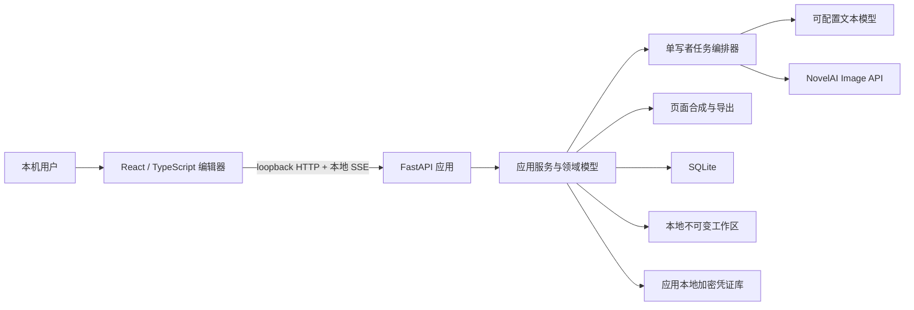
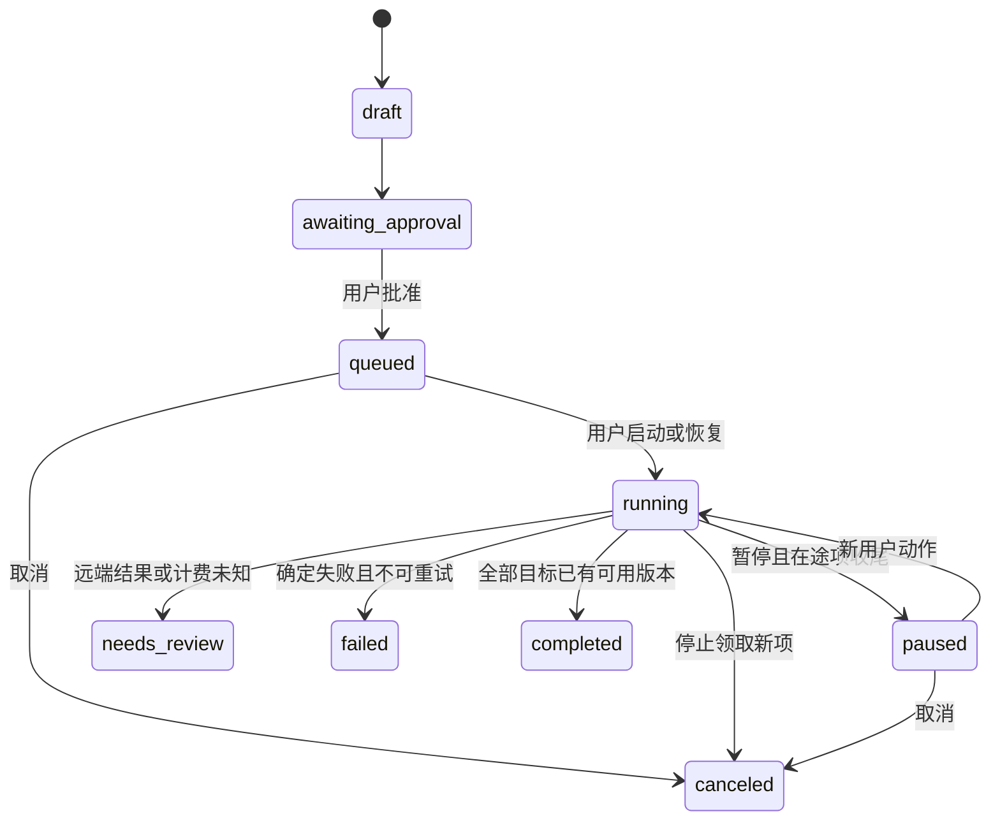

# Manga Maker 技术架构文档

| 项目 | 内容 |
|---|---|
| 文档版本 | v0.1 |
| 日期 | 2026-08-09 |
| 状态 | P0 离线 Mock 闭环已实现；P1/P2 目标架构与当前实现并存 |
| 对应产品文档 | [README.md](README.md)、[PRD.md](PRD.md) |
| P0 形态 | macOS 本机单用户、本地 Web 应用 |
| P0 验收单位 | 一个 TXT 小说章节的完整漫画化闭环 |

> 本文定义目标系统边界、组件、数据流、接口和验收方法。当前 P0 已交付从 TXT 到四格式导出的离线 Mock 单章闭环，并覆盖启动 reconciliation、未知计费、磁盘不足、诊断脱敏和凭证零泄露扫描；P1 已交付跨章节连续性账本。云模型链路仍只通过离线 Mock 验收，尚未执行真实付费图像调用或代表性授权章节的真实闭环。

## 1. 架构结论

Manga Maker P0 采用本地模块化单体：React/TypeScript 提供编辑界面，Python/FastAPI 承担领域逻辑、任务编排、模型适配、图片处理和导出，SQLite 保存结构化元数据，本地工作区保存不可变版本文件，应用本地加密凭证库保存供应商密钥。

最重要的技术决策如下：

1. **不把 NovelAI Scripting API 当作外部集成通道。** Scripting API 运行在 NovelAI 网页内部的隔离 Web Worker，只能调用预定义的 `api.v1` 接口，不能任意访问网络或 DOM；其 Generation API 当前是文字生成接口，不提供图片生成。Manga Maker 直接从本地后端调用独立的 Image API。
2. **NovelAI 只生成单格画面。** 页面格框、裁切、气泡、中文对白、旁白、音效和页码由本地确定性合成器完成。
3. **每次外部生成都来自可审计的人类操作。** 用户确认固定章节、面板清单、模型、参考图和成本上限后，才能启动有界任务；恢复暂停或崩溃任务需要新的用户操作。
4. **P0 默认串行。** 同一时刻最多存在一个在途 NovelAI 请求，不做隐藏并发、定时生成或无限后台生产。
5. **领域契约与供应商请求分离。** `GenerationSpec` 不直接复刻 NovelAI 请求体；版本化映射器把稳定的内部语义转换为当前官方字段。
6. **生成结果不可变。** reroll、inpaint、布局编辑和恢复只创建新版本或切换当前指针，不覆盖旧素材。
7. **P0 自建小型适配器。** GitHub 社区 SDK 用于理解字段、错误和测试设计，不作为未经审计的默认运行依赖；官方 Swagger 和实际契约测试才是接口真源。
8. **服务端输出是发布真源。** 浏览器画布用于编辑和预览，PNG/PDF/CBZ 由本地后端规范渲染，避免截图式导出漂移。

## 2. 证据边界与 NovelAI API 全景

### 2.1 证据优先级

实现时按以下顺序判断接口事实：

1. 当前 NovelAI 官方 Swagger 与官方文档；
2. 当前 NovelAI Terms of Service；
3. 用户批准的最小真实契约测试；
4. GitHub 社区实现和 README，仅作为交叉验证与设计参考；
5. 本文记录的字段示例。

模型 ID、参数范围、价格、限流和返回格式都可能变化。运行时遇到官方信息与本文不一致时，停止真实调用并更新适配器，不以社区代码或旧缓存猜测。

### 2.2 四类官方接口的职责

| 接口 | 官方入口 | 能力 | Manga Maker P0 决策 |
|---|---|---|---|
| Scripting API | [Scripting Introduction](https://docs.novelai.net/en/scripting/introduction/) | NovelAI 网页内 TypeScript 脚本、UI 扩展、文档操作、站内文字生成 | 不作为外部桥接或图片生产通道 |
| Primary API | [Primary API](https://api.novelai.net/docs) | 登录、订阅、故事与账户数据等 | 不接管账户；不收集邮箱/密码；不调用登录接口 |
| Image API | [Image API](https://image.novelai.net/docs/index.html) | 图片生成、流式图片生成、inpaint/img2img、upscale、Director Tools、Vibe 编码 | P0 的 NovelAI 生产接口 |
| Text API | [Text API](https://text.novelai.net/docs/index.html) | OpenAI-compatible chat/completions 与 NovelAI 原生文字生成 | 可选文本适配器，不取代通用 LLM 接口 |

### 2.3 为什么 Scripting API 不能承担 P0 集成

官方 Scripting 文档给出以下边界：

- 脚本由用户在 NovelAI 的 User Scripts 界面创建或导入，分为账户脚本和故事脚本；
- 脚本运行在隔离的 JavaScript 解释器和 Web Worker 中，只能使用预定义 `api.v1` 方法；
- 脚本不能任意发起网络请求、直接访问 DOM 或读取大部分账户信息；
- 脚本可能因禁用、切换故事或关闭界面随时卸载，重要状态必须放进 Scripting Storage；
- `api.v1.generate` 是站内文字生成。当前文档示例使用 OpenAI-like messages 和 `glm-4-6`，没有图片生成方法；
- 每个脚本当前存在输出 2048 token/4 分钟、输入窗口和用户交互恢复等限制；`api.v1.editor.generate` 在没有新用户交互时最多连续调用三次。

因此，Scripting API 无法安全地连接本机 FastAPI，也无法承担逐格 NovelAI 图片生成、素材落盘、任务恢复或版本管理。

P2 可以评估一个**完全独立的可选伴侣脚本**：在用户授权后，把选中的 NovelAI 故事内容整理为可下载文件，再由用户手工导入 Manga Maker。该能力不得绕过 Scripting 权限、不得尝试访问本机端口，也不属于 P0。

### 2.4 Image API 的 P0 接口面

2026-08-09 的实现基线读取 `https://image.novelai.net/docs/doc.json`：Swagger 2.0，
标题 `Omegalaser API`，版本 `1.0`，112,680 bytes，SHA-256 为
`f43ea4feff0d390dc65e5ed704d4cf7e75af741bb413b86981f465fb8fb556f8`。映射版本为
`novelai-image-2026-08-09.2`。注意同主机的 `/openapi.json` 当前标题为
`Observability API`，只包含错误追踪能力，不是 Image API 契约。审计元数据保存在
`contracts/novelai/`，应用启动时不会自动联网替换。

P0 只允许访问 `https://image.novelai.net` 的以下路径：

| 官方路径 | P0 用途 | 决策 |
|---|---|---|
| `POST /ai/generate-image` | 文生图、img2img、inpaint | 主生产路径；请求 `Accept: application/json` |
| `GET /ai/generate-image/suggest-tags` | 凭证与模型可用性检查、提示词辅助 | 必须由用户点击连接测试；不等于生成验收 |
| `POST /ai/upscale` | 用户明确触发的素材放大 | P0 可选；结果另建 AssetVersion |
| `POST /ai/generate-image-stream` | SSE 中间图与最终图 | P0 不使用；P1 再评估 |
| `POST /ai/augment-image` | Director Tools | P0 非必需；适配器保留扩展位 |
| `POST /ai/encode-vibe` | Vibe Transfer 编码 | P0 默认不使用，与 Precise Reference 分开评估 |

P0 选择非流式 JSON 的原因：

- 一格对应一次明确的最终结果，容易做原子落盘和失败恢复；
- 不需要保存大量中间去噪图；
- 浏览器仍可通过 Manga Maker 自己的 SSE 获得任务状态；
- 远端流式连接断开时更难判断最终结果和计费状态。

如果 P1 引入远端 SSE，必须先定义事件序号、最终事件判定、断流恢复和中间图清理策略。

### 2.5 Text API 的位置

官方 Text API 提供：

- `GET /oa/v1/models`；
- `POST /oa/v1/chat/completions`；
- `POST /oa/v1/completions`；
- JSON 与 SSE 响应；
- `x-correlation-id`；
- OpenAI-compatible 的 messages、model、temperature、max_tokens、stop 等字段。

Manga Maker 的文本改编仍面向 `TextModelProvider`，默认支持用户配置的 OpenAI-compatible 端点。NovelAI Text API 可以是其中一个预设，但不是硬编码依赖。结构化分镜必须在 Manga Maker 侧经过 JSON Schema 校验，不能假设任何供应商天然返回可靠 JSON。

### 2.6 身份认证边界

Image API Swagger 使用 `Authorization` 请求头。Persistent API Token 的官方描述格式为：

```text
Authorization: Bearer pst-<token>
```

Manga Maker 的规则：

- 只接收用户已经通过官方方式获得的 Persistent API Token；
- 不接收或保存 NovelAI 邮箱和密码；
- 不调用 `/user/login` 或 `/user/create-persistent-token`；
- Token 仅存入 Manga Maker 应用数据目录中的加密凭证库，SQLite 只保存不含秘密的 `credential_profile_id`；
- 用户设置主密码；软件使用 Argon2id 和随机 salt 派生加密密钥，主密码与派生密钥均不落盘；
- 凭证库采用带认证加密并原子写入，目录仅允许当前 macOS 用户访问；应用关闭后清除内存中的解锁密钥；
- 忘记主密码时只能重置凭证库并重新录入 Token，不能通过项目文件或软件后门恢复；
- 前端永远看不到 Token，后端只在发请求前临时读取；
- 请求头、异常、崩溃报告和工程包必须执行字段级脱敏。

凭证库使用单文件版本化容器：明文 header 只保存 magic、格式版本、Argon2id 参数、随机 salt 和随机 nonce；供应商名称、profile、Token 与校验数据全部放在 XChaCha20-Poly1305 密文中，header 作为 associated data 参与认证。KDF 参数在目标 Mac 上校准到约 300–500 ms，内存成本不得低于 64 MiB；参数升级时先解锁旧 vault，再原子迁移到新版本。

用户第一次保存凭证时创建主密码。应用启动后默认保持锁定，首次连接测试或生成时要求解锁；用户可以随时手动锁定。进程可以在当前会话中缓存解锁密钥，但不写磁盘、不放入前端状态，并尽量减少内存副本。该方案防护的是磁盘文件、项目包和普通备份泄露，无法抵御已经控制当前 macOS 账户或读取已解锁进程内存的攻击者。

## 3. 社区调研与采用边界

调研日期为 2026-08-09。以下项目只作为设计证据，没有被引入仓库或安装为运行依赖。

| 项目 | 许可与观察 | 可借鉴部分 | 不直接采用的原因 |
|---|---|---|---|
| [Aedial/novelai-api](https://github.com/Aedial/novelai-api) | MIT；Python；区分 low-level/high-level；有 schema 与 API 测试 | 供应商底层映射与高层语义分离、契约校验 | 覆盖账户登录和故事数据，README 仍展示用户名/密码取 token；与本项目最小账户权限边界不同 |
| [caru-ini/novelai-sdk](https://github.com/caru-ini/novelai-sdk) | MIT；Python；Pydantic v2；用户模型/API 模型双层；支持 Precise Reference、多角色与 SSE | 强类型参数、两层 DTO、图片预处理和流式事件建模 | 社区 SDK 不能替代官方契约；测试和安全审计完成前不进入 P0 运行依赖 |
| [Nya-Foundation/NekoAI-API](https://github.com/Nya-Foundation/NekoAI-API) | AGPL-3.0；交叉核对 commit `58e595d6f1a07aafc510eb946377df8066ade0bb`；覆盖生成、inpaint、Vibe、Director Tools、重试与节流 | 模型字符串、异步资源管理、错误分类、参考编码缓存思路 | 只记录独立观察结论，不复制代码；AGPL 分发义务、账户凭证入口和宽泛自动重试不适合 P0 |
| [NovelAI/novelai-image-metadata](https://github.com/NovelAI/novelai-image-metadata) | NovelAI 官方 GitHub；MIT；读取/验证 PNG 隐藏元数据和签名 | 原始素材元数据检查、导入兼容性和验证测试 | 元数据不能替代 Manga Maker 自己的审计记录；官方 upscale 明确不带 NovelAI 元数据 |
| [zhulinyv/Auto-NovelAI-Refactor](https://github.com/zhulinyv/Auto-NovelAI-Refactor) | GPL-3.0；NovelAI WebUI；批量生成、inpaint、角色分区和元数据工具 | 生成参数工作台、素材筛选、批处理可见性 | 明文 `.env`、量产导向和许可证边界不符合 P0 的本地加密凭证库、人类审批与受控负载设计 |
| [victorhuangwq/story-to-manga](https://github.com/victorhuangwq/story-to-manga) | MIT；Next.js；故事分析、角色参考、逐格生成、渐进展示、rerun | “先角色、再分镜、再面板”的渐进体验，单格重跑入口 | 浏览器 localStorage/IndexedDB 不足以承担本项目的不可变版本、恢复和大素材单一真源 |
| [LingyiChen-AI/AIComicBuilder](https://github.com/LingyiChen-AI/AIComicBuilder) | Apache-2.0；Next.js + SQLite；多供应商；阶段化剧本/角色/分镜/素材任务 | 各阶段可独立触发、看板状态、版本和供应商适配层 | 目标是漫剧/视频流水线，不包含本项目的 SourceAnchor、分页文字合成和 NovelAI 专用合规边界 |

结论：没有现成项目同时满足 TXT 来源锚点、单章审批、NovelAI 逐格生成、本地中文排版、页/格不可变版本、应用本地加密凭证库、崩溃后未知计费处理和四类导出。因此 P0 继续采用定制模块化单体，但复用社区已经验证的架构模式，不复制不兼容许可证代码。

未来若要引入社区依赖，必须逐项完成：锁定版本/commit、许可证审查、依赖与秘密处理审查、离线契约测试、真实低成本测试和替换/回退方案。

## 4. 系统上下文



### 4.1 信任边界

| 边界 | 内部数据 | 可外发数据 | 禁止外发 |
|---|---|---|---|
| 浏览器 ↔ FastAPI | 编辑命令、预览、蒙版、任务控制 | 无公网外发 | Token、凭证库明文与解锁密钥 |
| FastAPI ↔ 文本模型 | 所选章节、StoryBeat、必要设定、结构化指令 | 用户确认的数据类别 | 整本未选 TXT、NovelAI Token |
| FastAPI ↔ NovelAI | 当前面板提示词、负面词、参考图、base image、mask、参数 | 当前 GenerationSpec 需要的最小集合 | 小说全文、其他项目素材、LLM 密钥 |
| 工作区 ↔ 导出 | 已选页面版本、文字与元数据 | 用户明确选择的导出 | 密钥、调试日志、废弃版本；发布包不含源小说 |

首次调用每个云供应商前，界面必须展示外发数据类别、目标主机和官方条款链接。

## 5. 模块划分

### 5.1 前端

| 模块 | 职责 |
|---|---|
| Project Shell | 项目阶段、保存状态、全局错误和恢复入口 |
| TXT Importer | 编码预览、章节拆分/合并、范围确认 |
| Adaptation Workbench | 原文/StoryBeat、页面树、分格编辑与来源覆盖 |
| Bible Editor | 角色设定、风格板、参考图与审批 |
| Generation Console | 任务范围、成本估算、开始/暂停/恢复/取消、错误处置 |
| Page Canvas | 格框、裁切、气泡、文字、音效、蒙版和阅读顺序 |
| Version Browser | AssetVersion/PageVersion 比较、选择和恢复 |
| Export Center | 预检、格式选择、ExportRevision 与恢复包 |

前端状态只保存正在编辑的短期草稿和 UI 偏好。项目真源始终在后端；刷新页面后必须从 SQLite 与版本文件恢复。

### 5.2 后端

| 模块 | 职责 |
|---|---|
| API Layer | loopback 会话、命令校验、乐观锁、SSE 事件 |
| Application Services | 用例编排、审批失效、影响分析、事务边界 |
| Domain | Project、Storyboard、Bible、Page、Panel、Job、版本规则 |
| TXT Ingestion | 编码检测、章节边界、SourceAnchor 和哈希 |
| LLM Adapter | 结构化改编、两次修复上限、token 与错误归一化 |
| Prompt Compiler | 把 Storyboard/Bible/Panel 编译为供应商无关 PromptPlan |
| NovelAI Adapter | 字段映射、本地凭证库、HTTP、响应解包、错误分类 |
| Job Orchestrator | 串行领取、预算、暂停/取消、恢复和审计 |
| Asset Store | 临时写入、解码校验、哈希、不可变文件和回收标记 |
| Page Renderer | 页面规范渲染、字体检查、预览与正式输出 |
| Exporter | 工程包、PNG、PDF、CBZ、清单与秘密扫描 |

### 5.3 目标代码结构

以下目录是模块化演进目标；当前仓库已经实现其中的 `api`、`ingestion`、`adaptation`、`bibles`、`novelai`、`generation`、`pages`、本地持久化基础和 React 前端，其余按 [WORK_ITEMS.md](WORK_ITEMS.md) 扩展：

```text
backend/
├── app/
│   ├── api/                 # FastAPI routes、SSE、session
│   ├── application/         # commands、queries、use cases
│   ├── domain/              # 供应商无关领域对象与状态机
│   ├── adapters/
│   │   ├── llm/
│   │   ├── novelai/
│   │   ├── credential_vault/
│   │   └── persistence/
│   ├── ingestion/
│   ├── rendering/
│   ├── exporting/
│   └── workers/
├── migrations/
└── contracts/
    └── novelai/             # 经审阅的 Swagger 快照、哈希和 mock fixtures
frontend/
├── src/features/
├── src/canvas/
├── src/api/
└── src/types/
schemas/                     # Storyboard/Bible/Project Package JSON Schema
tests/
├── unit/
├── contract/
├── recovery/
├── rendering/
└── e2e/
```

## 6. 核心数据设计

### 6.1 SQLite 表族

| 表族 | 主要表 | 关键约束 |
|---|---|---|
| 项目与来源 | `projects`、`source_files`、`source_chapters`、`source_anchors`、`story_beats` | 源版本不可变；offset 与摘录哈希可复核 |
| 改编与设定 | `storyboards`、`storyboard_versions`、`character_bibles`、`style_bibles`、`approvals` | 修改创建新版本；审批绑定精确版本哈希 |
| 页面与素材 | `comic_pages`、`generation_specs`、`asset_versions`、`page_versions` | 当前指针可切换；版本行不可更新内容 |
| 任务 | `generation_jobs`、`generation_items`、`user_actions`、`provider_attempts` | Job 范围不可变；每次 attempt 关联人类动作 |
| 成本与审计 | `cost_estimates`、`cost_records`、`audit_events` | 追加式；估算与供应商可验证实际值分开 |
| 导出 | `export_revisions`、`export_files`、`package_manifests` | 绑定固定 PageVersion 清单与 SHA-256 |

SQLite 启用 foreign keys、WAL、busy timeout 和 schema migration。一个进程内只有单写者执行数据库写命令，读取使用独立连接。编辑命令携带 `expected_revision`，发现版本冲突返回 409，不静默覆盖。

### 6.2 文件工作区

```text
workspace/projects/<project_id>/
├── manifest.json
├── source/
│   ├── original.txt
│   └── chapters/<chapter_id>/<version>.txt
├── storyboard/versions/
├── bibles/characters/
├── bibles/styles/
├── assets/
│   ├── references/<sha256>.<ext>
│   ├── panels/<panel_id>/<asset_version_id>/original.png
│   ├── panels/<panel_id>/<asset_version_id>/provenance.json
│   ├── masks/<mask_asset_id>.png
│   └── staging/
├── pages/<page_id>/<page_version_id>/
├── exports/<export_revision_id>/
└── audit/
```

正式文件名使用稳定 ID 或内容哈希，不依赖标题和页码。源图片、参考图和蒙版都先检查类型、尺寸、像素总量和解码结果；不信任扩展名。

### 6.3 跨 SQLite 与文件系统的一致性

SQLite 事务与文件重命名无法形成真正的跨资源原子事务，因此采用可恢复的两阶段提交：

1. 在 SQLite 创建 `staging` 记录和预期路径；
2. 把响应写入项目内 staging 文件，完成解码、尺寸和 SHA-256 校验；
3. `fsync` 后原子重命名到不可变目标路径；
4. 在 SQLite 事务中把 AssetVersion 标为 `ready`，更新当前指针并写审计事件；
5. 启动时 reconciliation 扫描悬空记录、孤立 staging 和已存在但未登记的目标文件。

只有第 4 步完成后，前端才能把素材视为正式版本。清理只处理确认无引用的 staging；P0 不自动物理删除正式版本。

## 7. 内部接口契约

### 7.1 本地 HTTP API

下表是 P0 完整目标契约。当前写接口均要求启动会话令牌和 CSRF token；涉及付费生成与任务控制的后续接口还必须加入 `Idempotency-Key` 和 `expected_revision`。

| 方法与路径 | 用途 |
|---|---|
| `POST /api/v1/projects` | 创建本地项目，不调用云模型 |
| `POST /api/v1/projects/{id}/source/preflight` | TXT 编码和章节预检 |
| `POST /api/v1/projects/{id}/source/confirm` | 固化 SourceChapter 版本 |
| `PUT /api/v1/projects/{id}/adaptation/text-model` | 保存非敏感模型配置；凭证仅引用本地 vault profile |
| `POST /api/v1/projects/{id}/adaptation/text-model/test` | 用户明确触发连接测试 |
| `POST /api/v1/projects/{id}/adaptation/storyboards/generate` | 用户触发所选章节的结构化改编 |
| `POST /api/v1/projects/{id}/adaptation/storyboards/{version_id}/revisions` | 将人工修改保存为不可变新版本 |
| `POST /api/v1/projects/{id}/adaptation/storyboards/{version_id}/approve` | 对固定内容哈希进行分镜审批 |
| `POST /api/v1/projects/{id}/bibles/generate` | 从当前已审批分镜在本机确定性草拟角色表与风格板 |
| `POST /api/v1/projects/{id}/bibles/characters/{version_id}/revisions` | 保存不可变 CharacterBible 新版本和受影响面板清单 |
| `POST /api/v1/projects/{id}/bibles/styles/{version_id}/revisions` | 保存不可变 StyleBible 新版本并使生成就绪失效 |
| `POST /api/v1/projects/{id}/bibles/{kind}/{version_id}/references` | 校验授权、真实图片类型/尺寸/像素/解码与哈希后绑定参考图 |
| `POST /api/v1/projects/{id}/bibles/{kind}/{version_id}/approve` | 独立审批角色表或风格板的精确版本哈希 |
| `GET /api/v1/projects/{id}/novelai/capabilities` | 读取固定契约哈希、allowlist 和模型能力，不联网 |
| `PUT /api/v1/projects/{id}/novelai/config` | 保存模型、超时和本地 vault profile 引用，不保存 Token |
| `POST /api/v1/projects/{id}/novelai/connection-test` | 用户点击触发一次标签建议查询；不出图、不自动重试 |
| `POST /api/v1/projects/{id}/generation/estimate` | 固定版本和 panel 清单，计算用户保守预留，不生成 |
| `POST /api/v1/projects/{id}/generation/jobs` | 用户确认后固化有界 Job、调用/成本上限和用户动作 |
| `POST /api/v1/projects/{id}/generation/jobs/{job_id}/start` | 使固定 Job 进入可执行状态；此操作本身不请求图像 |
| `POST /api/v1/projects/{id}/generation/jobs/{job_id}/execute` | 校验精确 revision 与二次确认字面量，显式调度冻结队列 |
| `POST /api/v1/projects/{id}/generation/jobs/{job_id}/pause` | 当前在途项可收尾，停止领取新项 |
| `POST /api/v1/projects/{id}/generation/jobs/{job_id}/resume` | 新的人类操作，恢复领取资格 |
| `POST /api/v1/projects/{id}/generation/jobs/{job_id}/cancel` | 取消 queued 项并保留在途结算记录 |
| `GET /api/v1/projects/{id}/generation/assets` | 列出当前不可变面板素材元数据 |
| `GET /api/v1/projects/{id}/generation/assets/{asset_version_id}/content` | 经本地会话保护读取原始 PNG |
| `GET /api/v1/projects/{id}/generation/assets/panels/{panel_id}/versions` | 列出面板不可变素材分支 |
| `POST /api/v1/projects/{id}/generation/assets/{version_id}/activate` | 仅切换素材当前指针，不调用外部服务 |
| `POST /api/v1/projects/{id}/generation/masks` | 校验并冻结与父素材绑定的本地 PNG 蒙版 |
| `POST /api/v1/projects/{id}/generation/revisions/estimate` | 固定 reroll/inpaint 父版本、目标和成本预留，不出图 |
| `POST /api/v1/projects/{id}/generation/revisions/jobs` | 第一次确认后创建有界 revision Job，不出图 |
| `GET /api/v1/projects/{id}/pages/templates` | 读取本机 1–6 格模板，不访问外部服务 |
| `POST /api/v1/projects/{id}/pages/draft` | 从当前已生成素材创建规范 PageVersion 与 PNG |
| `GET /api/v1/projects/{id}/pages?chapter_id=...` | 列出章节的当前页面版本 |
| `POST /api/v1/projects/{id}/pages/{page_id}/versions` | 以乐观锁保存布局/文字新版本，仅在本机渲染 |
| `GET /api/v1/projects/{id}/pages/{page_id}/versions/{version_id}/content` | 经本地会话保护读取规范页面 PNG |
| `GET /api/v1/projects/{id}/pages/{page_id}/versions` | 列出页面不可变历史与分支 |
| `POST /api/v1/projects/{id}/pages/{page_id}/versions/{version_id}/activate` | 以乐观锁恢复页面版本，不调用外部服务 |
| `POST /api/v1/panels/{id}/reroll` | 创建单格新 seed 任务 |
| `POST /api/v1/panels/{id}/inpaint` | 固化父素材、蒙版和局部重绘任务 |
| `POST /api/v1/pages/{id}/reroll` | 为当前页所有面板创建有界任务 |
| `POST /api/v1/pages/{id}/versions/{version}/activate` | 恢复页面版本，不调用外部 API |
| `POST /api/v1/exports` | 生成 ExportRevision |
| `GET /api/v1/events` | 本地 SSE 状态流 |

同一个 `Idempotency-Key` 重复提交只能返回原命令结果，不能创建第二个付费 Job。

### 7.2 文本模型适配器

```python
class TextModelProvider(Protocol):
    async def validate_configuration(self) -> ProviderValidationResult: ...
    async def generate_storyboard(self, request: StoryboardRequest) -> ModelCandidate: ...
    async def repair_structured_output(self, request: RepairRequest) -> ModelCandidate: ...
```

`ModelCandidate` 同时保存：供应商、模型、端点主机、模板版本、原始响应哈希、解析结果、token、耗时和错误。默认不保存完整原始小说与完整供应商响应；需要调试时由用户显式开启并显示隐私提示。

### 7.3 图片生成适配器

```python
class ImageGenerationProvider(Protocol):
    async def validate_configuration(self, user_action_id: UUID) -> ValidationResult: ...
    def estimate(self, specs: Sequence[GenerationSpec]) -> CostEstimate: ...
    async def generate(self, spec: GenerationSpec, attempt: ProviderAttempt) -> GeneratedAsset: ...
    async def inpaint(self, spec: InpaintSpec, attempt: ProviderAttempt) -> GeneratedAsset: ...
    async def upscale(self, spec: UpscaleSpec, attempt: ProviderAttempt) -> GeneratedAsset: ...
```

所有方法先检查：审批哈希未失效、Job 包含目标、预算有余量、用户动作有效、当前没有其他在途请求。检查失败不得构造 `Authorization` 请求头。

## 8. NovelAI 请求映射

### 8.1 稳定内部对象

`GenerationSpec` 至少包含：

- `spec_version`、`mapping_version`；
- `panel_id`、`storyboard_version_id`、`character_bible_version_id`、`style_bible_version_id`；
- `provider_model_id` 和用户可读 `model_label`；
- `PromptPlan`、负面提示、角色区域；
- width、height、steps、scale、sampler、noise schedule、seed；
- 参考图版本、用途、Strength、Fidelity、预处理哈希；
- reroll/inpaint 的父素材与蒙版；
- 估算成本和审批哈希。

内部对象不暴露任意供应商 JSON。前端无法注入未知字段、任意 URL 或供应商私有参数。

### 8.2 映射到官方 Image API

当前 Swagger 的请求根对象包含 `action`、`input`、`model`、`parameters`。适配器只从 allowlist 生成字段：

| 内部语义 | 官方字段方向 |
|---|---|
| 基础提示 | `input`、`parameters.prompt`、`parameters.v4_prompt.caption.base_caption` |
| 负面提示 | `parameters.negative_prompt`、`parameters.v4_negative_prompt` |
| 多角色 | `v4_prompt.caption.char_captions[]` 与坐标；负面角色提示同样分区 |
| 画布与采样 | `width`、`height`、`steps`、`scale`、`sampler`、`noise_schedule`、`seed` |
| Precise Reference 图片 | `director_reference_images[]` |
| 参考类型 | `director_reference_descriptions[]` 的 `character`、`style` 或 `character&style` 语义 |
| Strength | `director_reference_strength_values[]` |
| Fidelity | `director_reference_secondary_strength_values[]` |
| img2img/inpaint | `image`、`mask`、`strength`、`noise`、`img2img`、`add_original_image` |

Swagger 当前对不少字段没有 `required`、enum 或完整范围定义，因此不能只靠自动生成客户端。实施时必须维护：

- 手工审阅的 Pydantic 请求模型；
- 每个支持模型的 capability profile；
- 从官方文档生成的正反契约 fixture；
- `mapping_version` 和官方 Swagger SHA-256；
- 真机 smoke 后确认的字段组合。

### 8.3 Prompt Compiler

提示词按确定顺序编译：

```text
StyleBible 固定风格
→ 场景与时间地点
→ 面板叙事目的和镜头
→ 角色公共数量/关系/动作
→ 各角色独立外观、服装、情绪与区域
→ 连续性道具和必须出现元素
→ no text / no speech bubble 等本地排版约束
→ 项目与面板负面提示
```

编译结果同时保留人类可读分段和供应商字符串，便于定位角色串扰。相同已审批输入必须生成相同 `PromptPlan` 哈希。

### 8.4 多角色策略

官方文档说明 V4 及以上支持最多六个角色的独立提示，并能给出粗略位置；角色数量标签应放在 base prompt，单个角色框只描述角色本身。位置只是建议，不能当作严格布局约束。

P0 顺序：

1. 单角色面板优先使用一个 V4.5 Precise Reference；
2. 多角色面板使用 base prompt + 独立 character captions + 坐标；
3. 不同时叠加多个角色 Precise Reference，因为官方文档明确会把多个角色参考融合；
4. 角色仍混淆时，拆成分步 img2img/inpaint，由用户选择结果；
5. 最终以人工一致性抽检为准。

### 8.5 Precise Reference 预处理

官方文档的当前约束：

- 仅 V4.5 模型可用；
- 类型为 Character、Style、Character & Style；
- 每张参考图当前每次生成额外消耗 5 Anlas，数量叠加；
- 推荐大尺寸为 1024×1536、1472×1472 或 1536×1024；
- 服务会缩放并 padding；Swagger 描述要求用黑色 padding 适配；
- Strength 与 Fidelity 均需记录；
- Precise Reference 当前与 Vibe Transfer 不兼容。

Manga Maker 在本地生成规范化副本，不改动用户原图：自动选择最接近画布、保持比例、黑色 padding、记录变换矩阵和输出哈希。用户确认界面同时显示原图与规范化预览。

### 8.6 inpaint

内部蒙版统一为：白色表示允许替换，黑色表示保留，8-bit 单通道 PNG，尺寸必须与父素材一致。NovelAI Adapter 负责转换为当前官方接口所需格式；不能把内部颜色约定直接当作永久供应商契约。

inpaint 流程：

1. 用户选定不可变父 AssetVersion；
2. 画布创建不可变 MaskAsset，并拒绝空蒙版、全图误选和尺寸不符；
3. 用户编辑局部提示词，查看参考图与预计成本；
4. 创建只含一个目标的 GenerationJob；
5. 结果成为新的 AssetVersion，`parent_asset_version_id` 指向父素材；
6. 基于当前页面创建新 PageVersion，其他面板版本不变。

官方 UI 文档还描述了 Focused Inpainting，但 Swagger 没有给出稳定的同名 P0 契约，因此本文不把它承诺为 P0 API 能力。

### 8.7 响应处理与元数据

`POST /ai/generate-image` 使用 `Accept: application/json` 时，官方响应为 `images[]`，包含 base64 图片、index 和 seed。处理顺序：

1. 校验 HTTP 状态、Content-Type 和响应体上限；
2. base64 解码到 staging，不把内容写日志；
3. 验证 PNG 魔数、完整解码、尺寸、像素数量和非空图像；
4. 保存供应商返回 seed、模型、参数、提示词哈希、参考图哈希、时间和 correlation ID；
5. 原始 NovelAI PNG 原样保留为 `original.png`；
6. 合成或发布时使用重新编码的派生图，避免把提示词等生成元数据带入 PNG/PDF/CBZ。

官方 `novelai-image-metadata` 项目可用于测试元数据提取和签名验证，但 Manga Maker 的 provenance sidecar 才是项目内真源。官方 upscale 响应明确不带 NovelAI 元数据，因此放大结果必须通过父版本链追溯。

## 9. 人工触发、队列与状态机

### 9.1 审批快照

“开始生成”不是一个无限授权，而是创建不可变 `GenerationApproval`：

- 精确 storyboard/bible 版本与哈希；
- 明确 panel ID 列表；
- 每格至多多少次尝试；
- 模型、参考图、调用上限和成本上限；
- 用户动作 ID、时间和界面展示摘要哈希；
- 到期和撤销状态。

任一输入版本变化会使批准失效。新增面板、整页 reroll、单格 reroll 和 inpaint 都需要新的估算与用户动作。

官方 Image API 明确要求所有生成请求由人的操作触发，并禁止造成过量负载的自动化。P0 将一次人工批准解释为启动一个明确、有限、可随时停止的单章队列；实施前必须再次核对最新条款。如果官方解释要求逐请求操作，产品降级为逐页或逐格确认，不设计规避机制。

### 9.2 Job 与 Item 状态



Job 状态沿用 PRD 的统一枚举。GenerationItem 使用 `queued / running / needs_review / failed / completed / canceled`；重试等待由独立 attempt 记录承载，不用 Job 总状态推测单格结果。数据库的 partial unique index 与单写者事务共同保证全应用最多一个 `running` attempt；用户在发送前暂停时，预备 attempt 退回 queued 且不消耗请求计数。

### 9.3 崩溃恢复

启动时：

- `queued` 不自动开始；
- 有 `running` attempt 的 Job 和 item 进入 `needs_review`，不猜测是否计费；
- 其余 `running` Job 恢复为 `paused`；
- 中断的导出被标记为 `PROCESS_RESTARTED`，其 staging/final 半成品移动到 `.failed-*` 恢复边界，不发布为成功版本；
- 中断的项目创建/恢复目录移动到 `.orphan-recovery-*`，不静默删除；
- 素材和页面 staging、未登记版本文件、缺失文件、哈希错误、外键错误及项目内疑似凭证文件进入持久化完整性摘要；
- 用户查看范围和已产生成本后，必须点击恢复。

这样既保留断点，也不会因应用重启自动产生新的付费调用。

## 10. 错误、重试与未知计费

| 场景 | 分类 | 自动行为 |
|---|---|---|
| 本地参数/schema 错误 | `INVALID_SPEC` | 不发请求，要求修正 |
| 未审批/审批失效/超预算 | `APPROVAL_REQUIRED` | 不发请求 |
| 401 | `PROVIDER_UNAUTHORIZED` | 停止队列，不重试 |
| 403 | `PROVIDER_FORBIDDEN` | 停止队列，不重试 |
| 明确余额/额度不足 | `PROVIDER_QUOTA` | 暂停，不重试，重新估算 |
| 400/422 或内容参数错误 | `PROVIDER_REJECTED` | 不重试 |
| 429 | `PROVIDER_RATE_LIMITED` | 默认暂停；只有当前官方 Image 契约明确给出可用 Retry-After 时才允许一次有界等待 |
| 建连前网络失败 | `NETWORK_PRE_SEND` | 最多重试两次，有界指数退避 |
| 已发送请求后超时/断线 | `UNKNOWN_PROVIDER_OUTCOME` | `needs_review`，不自动重发 |
| 明确 5xx 响应 | `PROVIDER_TEMPORARY` | 最多重试两次；保留每次 correlation ID |
| 响应损坏/图片不可解码 | `INVALID_PROVIDER_RESPONSE` | 不登记版本；若可能已计费则人工审阅 |
| 磁盘不足/写入失败 | `LOCAL_STORAGE_FAILURE` | 阻止下一请求，不更新当前指针 |

每次请求生成 UUIDv7 `X-Correlation-ID`，同时记录本地 `attempt_id`。日志不得记录 Authorization、完整 prompt、base64、小说正文或图片字节。

## 11. 成本模型

成本记录分三层：

1. `CostPolicySnapshot`：估算时使用的模型规则、参考图附加规则、来源 URL、抓取日期和哈希；
2. `CostEstimate`：每格区间、Job 上限、参考图附加成本和风险说明；
3. `CostRecord`：实际请求数、成功/失败/重试、供应商可验证的扣费值，或明确标记为 `estimated_only`。

当前未引入可能漂移的供应商定价公式。界面要求用户输入“每格保守预留上限”，每次实际发送前累加分配值，超限则不发请求。Image API 成功响应当前不回传可验证的逐次成本，因此结果显示为 `not_reported`，不得把保守预留改名为实际成本。

Swagger 没有为所有模型暴露稳定的实时价格和单次扣费响应。系统不得把本地成本表计算值伪装成账户实际扣费，也不为查询余额而扩大 Primary API 账户权限。用户看到的“实际”只包含供应商响应或官方可验证数据；否则显示“按规则估算”。

Precise Reference 当前的 5 Anlas/参考图/生成可进入官方规则快照，但仍需在真实调用前刷新。

## 12. 本地页面合成

### 12.1 页面模型

PageVersion 是以下内容的不可变快照：

- 页面尺寸、阅读方向和模板版本；
- 每个格框的规范化坐标、层级和裁切；
- 每个 Panel 选用的 AssetVersion；
- 气泡、对白、旁白、音效、页码的文本与样式；
- 字体文件哈希、排版引擎版本和渲染参数；
- 父版本与变更原因。

### 12.2 渲染管线

```text
PageVersion JSON
→ schema 校验
→ 字体授权/存在性检查
→ 2048×3072 规范画布
→ 格框与图像裁切
→ 气泡/旁白/音效/页码
→ 溢出、遮挡和阅读顺序检查
→ 预览 PNG
→ 正式 PNG
→ PDF / CBZ
```

浏览器和后端共享坐标模型与文本测量测试，但正式导出以后端为准。前端显示“预览与正式渲染差异”警告，黄金页面测试比较像素差、文字边界和页序。

当前实现固定 2048 × 3072 像素坐标、六种 1–6 格模板、10 px 黑色格框、灰度面板素材、对白椭圆、旁白圆角框、描边音效字和页码。素材以 cover-crop 加焦点与缩放参数放置；中文按字符换行，无法在边界内排下时拒绝版本而不生成不可读页面。PNG 压缩参数、渲染器版本和字体文件 SHA-256 写入 PageVersion，同一输入的回归测试比较完整文件哈希。`comic_pages` 保存当前指针，`page_versions` 内容只追加并可用 `source_job_id` 回溯 revision Job，`mask_assets` 固定父素材和蒙版哈希。

## 13. 导出与恢复

### 13.1 可编辑工程包

`.manga-maker.zip` 包含版本化 manifest、源章节、Storyboard、Bible、素材、PageVersion、审计摘要和 SHA-256 清单。导入时先在临时目录 dry-run：

- 拒绝绝对路径、`..`、符号链接和 Zip Slip；
- 限制文件数、单文件大小、总解压大小和压缩比；
- 校验 schema 版本、必需文件、哈希和磁盘空间；
- 项目 ID 冲突时创建新本地实例 ID；
- 用户确认后再写入正式项目库。

### 13.2 发布格式

- PNG：零填充页号，2048×3072；
- PDF：与 PNG 同页序，尽量保留矢量中文文字；
- CBZ：复用最终 PNG 与漫画元数据；
- 发布格式不包含小说正文、参考图原件、提示词、Token、调试日志或废弃版本。

导出先写独立 staging 目录，全部格式通过页数、尺寸、页序、打开测试和秘密扫描后，才登记 ExportRevision。

当前数据库 schema 为 v13。`export_revisions` 冻结按阅读顺序排列的 PageVersion、版本号、尺寸和渲染 SHA-256，并登记发布前秘密扫描摘要；`export_files` 逐文件登记类型、序号、大小与 SHA-256；`recovery_runs` 只持久化脱敏的本地完整性计数。工程包 schema v1.1 增加 ContinuityLedger 版本与审批。Exporter 生成逐页 PNG、由相同 PNG 合成的 PDF、带 `ComicInfo.xml` 的 CBZ，以及含 `records.json`/文件清单的 `.manga-maker.zip`。只有四种结果和解包后的 ZIP 条目全部完成凭证字节扫描，staging 才原子移动到正式导出目录并提交 `completed`；失败版本只登记安全错误码，之前的成功目录和哈希不变。

### 13.3 跨章节连续性账本

`continuity_ledgers` 为每个项目保存一个稳定账本，`continuity_ledger_versions` 只追加不可变 JSON 快照，`continuity_approvals` 独立保存用户批准证据。账本必须按当前章节集的序号推进；每次草拟只读取该章当前已审批的 Storyboard 与 CharacterBible，不调用模型。状态项用稳定 key 跨版本保留 entry ID，覆盖角色、服装、道具、场景和剧情五类，并保留来源章节与分格。

手工修改先与父版本比较，再扫描序号更大的当前已审批 Storyboard：角色/服装按人物名，道具/场景按可见文本，剧情变化保守命中未来分格。影响报告只提供审稿范围，不自动修改分镜或启动图片生成。上游分镜或角色设定变化后，未批准账本不能沿用旧来源；进入下一章前必须批准当前版本。

工程包导入首先只把上传内容放入应用级 import staging，并在不解压到工作区的情况下检查重复名、绝对路径、反斜杠、`..`、符号链接、文件数、单文件/总展开大小、压缩比、schema、对象计数、清单完整性、逐文件 SHA-256 和可用磁盘空间。用户第二次确认后，才在新的 project staging 解出清单允许的文件。项目 ID 冲突会为所有主键和外键生成新 UUIDv7，同时递归更新版本 JSON 引用、重算文档哈希并保留 `source_project_id`；任何失败把半成品留在 orphan 边界，不覆盖既有项目。

## 14. 本地安全架构

- FastAPI 仅绑定 `127.0.0.1` 和 `::1`，P0 不提供公网开关；
- 启动时生成随机端口、内存会话令牌和 CSRF token；
- 严格校验 `Origin`/`Host`，CORS 不允许通配；
- 前端静态资源随应用提供，不加载第三方脚本、字体或分析 SDK；
- NovelAI host 固定 allowlist，禁止前端控制目标 URL，防止 SSRF；
- LLM 自定义 endpoint 独立校验，禁止把 URL 中的凭证写日志；
- 上传和工程包按文件签名解析，限制尺寸、像素、解压量和路径；
- 凭证库只允许后端访问；解锁后的 Token 只在发送请求所需的短期内存中存在，进程退出即清除；
- 凭证库建议位于 `~/Library/Application Support/Manga Maker/secrets/credentials.vault`，目录权限 `0700`、文件权限 `0600`，不得放入项目、云同步目录或导出包；
- 加密基线使用 XChaCha20-Poly1305；主密码使用 Argon2id 与随机 salt 派生，参数随 vault header 版本化；更换算法必须新增 ADR 和迁移测试；
- 变更凭证采用临时文件、`fsync` 和原子替换；认证失败不得输出密文、明文或可用于离线猜测的额外诊断；
- P0 不提供主密码找回或凭证自动备份。用户可重置凭证库并重新录入密钥，项目与素材不受影响；
- 日志使用字段 allowlist，异常对象先归一化再输出；
- 桌面启动器默认关闭 HTTP access log；持久诊断只允许安全错误码和字段级脱敏对象，不记录 URL 查询、正文、完整提示词或请求头；
- 删除项目默认进入可恢复区域，永久清除使用独立明确操作；
- 每次导出执行秘密模式扫描和 manifest 内容检查。
- 若已配置凭证库但尚未解锁，导出在创建 staging 之前失败关闭；扫描在内存中读取当前凭证字节并检查普通文件及 ZIP 条目，不把命中内容写入响应或审计。

NovelAI 当前条款说明用户保留其内容权利、请求内容默认不在未同意时记录，并可能对参考图、mask、img2img base image 做使用客户端提供密钥的短期加密缓存。Manga Maker 仍把任何发送到 NovelAI 的数据视为外部传输，并在首次调用前取得用户确认。

## 15. 可观察性

### 15.1 结构化事件

每个事件至少包含：

- `event_id`、时间、事件类型；
- project/job/item/panel/page ID；
- user_action_id、attempt_id、correlation_id；
- 状态迁移前后、耗时、重试序号；
- 模型标签、mapping version、spec hash；
- 成本估算或可验证实际值；
- 安全的错误代码。

不包含 Token、完整小说、完整提示词、base64 或图片内容。用户可从 UI 导出脱敏诊断包，并在导出前预览字段清单。

### 15.2 进度

进度只显示可核验计数：

- 目标面板数；
- pending/running/succeeded/failed/needs_review 数；
- 已合成页面数；
- 请求数、重试数和墙钟；
- 文本 token 与 NovelAI 图像成本分栏。

不使用无法解释的“AI 完成百分比”。

## 16. 测试与契约演进

### 16.1 官方契约快照

MM-011 已保存经审阅的官方 Swagger 快照元数据：URL、抓取时间、SHA-256、支持端点、支持模型 capability 和本地映射版本。完整上游 Swagger 不在运行时自动更新；升级前做结构 diff：

- 新增/删除路径；
- 字段类型、required、enum 和响应状态变化；
- 认证方式变化；
- 人工触发、限流或费用说明变化。

发现破坏性变化时，真实生成总开关默认关闭，直到 mock 与用户批准的 smoke 重新通过。

### 16.2 测试金字塔

| 层级 | 内容 |
|---|---|
| 单元 | Prompt Compiler、参考图 padding、蒙版、状态机、预算、版本指针、TXT/SourceAnchor |
| Schema | Storyboard、Bible、GenerationSpec、PageVersion、工程包 |
| NovelAI mock | 连接和图像 201、401/403/余额/429/5xx、发送前网络失败、发送后结果不明、异常 JSON/base64/尺寸、Precise Reference 和有界重试已实现 |
| 恢复 | 每个两阶段提交断点、在途请求崩溃、staging reconciliation、取消/暂停 |
| 渲染 | 1–6 格模板、中文字体、溢出、黄金页、PNG/PDF/CBZ 页序 |
| E2E mock | TXT 到四类导出、单格/整页 reroll、inpaint、历史恢复 |
| 真实 smoke | 用户确认后一次低成本连接与生成，记录完整证据 |
| 真实单章 | 授权章节的成本、耗时、失败率和人工一致性抽检 |

### 16.3 社区实现的验证用途

- 用 `caru-ini/novelai-sdk` 和 `Aedial/novelai-api` 的公开字段模型交叉检查映射差异；
- 用 `NovelAI/novelai-image-metadata` 验证原始 PNG 元数据测试样本；
- 用故事转漫画项目的阶段划分编写 UX/E2E 场景；
- 不把任何社区项目的成功测试当作 Manga Maker 的接口验收。

## 17. 关键架构决策记录

| ADR | 决策 | 取舍 |
|---|---|---|
| ADR-001 | 本地模块化单体，不拆微服务 | 降低本机部署和恢复复杂度；通过模块边界保留未来拆分可能 |
| ADR-002 | 直接使用 Image API，不使用 Scripting 作为桥 | 符合官方沙箱边界，代价是需要自建安全适配器 |
| ADR-003 | P0 自有薄适配器，不默认依赖社区 SDK | 契约和凭证边界可控，代价是需要维护模型映射 |
| ADR-004 | 非流式 JSON 图片响应 | 原子落盘与恢复简单，暂不提供中间去噪预览 |
| ADR-005 | 单写者、串行远端请求 | 降低状态损坏和过量负载风险，吞吐较低但适合单章 P0 |
| ADR-006 | SQLite + 不可变文件 + reconciliation | 能保存大素材并支持恢复，需处理跨资源两阶段提交 |
| ADR-007 | 逐格生成、本地排版 | 文字和布局可编辑，牺牲模型一次生成整页的表面速度 |
| ADR-008 | 原始素材与发布派生物分离 | 保留 provenance，又避免发布泄露提示词元数据 |
| ADR-009 | 重启后不自动恢复付费调用 | 满足人工触发和预算可见，用户需要手动点击恢复 |

### 被拒绝的方案

- **浏览器直接请求 NovelAI**：会把 Token 暴露给前端和浏览器存储，难以统一审计与恢复。
- **NovelAI Scripting 站内全流程**：没有任意网络和图片生成接口，脚本瞬态且存储受限。
- **完整页面一次生成**：格框和中文文字不可控，无法最小范围 reroll。
- **多角色直接堆叠 Precise Reference**：官方明确会融合角色特征。
- **导入即自动出图**：跳过分镜、设定和成本审批。
- **启动时自动续跑**：可能在用户不知情时继续付费调用。
- **无限重试或并发提速**：与错误成本控制及服务负载边界冲突。

## 18. 实施顺序

1. **契约基线**：固定本文、官方 Swagger 哈希、内部 Schema、错误表和 mock。
2. **本地骨架**：FastAPI、React、SQLite migration、应用本地加密凭证库、loopback 会话、工作区。
3. **TXT 与来源**：预检、章节修正、SourceAnchor、StoryBeat 覆盖。
4. **结构化改编**：TextModelProvider、Schema 校验、修复、审批。
5. **角色与风格**：Bible、参考图预处理、Prompt Compiler、多角色计划。
6. **NovelAI 适配器**：连接测试、映射、JSON 响应、错误、mock 和单次 smoke。
7. **队列与恢复**：批准快照、单写者、暂停/取消、未知计费、reconciliation。
8. **页面与版本**：Canvas、AssetVersion/PageVersion、reroll、inpaint、恢复。
9. **导出**：工程包、PNG、PDF、CBZ、秘密扫描和空工作区恢复。
10. **单章验收**：用户批准的授权章节、成本/耗时/一致性/失败报告。

## 19. 开放问题与上线门禁

| 编号 | 开放问题 | P0 门禁 |
|---|---|---|
| OPEN-01 | 当前账户能否通过官方响应获得逐次可验证 Anlas 扣费 | 不能则明确显示 `estimated_only`，不得声称实际扣费 |
| OPEN-02 | 一次用户批准有界单章队列是否满足最新人工触发要求 | 实现前复核；不确定则降级逐页/逐格确认 |
| OPEN-03 | 当前模型 ID、参数范围、采样器和尺寸组合 | capability fixture + mock + 用户批准 smoke |
| OPEN-04 | inpaint mask 与请求字段的当前精确编码 | 官方契约样本和低成本真实验证 |
| OPEN-05 | 多角色 + 单角色 Precise Reference 的稳定组合 | 金标面板人工抽检；不稳定则分步 inpaint |
| OPEN-06 | PDF 中文字体的可分发许可 | 缺少合法字体时阻止正式导出 |

没有通过以上门禁时，可以继续编辑文档和分镜，但不得把相关能力标记为已实现或稳定。

## 20. 架构 Definition of Done

技术架构只有在以下证据齐全后才算落实：

1. README、PRD 与本文的状态、范围、术语和链接一致；
2. 实际目录、数据模型和接口与本文一致，偏差有 ADR；
3. NovelAI 官方 Swagger/条款快照和 mapping version 可追溯；
4. Token 仅进入应用本地加密凭证库和解锁后的瞬时请求内存，主密码不落盘，秘密扫描为零泄露；
5. mock 覆盖成功、认证、限流、5xx、损坏响应和未知计费；
6. 暂停、取消、崩溃和每个提交断点都完成恢复演练；
7. 单格、整页和 inpaint 都创建不可变版本，其他页面不受影响；
8. 四种导出和空工作区恢复通过哈希、页序和内容检查；
9. 用户明确批准的最小真实调用通过；
10. 一个授权章节完成真实闭环并报告调用、估算/实际成本边界、墙钟和人工质量；
11. 未通过项明确列出，不能用社区项目、文档或 mock 代替真实产品验收。

## 21. 官方参考

- [NovelAI Scripting Introduction](https://docs.novelai.net/en/scripting/introduction/)
- [NovelAI Scripting Generation API](https://docs.novelai.net/en/scripting/generation-api/)
- [NovelAI Scripting Storage API](https://docs.novelai.net/en/scripting/storage-api/)
- [NovelAI Scripting API Reference](https://docs.novelai.net/en/scripting/api-reference/)
- [NovelAI Primary API](https://api.novelai.net/docs)
- [NovelAI Image API](https://image.novelai.net/docs/index.html)
- [NovelAI Text API](https://text.novelai.net/docs/index.html)
- [NovelAI Multi-Character Prompting](https://docs.novelai.net/en/image/multiplecharacters/)
- [NovelAI Precise Reference](https://docs.novelai.net/en/image/precisereference/)
- [NovelAI Inpaint](https://docs.novelai.net/en/image/inpaint/)
- [NovelAI Terms of Service](https://novelai.net/terms)

## 22. 文档边界

- 本文以技术设计为主，不应据此推断功能已经交付；当前实现边界以 README 和开发工单为准。
- GitHub 社区项目仅作为公开设计参考，未被安装，也不构成 Manga Maker 的供应商支持承诺。
- 本文不是法律意见。用户仍需确认小说、参考图、字体和生成内容的权利与发布条件。
- 开发 NovelAI 适配器与每次真实验收前必须重新读取官方 Swagger、文档和条款，并记录新的核对日期。
