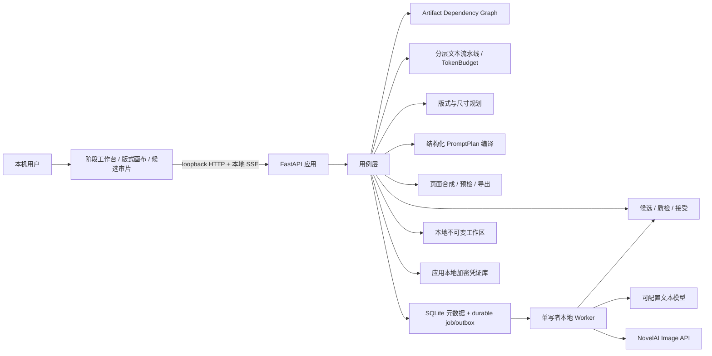
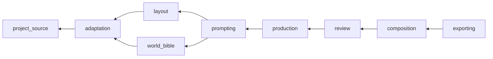
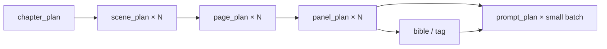
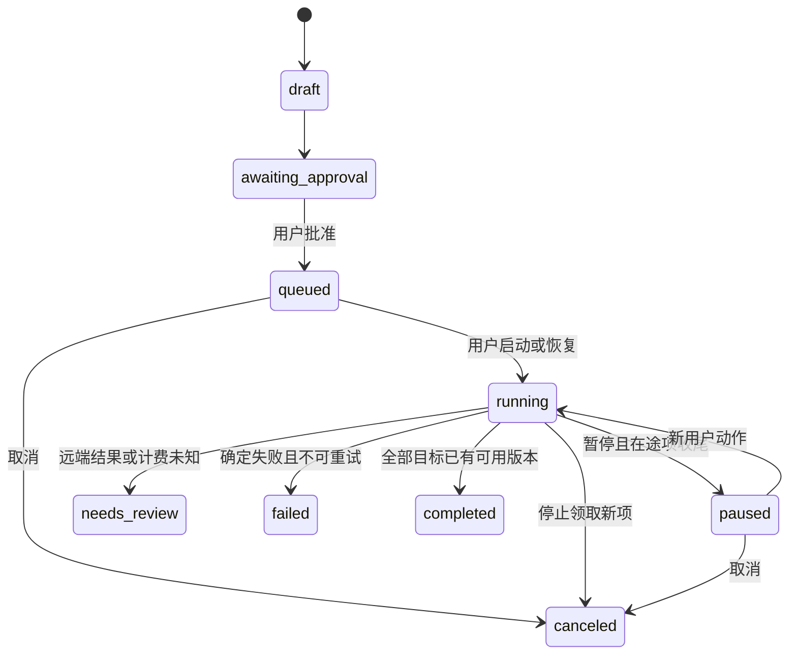
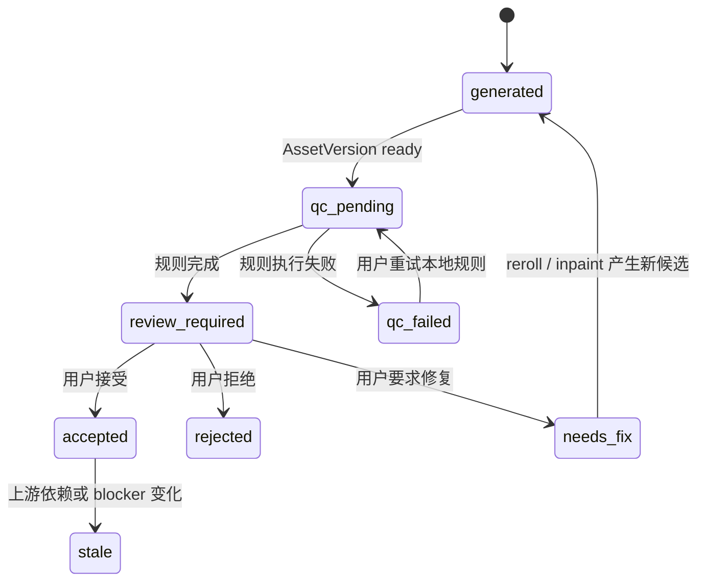
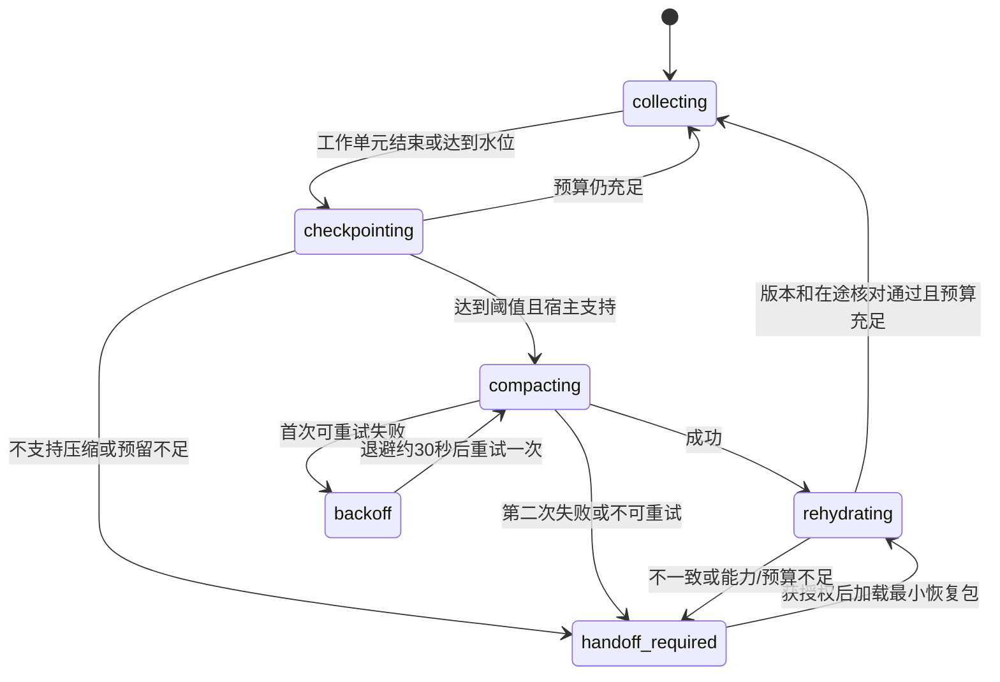

# Manga Maker 技术架构文档

| 项目 | 内容 |
|---|---|
| 文档版本 | v0.3 |
| 日期 | 2026-09-06 |
| 本次架构补充 | FR-25/26 必备封面与启动前画家风格确认，新增目标设计待实现；见第 25 节 |
| 上下文恢复交付 | FR-24 / AC-13 本地检查点、预算/失败状态机和脚本/API/UI 已实现；宿主集成与整书验收分别记录于 MM-078，见第 23 节 |
| 状态 | v0.2 本地/Mock 基线已实现；v0.3 架构底座、Storyboard 1.1 逐页政策、版式先行、PromptPlan/PromptPackage v2、NovelAI 多角色映射、审批冻结与 Prompt Inspector 已完成 Mock 验收，候选/审片、迁移发布门禁与 Token 流水线仍待实现 |
| 对应产品文档 | [README.md](README.md)、[PRD.md](PRD.md) |
| P0 形态 | macOS 本机单用户、本地 Web 应用 |
| P0 验收单位 | 一个 TXT 小说章节的完整漫画化闭环 |

> 本文定义 v0.3 目标系统边界、组件、数据流、接口和验收方法。当前 v0.2 已交付从 TXT 到四格式导出的离线 Mock 单章闭环，并覆盖启动 reconciliation、未知计费、磁盘不足、诊断脱敏和凭证零泄露扫描；跨章节连续性、整本有界计划、高级页面 profile、扩展模板和可复用素材库也已存在。v0.3 已按工单完成架构底座、Storyboard 1.1 自动 `page_type` 与普通页 3–6 格本地门禁、版式先行、结构化多角色映射、审批冻结和 Prompt Inspector，其他目标不得由本文推断为已交付。2026-08-29 已以授权《沙王》完成真实 NovelAI V5 Full 零 Anlas 12 页图像、重绘、排版与导出闭环；Storyboard 1.1 已完成本地 Mock/E2E 验收，但外部文本模型真实分类、付费 Anlas、多候选接受/PageApproval 和其余 v0.3 目标仍未验收。

## 2026-09-06 分镜链路实现补充

本节记录本轮已实现范围，详细用例与分层结果见 [分镜修复验收](docs/storyboard-repair-cases.md)。其余 v0.3 目标状态不变。

- `pages/layout.py` 从批准的 LayoutFacade 快照递归解析父子格框，转换为确定性页面像素；新 PageVersion 绑定 `layout_source`。相同版本拼页幂等，新版式保留旧素材、文字编辑与页面历史。
- PromptPlan 的可选 `base.visual_description` 保留完整自然语言，`composition_prompt` 从景别、焦点、裁切保护和文字区确定性编译。旧字段未出现时不加入序列化，保护历史哈希。NovelAI mapper 把这些段落传入实际 base caption。
- `fullpages/compiler.py` 和 `FullPageService` 提供独立 V5 Full 整页用例，冻结批准输入、文字策略、seed、模型配置、ProviderExecutionSpec 与最终 payload。`generation_scope=full_page` 的 base-only 契约与逐格角色区块校验分开。
- schema 33 在 production 名下增加 `full_page_generations`。逐格队列 claim 与整页 claim 都在同一 SQLite writer 事务中检查两种运行记录，实现跨模式单在途；整页固定单候选、最多一次图像请求，未知结果转人工核查，启动不重放。
- `/full-pages` 提供 sources、preview、history、generate、content、adopt。预览不出网，generate 要求冻结哈希与明确确认；采用要求成图 ready、来源仍有效以及当前页修订匹配。
- PageDocument 的 `page_image` 让渲染器整图绘制一次，不再把同一整页图裁进各格。本地文字策略保留图层；模型文字策略禁止重复图层。不可变图像、provenance 和整页记录进入 v1.5 工程包，旧 v1.5 包无此可选表仍可恢复。
- 恢复工程重新绑定 ID 与版式哈希，保留成图但清除执行审批；重新配置、预览与确认后才能创建新的生成。V5 逐格映射升级为 `novelai-image-2026-09-06.5-explicit-uc-1`，整页映射为 `novelai-v5-full-page-2026-09-06.1`。

## 1. 架构结论

Manga Maker v0.3 继续采用本地模块化单体：React/TypeScript 提供阶段工作台、版式画布和候选审片，Python/FastAPI 承担领域用例、持久任务、模型适配、质量规则、图片处理和导出，SQLite 保存结构化元数据、依赖关系与 durable job/outbox，本地工作区保存不可变版本文件，应用本地加密凭证库保存供应商密钥。

最重要的技术决策如下：

1. **不把 NovelAI Scripting API 当作外部集成通道。** Scripting API 运行在 NovelAI 网页内部的隔离 Web Worker，只能调用预定义的 `api.v1` 接口，不能任意访问网络或 DOM；其 Generation API 当前是文字生成接口，不提供图片生成。Manga Maker 直接从本地后端调用独立的 Image API。
2. **先批准版式，再生成画面。** `PageLayoutDraft` 在 Prompt 与图像请求之前冻结格框比例、阅读顺序、焦点、人物粗略位置和文字安全区；默认逐格模式由本地合成器负责格框、裁切和文字。V5 Full 整页模式把版式作为模型参考，一页生成一图，人工检查后采用。
3. **每次外部生成都来自可审计的人类操作。** 用户确认固定章节、面板清单、模型、参考图和成本上限后，才能启动有界任务；恢复暂停或崩溃任务需要新的用户操作。
4. **P0 默认串行。** 同一时刻最多存在一个在途 NovelAI 请求，不做隐藏并发、定时生成或无限后台生产。
5. **领域契约与供应商请求分离。** `ImageIntent`、`PromptPlan`、`GenerationSpec` 和 NovelAI 专用 `ProviderExecutionSpec` 分层；版本化映射器把结构化 base/角色正负区块/坐标转换为当前官方字段，禁止先扁平化再反推角色。
6. **生成结果不可变。** reroll、inpaint、布局编辑和恢复只创建新版本或切换当前指针，不覆盖旧素材。
7. **P0 自建小型适配器。** GitHub 社区 SDK 用于理解字段、错误和测试设计，不作为未经审计的默认运行依赖；官方 Swagger 和实际契约测试才是接口真源。
8. **服务端输出是发布真源。** 浏览器画布用于编辑和预览，PNG/PDF/CBZ 由本地后端规范渲染，避免截图式导出漂移。
9. **供应商成功不等于素材接受。** 响应只创建 Candidate AssetVersion；版本化规则生成 QualityFinding，只有用户动作能创建 accepted ReviewDecision 和 PageApproval。
10. **文本任务按阶段与 Token 预算执行。** `chapter → scene → page → panel → bible/tag → prompt` 每阶段有 TokenBudget、检查点、裁剪报告和幂等结果，禁止把整个长章节和全部 Prompt 塞进一次调用。
11. **所有长任务先持久化再调度。** 使用 SQLite durable job/outbox 与单写者本地 worker，不引入 Redis、Kafka 或外部队列；进程内 `asyncio.Task` 只负责执行已持久化的工作，不是真源。
12. **依赖失效集中计算。** Artifact Dependency Graph 统一记录 Storyboard → Layout → Bible/Tag → PromptPlan → Spec → Candidate/Review → PageApproval → Export 的边，避免各 service 分散猜测 stale 状态。
13. **继续保持模块化单体。** v0.3 的问题是领域边界和生产闭环不足，不是部署拓扑不足；不以微服务化、外部向量库或提高并发替代质量与契约建设。
14. **按业务能力纵向切模块。** 每个模块拥有自己的领域规则、用例、端口、持久化适配器、迁移和测试；不继续扩张全局 `services/models/repositories` 横向大层。
15. **跨模块只依赖公开契约。** 业务模块不得导入其他模块的领域实体、repository、SQL、供应商 DTO 或内部 service；同步交互使用版本化 Query/Command 契约，异步副作用使用 outbox 事件。
16. **高内聚、低耦合是自动化门禁。** 禁止依赖、循环依赖、跨模块写表、未版本化事件和绕过 composition root 的真实客户端构造必须由架构测试在 CI 中阻断，而不是依靠评审记忆。
17. **模型分类、本地门禁。** 文本模型为每页提出 `page_type` 和分镜，本地 `adaptation` 领域以 Storyboard 1.1 的版本化规则确定性校验：普通页 3–6 格，特殊页 1–6 格，空页或超过 6 格一律不能写入有效检查点、批准或进入版式阶段。

### 1.1 v0.3 核心架构驱动

| PRD 项目 | 架构驱动 | 关键新对象 | 硬门禁 |
|---|---|---|---|
| FR-05/FR-06 逐页分镜 | 模型自动分类页面，领域层确定性约束格数 | `StoryboardPageV1_1`、`PageType`、`StoryboardPagePolicyValidator` | 缺页型、未知页型、空页或格数违规不能形成检查点、分镜审批或 LayoutDraft |
| V03-P0-01 版式先行 | 布局成为生成输入，不再是生成后的装饰 | `PageLayoutDraft`、`FrameSpec`、`DimensionSelection` | 未批准版式不能创建 PromptPackage/GenerationSpec |
| V03-P0-02 多角色契约 | 结构化角色语义贯穿领域层和供应商映射 | `PromptPlan.characters[]`、`ProviderExecutionSpec` | 角色区块遗漏、错序、空数组或扁平回退时不发请求 |
| V03-P0-03 候选闭环 | 分离文件成功、规则质检、人工接受和页面批准 | `PanelCandidateSet`、`QualityFinding`、`ReviewDecision`、`PageApproval` | 无有效 accepted 候选或有 blocker 时不能正式导出 |
| V03-P1-01 Token 感知 | 文本工作流分层、可恢复、可度量 | `ModelCapabilitySnapshot`、`TokenBudget`、`TextStageRun`、`TruncationReport` | 硬约束放不进预算、输出截断或检查点无效时不能推进 |

## 2. 证据边界与 NovelAI API 全景

### 2.1 证据优先级

实现时按以下顺序判断接口事实：

1. 当前 NovelAI 官方 Swagger 与官方文档；
2. 当前 NovelAI Terms of Service；
3. 用户批准的最小真实契约测试；
4. GitHub 社区实现和 README，仅作为交叉验证与设计参考；
5. 本文记录的字段示例。

模型 ID、参数范围、价格、限流和返回格式都可能变化。运行时遇到官方信息与本文不一致时，停止真实调用并更新适配器，不以社区代码或旧缓存猜测。

### 2.2 四类官方接口的职责

| 接口 | 官方入口 | 能力 | Manga Maker P0 决策 |
|---|---|---|---|
| Scripting API | [Scripting Introduction](https://docs.novelai.net/en/scripting/introduction/) | NovelAI 网页内 TypeScript 脚本、UI 扩展、文档操作、站内文字生成 | 不作为外部桥接或图片生产通道 |
| Primary API | [Primary API](https://api.novelai.net/docs) | 登录、订阅、故事与账户数据等 | 不接管账户；不收集邮箱/密码；不调用登录接口 |
| Image API | [Image API](https://image.novelai.net/docs/index.html) | 图片生成、流式图片生成、inpaint/img2img、upscale、Director Tools、Vibe 编码 | P0 的 NovelAI 生产接口 |
| Text API | [Text API](https://text.novelai.net/docs/index.html) | OpenAI-compatible chat/completions 与 NovelAI 原生文字生成 | 可选文本适配器，不取代通用 LLM 接口 |

### 2.3 为什么 Scripting API 不能承担 P0 集成

官方 Scripting 文档给出以下边界：

- 脚本由用户在 NovelAI 的 User Scripts 界面创建或导入，分为账户脚本和故事脚本；
- 脚本运行在隔离的 JavaScript 解释器和 Web Worker 中，只能使用预定义 `api.v1` 方法；
- 脚本不能任意发起网络请求、直接访问 DOM 或读取大部分账户信息；
- 脚本可能因禁用、切换故事或关闭界面随时卸载，重要状态必须放进 Scripting Storage；
- `api.v1.generate` 是站内文字生成。当前文档示例使用 OpenAI-like messages 和 `glm-4-6`，没有图片生成方法；
- 每个脚本当前存在输出 2048 token/4 分钟、输入窗口和用户交互恢复等限制；`api.v1.editor.generate` 在没有新用户交互时最多连续调用三次。

因此，Scripting API 无法安全地连接本机 FastAPI，也无法承担逐格 NovelAI 图片生成、素材落盘、任务恢复或版本管理。

P2 可以评估一个**完全独立的可选伴侣脚本**：在用户授权后，把选中的 NovelAI 故事内容整理为可下载文件，再由用户手工导入 Manga Maker。该能力不得绕过 Scripting 权限、不得尝试访问本机端口，也不属于 P0。

### 2.4 Image API 的 P0 接口面

2026-08-29 的实现基线读取 `https://image.novelai.net/docs/doc.json`：Swagger 2.0，
标题 `Omegalaser API`，版本 `1.0`，113,758 bytes，SHA-256 为
`2bd3c5fcd491016e1951f5a3f347d0207d49d4add153899405224e21fd1dc684`。映射版本为
`novelai-image-2026-08-29.4-v5-full-1`。注意同主机的 `/openapi.json` 当前标题为
`Observability API`，只包含错误追踪能力，不是 Image API 契约。审计元数据保存在
`contracts/novelai/`，应用启动时不会自动联网替换。

P0 只允许访问 `https://image.novelai.net` 的以下路径：

| 官方路径 | P0 用途 | 决策 |
|---|---|---|
| `POST /ai/generate-image` | 文生图、img2img、inpaint | 主生产路径；请求 `Accept: application/zip`，并兼容已审计的 JSON 响应 |
| `GET /ai/generate-image/suggest-tags` | 凭证与模型可用性检查、提示词辅助 | 必须由用户点击连接测试；不等于生成验收 |
| `GET /user/subscription` | 核验 Opus 免费出图资格 | 零 Anlas 模式在每张图片请求前校验 active tier 3；每次核验都绑定 attempt 并计入冻结的外部请求上限；不读取或保存 Token |
| `POST /ai/upscale` | 用户明确触发的素材放大 | P0 可选；结果另建 AssetVersion |
| `POST /ai/generate-image-stream` | SSE 中间图与最终图 | P0 不使用；P1 再评估 |
| `POST /ai/augment-image` | Director Tools | P0 非必需；适配器保留扩展位 |
| `POST /ai/encode-vibe` | Vibe Transfer 编码 | P0 默认不使用，与 Precise Reference 分开评估 |

P0 选择非流式最终图片响应（ZIP 主路径、JSON 兼容）的原因：

- 一格对应一次明确的最终结果，容易做原子落盘和失败恢复；
- 不需要保存大量中间去噪图；
- 浏览器仍可通过 Manga Maker 自己的 SSE 获得任务状态；
- 远端流式连接断开时更难判断最终结果和计费状态。

如果 P1 引入远端 SSE，必须先定义事件序号、最终事件判定、断流恢复和中间图清理策略。

### 2.5 Text API 的位置

官方 Text API 提供：

- `GET /oa/v1/models`；
- `POST /oa/v1/chat/completions`；
- `POST /oa/v1/completions`；
- JSON 与 SSE 响应；
- `x-correlation-id`；
- OpenAI-compatible 的 messages、model、temperature、max_tokens、stop 等字段。

Manga Maker 的文本改编仍面向 `TextModelProvider`，默认支持用户配置的 OpenAI-compatible 端点。NovelAI Text API 可以是其中一个预设，但不是硬编码依赖。结构化分镜必须在 Manga Maker 侧经过 JSON Schema 校验，不能假设任何供应商天然返回可靠 JSON。

### 2.6 身份认证边界

Image API Swagger 使用 `Authorization` 请求头。Persistent API Token 的官方描述格式为：

```text
Authorization: Bearer pst-<token>
```

Manga Maker 的规则：

- 只接收用户已经通过官方方式获得的 Persistent API Token；
- 不接收或保存 NovelAI 邮箱和密码；
- 不调用 `/user/login` 或 `/user/create-persistent-token`；
- Token 仅存入 Manga Maker 应用数据目录中的加密凭证库，SQLite 只保存不含秘密的 `credential_profile_id`；
- 用户设置主密码；软件使用 Argon2id 和随机 salt 派生加密密钥，主密码与派生密钥均不落盘；
- 凭证库采用带认证加密并原子写入，目录仅允许当前 macOS 用户访问；应用关闭后清除内存中的解锁密钥；
- 忘记主密码时只能重置凭证库并重新录入 Token，不能通过项目文件或软件后门恢复；
- 前端永远看不到 Token，后端只在发请求前临时读取；
- 请求头、异常、崩溃报告和工程包必须执行字段级脱敏。

凭证库使用单文件版本化容器：明文 header 只保存 magic、格式版本、Argon2id 参数、随机 salt 和随机 nonce；供应商名称、profile、Token 与校验数据全部放在 XChaCha20-Poly1305 密文中，header 作为 associated data 参与认证。KDF 参数在目标 Mac 上校准到约 300–500 ms，内存成本不得低于 64 MiB；参数升级时先解锁旧 vault，再原子迁移到新版本。

用户第一次保存凭证时创建主密码。应用启动后默认保持锁定，首次连接测试或生成时要求解锁；用户可以随时手动锁定。进程可以在当前会话中缓存解锁密钥，但不写磁盘、不放入前端状态，并尽量减少内存副本。该方案防护的是磁盘文件、项目包和普通备份泄露，无法抵御已经控制当前 macOS 账户或读取已解锁进程内存的攻击者。

## 3. 社区调研与采用边界

调研日期为 2026-08-09。以下项目只作为设计证据，没有被引入仓库或安装为运行依赖。

| 项目 | 许可与观察 | 可借鉴部分 | 不直接采用的原因 |
|---|---|---|---|
| [Aedial/novelai-api](https://github.com/Aedial/novelai-api) | MIT；Python；区分 low-level/high-level；有 schema 与 API 测试 | 供应商底层映射与高层语义分离、契约校验 | 覆盖账户登录和故事数据，README 仍展示用户名/密码取 token；与本项目最小账户权限边界不同 |
| [caru-ini/novelai-sdk](https://github.com/caru-ini/novelai-sdk) | MIT；Python；Pydantic v2；用户模型/API 模型双层；支持 Precise Reference、多角色与 SSE | 强类型参数、两层 DTO、图片预处理和流式事件建模 | 社区 SDK 不能替代官方契约；测试和安全审计完成前不进入 P0 运行依赖 |
| [Nya-Foundation/NekoAI-API](https://github.com/Nya-Foundation/NekoAI-API) | AGPL-3.0；交叉核对 commit `58e595d6f1a07aafc510eb946377df8066ade0bb`；覆盖生成、inpaint、Vibe、Director Tools、重试与节流 | 模型字符串、异步资源管理、错误分类、参考编码缓存思路 | 只记录独立观察结论，不复制代码；AGPL 分发义务、账户凭证入口和宽泛自动重试不适合 P0 |
| [NovelAI/novelai-image-metadata](https://github.com/NovelAI/novelai-image-metadata) | NovelAI 官方 GitHub；MIT；读取/验证 PNG 隐藏元数据和签名 | 原始素材元数据检查、导入兼容性和验证测试 | 元数据不能替代 Manga Maker 自己的审计记录；官方 upscale 明确不带 NovelAI 元数据 |
| [zhulinyv/Auto-NovelAI-Refactor](https://github.com/zhulinyv/Auto-NovelAI-Refactor) | GPL-3.0；NovelAI WebUI；批量生成、inpaint、角色分区和元数据工具 | 生成参数工作台、素材筛选、批处理可见性 | 明文 `.env`、量产导向和许可证边界不符合 P0 的本地加密凭证库、人类审批与受控负载设计 |
| [victorhuangwq/story-to-manga](https://github.com/victorhuangwq/story-to-manga) | MIT；Next.js；故事分析、角色参考、逐格生成、渐进展示、rerun | “先角色、再分镜、再面板”的渐进体验，单格重跑入口 | 浏览器 localStorage/IndexedDB 不足以承担本项目的不可变版本、恢复和大素材单一真源 |
| [LingyiChen-AI/AIComicBuilder](https://github.com/LingyiChen-AI/AIComicBuilder) | Apache-2.0；Next.js + SQLite；多供应商；阶段化剧本/角色/分镜/素材任务 | 各阶段可独立触发、看板状态、版本和供应商适配层 | 目标是漫剧/视频流水线，不包含本项目的 SourceAnchor、分页文字合成和 NovelAI 专用合规边界 |

结论：没有现成项目同时满足 TXT 来源锚点、单章审批、NovelAI 逐格生成、本地中文排版、页/格不可变版本、应用本地加密凭证库、崩溃后未知计费处理和四类导出。因此 P0 继续采用定制模块化单体，但复用社区已经验证的架构模式，不复制不兼容许可证代码。

未来若要引入社区依赖，必须逐项完成：锁定版本/commit、许可证审查、依赖与秘密处理审查、离线契约测试、真实低成本测试和替换/回退方案。

## 4. 系统上下文



### 4.1 信任边界

| 边界 | 内部数据 | 可外发数据 | 禁止外发 |
|---|---|---|---|
| 浏览器 ↔ FastAPI | 编辑命令、预览、蒙版、任务控制 | 无公网外发 | Token、凭证库明文与解锁密钥 |
| FastAPI ↔ 文本模型 | 当前 TextStageRun 所需的章节片段、上游结构、StoryBeat、版式硬约束、必要设定与 Schema | 用户确认的数据类别和 TokenBudget 内的最小集合 | 整本未选 TXT、其他阶段无关原文、NovelAI Token |
| FastAPI ↔ NovelAI | 当前 ProviderExecutionSpec 的 base/角色正负区块、坐标、参考图、base image、mask、尺寸与参数 | 当前已批准生成目标需要的最小集合 | 小说全文、其他项目素材、LLM 密钥 |
| 工作区 ↔ 导出 | 已选页面版本、文字与元数据 | 用户明确选择的导出 | 密钥、调试日志、废弃版本；发布包不含源小说 |

首次调用每个云供应商前，界面必须展示外发数据类别、目标主机和官方条款链接。

## 5. 模块划分

### 5.1 前端

| 模块 | 职责 |
|---|---|
| Project Shell | 项目阶段、保存状态、全局错误和恢复入口 |
| TXT Importer | 编码预览、章节拆分/合并、范围确认 |
| Adaptation Workbench | 原文/StoryBeat、分层 TextStageRun、TokenBudget、页面树、模型判定的 `page_type`、分镜数量/违规状态、分格编辑与来源覆盖 |
| Layout Workbench | PageLayoutDraft、按 `page_type` 过滤的 1–6 格模板、格框/阅读顺序、焦点、人物粗略位置、文字安全区、目标尺寸预览与审批 |
| Bible Editor | 角色设定、风格板、参考图与审批 |
| Prompt Inspector | 供应商无关 PromptPlan、各角色独立正负区块、坐标、固定 Tags 与 NovelAI 映射预览 |
| Generation Console | 候选数、任务范围、成本估算、开始/暂停/恢复/取消、错误处置 |
| Candidate Review | 联系表、并排比较、QualityFinding、接受/拒绝/待修复、从候选发起 revision |
| Page Canvas | 格框、裁切、气泡、文字、音效、蒙版和阅读顺序 |
| Version Browser | AssetVersion/PageVersion 比较、选择和恢复 |
| Export Center | 预检、格式选择、ExportRevision 与恢复包 |

前端状态只保存正在编辑的短期草稿和 UI 偏好。项目真源始终在后端；刷新页面后必须从 SQLite 与版本文件恢复。

### 5.2 后端业务能力模块

模块按“同一组业务不变量、同一个变化原因、同一个数据所有者”划分，而不是按 Controller/Service/Model 横向切层。每个模块内部再使用 domain/application/ports/adapters 分层。

| 模块 | 高内聚职责与拥有的数据 | 明确不负责 |
|---|---|---|
| `project_source` | Project、SourceFile/SourceChapter、SourceAnchor、工作区身份、导入与章节边界 | Storyboard、模型调用、生成任务 |
| `text_execution` | TextModelProfile 非敏感配置引用、ModelCapabilitySnapshot、TokenBudget、TextStageRun、checkpoint、token ledger | 理解漫画语义、决定页/格内容、构造 NovelAI Prompt |
| `adaptation` | StoryBeat、Storyboard 1.1、`PageType`、逐页非空与格数政策、来源覆盖、章节/场景/页/格改编不变量和分镜审批；新增 CoverBrief 语义计划，待 §25 实现 | 页面几何、角色固定 Tags、供应商请求 |
| `world_bible` | CharacterBible、CharacterTagSet、StyleBible、ContinuityLedger、参考素材的语义归属与审批；新增 ArtistStyleIntent 的项目级确认，待 §25 实现 | 生成排队、页面渲染、候选接受 |
| `layout` | 消费已批准 StoryboardPage Snapshot，按页型/格数选择模板；拥有 PageLayoutDraft、FrameSpec、阅读顺序、焦点/安全区、DimensionSelection 和版式审批 | 推断或修改 `page_type`、图像 HTTP、最终页面文字渲染 |
| `prompting` | PromptPlan/PromptPackage、固定 Tags 注入、角色区块与冲突校验、Prompt 审批 | 文本模型/NovelAI HTTP、任务调度、图片落盘 |
| `production` | GenerationApproval、GenerationSpec、ProviderExecutionSpec、GenerationJob/Item/Attempt、AssetVersion、用于 inpaint 的 MaskAsset | 候选美术判断、页面批准、成品导出 |
| `review` | PanelCandidateSet、QualityRun/Finding、ReviewDecision、PageApproval、接受率等质量指标 | 修改原始素材、发起未获授权的生成、最终编码格式 |
| `composition` | PageVersion、文字/气泡/格框图层、规范渲染与页面派生物；新增 BookComposition 的封面/正文成员及顺序，待 §25 实现 | 角色/Prompt 规则、供应商调用、发布授权 |
| `asset_catalog` | 项目内可复用 AssetVersion 引用的类型、名称、标签、备注与归档状态 | 复制/修改原始素材、生成任务、候选接受 |
| `exporting` | ExportPreflight、ExportRevision、工程包、PNG/PDF/CBZ、清单与秘密扫描 | 自动修复页面或修改上游批准 |
| `lineage` | ArtifactRef、依赖边、失效事件、stale 原因解释 | 保存业务文档内容、决定业务边是否合法 |
| `chapter_workflow` / `book_workflow` | 多模块步骤、检查点、补偿和人工门禁的 process manager 状态 | 复制任何模块的领域对象、越过公开命令直接写表 |

`lineage` 和 workflow 是协调模块，不是“万能服务”。`lineage` 只接受各模块提交的稳定 ArtifactRef 和边类型；边是否合法仍由拥有该用例的业务模块判断。workflow 只保存步骤、关联 ID 和状态，不保存第二份 Storyboard、PromptPlan 或 PageApproval。

### 5.3 平台能力与共享内核

平台代码提供机制，不包含“什么样的漫画页面可以批准”等业务政策：

| 平台能力 | 责任 | 依赖约束 |
|---|---|---|
| `persistence` | SQLite connection、UnitOfWork、migration runner、备份与 reconciliation 基础 | 不导入业务模块；repository 实现在所属业务模块内 |
| `durable_work` | work item、lease、outbox、SSE replay 和本地 worker runtime | 只认识通用工作契约，不解释 Prompt、候选或页面 |
| `file_store` | staging、原子落盘、哈希、内容寻址与路径边界 | 不决定 AssetVersion/ExportRevision 状态 |
| `security` | loopback session、CSRF、vault、secret scanning、脱敏 | 不依赖业务模块；由端口注入 |
| `observability` | clock、correlation ID、结构化事件 sink、指标接口 | 不读取完整正文、Prompt、Token 或图片 |
| `recovery` | 聚合各模块 IntegrityProbe、生成恢复报告并调度所有者提供的 RepairCommand | 不直接读取/修复业务私表，不成为第二套 repository |
| `shared_kernel` | UUIDv7、不可变 ArtifactRef、时间/哈希值对象、基础 Result/Error 协议 | 不放业务 DTO、BaseService、万能 Repository 或可变全局状态 |

“两个模块字段长得一样”不构成放进 shared kernel 的理由。只有语义相同、生命周期稳定、没有单一业务所有者的原语才能共享；不确定时允许少量局部重复，避免错误抽象制造反向耦合。

外部适配器与消费它的业务能力放在一起：OpenAI-compatible adapter 属于 `text_execution/adapters/`，NovelAI adapter 属于 `production/adapters/`，Pillow renderer 属于 `composition/adapters/`。平台层可以提供安全 HTTP/file primitives，但不能提供知道供应商业务字段的“全局 AI client”。

### 5.4 允许的依赖方向

下表是编译期依赖白名单。A 依赖 B 仅表示 A 可以导入 B 的 `public.py` / `contracts.py`；不能导入 B 的 domain entity、内部 handler、repository 或 adapter。

| 消费模块 | 允许依赖的公开契约 |
|---|---|
| `project_source` | shared kernel、平台 ports |
| `text_execution` | shared kernel、平台 ports |
| `lineage` | shared kernel、平台 ports |
| `adaptation` | `project_source`、`text_execution` |
| `world_bible` | `project_source`、`adaptation`、`text_execution` |
| `layout` | `adaptation` |
| `prompting` | `adaptation`、`world_bible`、`layout`、`text_execution` |
| `production` | `prompting`、`world_bible`、`layout`、`lineage`、平台 ports |
| `review` | `production`、`world_bible`、`layout`、`lineage` |
| `composition` | `production`、`review`、`layout`、`lineage`、平台 ports |
| `asset_catalog` | `project_source`、`production` |
| `exporting` | `composition`、`review`、`lineage`、平台 ports |
| workflows | 以上模块的 application facade；无业务模块可以反向依赖 workflow |
| platform / shared kernel | 不依赖任何业务模块 |

主链的代码依赖方向如下；箭头 `A → B` 表示 A 只能依赖 B 的公开契约：



依赖必须保持有向无环。上游模块不能为了方便回调下游模块；需要下游反应时发布事实事件，由 outbox 在提交后驱动。任何例外必须有 ADR、明确到期迁移计划和架构测试豁免，不能靠循环 import 或 service locator 绕过。

### 5.5 目标代码结构：纵向模块、模块内分层

当前仓库的 `adaptation/`、`bibles/`、`generation/`、`pages/` 等已经接近业务切片；v0.3 以它们为迁移起点，目标不是新建全局 `application/domain/adapters` 大目录，而是让每个能力拥有完整闭环：

```text
backend/
├── app/
│   ├── bootstrap/                 # composition root、module installers、lifespan
│   ├── shared_kernel/             # ID、ArtifactRef、clock/hash/error 协议
│   ├── platform/
│   │   ├── persistence/           # connection、UnitOfWork、migration runner
│   │   ├── durable_work/          # worker、lease、outbox、SSE publisher
│   │   ├── file_store/
│   │   ├── security/
│   │   └── observability/
│   ├── modules/
│   │   ├── project_source/
│   │   ├── text_execution/
│   │   ├── adaptation/
│   │   ├── world_bible/
│   │   ├── layout/
│   │   ├── prompting/
│   │   ├── production/
│   │   ├── review/
│   │   ├── composition/
│   │   ├── asset_catalog/
│   │   ├── exporting/
│   │   └── lineage/
│   └── workflows/
│       ├── chapter_production/
│       └── book_production/
├── contracts/
│   └── novelai/                   # 审阅过的 Swagger、hash、mock fixtures
└── tests/
    ├── architecture/
    ├── modules/                   # 与 modules/ 同构
    ├── contracts/
    ├── workflows/
    ├── recovery/
    └── e2e/
```

每个业务模块采用相同的内部形状，但只创建实际需要的目录：

```text
modules/<module>/
├── public.py                      # 唯一跨模块 Python import 面
├── contracts.py                   # frozen command/query/snapshot/event DTO
├── domain/                        # entity、value object、policy、纯状态机
├── application/                   # command/query handler、facade、事务编排
├── ports/                         # 由消费方定义的 repository/provider/clock 等接口
├── adapters/                      # sqlite、HTTP、filesystem、renderer 实现
├── entrypoints/
│   └── http.py                    # FastAPI DTO 转换；可选
└── migrations/                    # 只操作本模块拥有的表
```

模块允许多个小而明确的 handler，不设置“每模块一个巨大 Service”。`public.py` 只重导出稳定 facade 和契约，不成为装满业务逻辑的门面文件。

前端同样按 feature 纵向组织：

```text
frontend/src/
├── app/                            # shell、routing、跨 feature workflow
├── features/
│   ├── adaptation/
│   ├── layout/
│   ├── prompting/
│   ├── production/
│   ├── review/
│   ├── composition/
│   ├── asset_catalog/
│   └── exporting/
├── shared/ui/                      # 无业务语义的基础组件与 design tokens
└── generated/api/                  # OpenAPI 生成 DTO/client
```

一个 feature 可以依赖 `shared/ui`、生成 API 和自身文件，不能导入另一个 feature 的内部 component/store。跨 feature 流程由 `app/` 组合公开入口。现有单一 `frontend/src/api.ts` 是兼容边界；v0.3 新接口直接进入对应 feature client，不再向该文件追加领域逻辑。

### 5.6 公开契约与数据所有权

每个模块的公开面仅包含：版本化 Command/Query DTO、不可变 Snapshot、完成时的事实 Event、稳定错误码和 facade Protocol。禁止公开 ORM row、可变 domain entity、内部 repository、FastAPI Request/Response、供应商 payload 或本地绝对路径。

契约规则：

- 契约由提供方拥有，消费方保存代表性 fixture；破坏性变更创建新版本，旧版本保留到所有消费方迁移完成；
- Snapshot 只包含消费场景需要的最小字段、artifact ID/version/hash，不复制整份上游文档；需要详情时通过 Query 获取；
- Event 使用过去式，包含 `event_id`、schema version、aggregate/artifact ref、occurred_at、correlation/causation ID；事件只陈述已提交事实，不发命令；
- 下游不得修改收到的 Snapshot 或把它保存成新的上游真源；派生产物记录输入 ArtifactRef 即可；
- 适配器 DTO 在 anti-corruption layer 转换为领域值对象，NovelAI/OpenAI 字段不能穿透到其他模块。

虽然所有模块物理上共用一个 SQLite 文件，逻辑上仍实行单一数据所有者：

- 每张表和每个文件目录只有一个模块可写；表所有权在 migration registry 中登记；
- 新 command 路径不得查询或写入其他模块的私有表，不得复用其他模块 repository；
- 模块内 foreign key 可以严格使用；跨模块引用优先保存 `ArtifactRef(type, id, version, sha256)`，禁止跨模块 cascade delete；确需跨模块 foreign key 时必须针对稳定身份根写 ADR；
- 跨模块列表/看板通过公开 Query 聚合，或由 outbox 维护可重建 read projection；投影视图不得用于业务不变量判断；
- 完整性扫描可以读取所有模块的公开 manifest/hash，但只能向所有者发出修复命令，不能越权改表。

`lineage` 与 `durable_work/outbox` 是允许随业务状态共同提交的协调元数据，但仍由各自 adapter 经 typed Port 写入；业务 handler 只能提交 ArtifactRef/Event DTO，不能包含这些表的 SQL 或 row 类型。这样保留一个 SQLite 事务的原子性，同时不把存储所有权泄漏给调用模块。

### 5.7 跨模块通信与事务边界

| 场景 | 机制 | 一致性 | 禁止做法 |
|---|---|---|---|
| 当前命令必须判断的硬门禁 | 同步调用上游公开 Query，返回 immutable Snapshot + hash | 强一致到查询 revision | 直接读上游表或持有上游 entity |
| 改变某模块状态 | workflow/API 调用该模块公开 Command | 单模块事务、幂等 | 模块 A 调用模块 B repository |
| 提交后的失效、投影、通知 | 版本化 domain/integration event + SQLite outbox | 最终一致、可重放 | 在领域实体内发送 HTTP 或启动 task |
| 跨多阶段长流程 | chapter/book process manager | 显式 checkpoint 与补偿 | 一个超大事务锁住全流程 |
| 跨模块只读页面 | query aggregator/read projection | 可标注 revision/延迟 | 为 UI 方便创建共享可写模型 |

一个公开 Command 默认只拥有一个业务模块和一个 UnitOfWork；它在同一事务内写本模块状态、lineage 引用和 outbox。跨模块业务变化拆成 process manager 的多个幂等步骤，不开启跨网络/跨供应商事务，也不让一个模块回滚另一个模块已提交的历史事实。

硬门禁不能只依赖异步事件：例如创建 GenerationSpec 时必须同步核验 Layout/Prompt/Bible Snapshot 及 hash；提交后再由事件驱动候选质检和页面 stale 标记。事件 handler 必须按 `(event_id, handler_version)` 幂等，失败进入 durable work 重试或人工审阅，不递归发布会形成循环的命令链。

### 5.8 依赖注入、测试缝与渐进重构

Port 由使用它的 application module 定义，具体 adapter 只在 composition root 绑定。领域与用例构造函数显式接收 repository、provider、clock、ID factory、tokenizer、file store、renderer 和 event sink；禁止模块内部读取全局配置、创建真实 HTTP client、访问 `request.app.state` 或依赖可变 singleton。

`bootstrap/` 使用 typed `AppContainer` 和 module installer 管理生命周期。FastAPI route 通过 `Depends` 获得公开 facade；`main.py` 只注册 installer/router，不逐个了解所有 service 的内部依赖。当前 route 直接读取 `request.app.state.*` 和集中 `database.py` 查询属于 v0.2 compatibility seam：允许旧路径继续运行，但架构测试阻止 v0.3 新模块增加同类依赖。

渐进迁移步骤：

1. 用 characterization test 固定旧 use case 的成功、错误、幂等和审计行为；
2. 定义目标模块的 public contract、port 和表所有权；
3. 先用 legacy adapter 包住旧 service，使调用方切到 facade；
4. 在模块内部逐个迁移 handler/repository，不同时改全部路由和存储；
5. 加入 forbidden-import/table-ownership 测试，禁止新代码回流旧边界；
6. 所有消费方和恢复 fixture 迁移后，再删除 legacy adapter。

数据库新迁移使用模块内编号文件，由全局 runner 按确定顺序执行。每个迁移同时有空库前向、v0.2 fixture 前向、重复执行/版本拒绝和备份恢复测试。仓库仍保持单一进程、单一发布物和一个 SQLite 数据库；高内聚低耦合不等于拆服务。

### 5.9 变更影响场景

以下场景用于评审模块边界是否真的降低维护成本，而不只是目录改名：

| 未来变化 | 预期主要改动面 | 默认不应修改 |
|---|---|---|
| 新增另一个 OpenAI-compatible 文本供应商方言 | `text_execution/adapters`、bootstrap、该 Port contract fixture | adaptation/layout/prompting 的领域规则 |
| NovelAI 更改 V5 payload 字段或尺寸枚举 | `production/adapters/novelai`、capability/mapping fixture | PromptPlan、ReviewDecision、PageVersion |
| 新增“手部异常”本地质检规则 | `review` rule + finding UI + 模块测试 | production、prompting、exporting repository |
| 新增页面模板 | `layout` template/validator；如渲染能力变化，再改 `composition` adapter | text_execution、world_bible、NovelAI client |
| 修改角色固定 Tags 不变量 | `world_bible` domain；只有公开 Snapshot 变化时升级 prompting consumer contract | generation queue、page renderer、exporter |
| 新增一种发布格式 | `exporting` adapter、preflight 能力和格式测试 | PageApproval、候选接受、供应商调用 |
| 调整整本推进策略 | `book_workflow` process manager 与 workflow 测试 | 单章各模块的内部 repository/domain entity |

若一个变化在没有公开契约变化的情况下仍迫使多个无关业务模块修改内部代码，必须暂停实现并复核所有权、DTO 泄漏、跨表访问或错误共享抽象；不能把批量修改当作正常成本。

## 6. 核心数据设计

### 6.1 SQLite 表族

| 所有模块 | 主要表 | 关键约束 |
|---|---|---|
| `project_source` | `projects`、`source_files`、`source_chapters`、`source_anchors` | 源版本不可变；offset 与摘录哈希可复核 |
| `text_execution` | `text_model_profiles`、`model_capability_snapshots`、`text_stage_runs`、`text_stage_checkpoints`、`token_ledgers` | 输入/输出版本和预算不可变；缓存键包含配置、模板、Schema 与上游哈希 |
| `adaptation` | `story_beats`、`storyboards`、`storyboard_versions`、`storyboard_approvals` | Storyboard 1.1 内容保存 `page_type` 与 panels；版本哈希和审批冻结页型、逐页格数及政策版本，派生索引不是真源 |
| `world_bible` | `character_bibles`、`character_tag_sets`、`style_bibles`、`continuity_ledgers`、对应 approvals | 设定/连续性版本和批准绑定精确内容哈希 |
| `layout` | `page_layout_drafts`、`layout_approvals`、`dimension_selections` | frame、尺寸选择与审批版本一致，不存供应商请求 |
| `prompting` | `prompt_packages`、`prompt_approvals` | PromptPlan 保持角色结构；不保存 NovelAI 私有 DTO |
| `production` | `generation_specs`、`provider_execution_specs`、`generation_jobs`、`generation_items`、`provider_attempts`、`asset_versions`、`mask_assets`、`cost_estimates`、`cost_records` | 供应商载荷由 mapping version 确定；文件 ready 不等于 accepted |
| `review` | `panel_candidate_sets`、`quality_runs`、`quality_findings`、`review_decisions`、`page_approvals` | 自动规则不创建人工接受；批准绑定完整依赖哈希和 finding 快照 |
| `composition` | `comic_pages`、`page_versions` | 当前指针可切换；页面版本只追加，不拥有候选接受状态 |
| `asset_catalog` | `asset_library_items` | 只保存同项目 AssetVersion 的引用与目录元数据；不复制、不改写源文件 |
| `lineage` | `artifact_versions`、`artifact_dependencies`、`invalidation_events` | 依赖边只追加；失效可解释、可重算，不保存业务文档 |
| `durable_work` | `work_items`、`outbox_events`、`worker_leases`、`handled_events` | 意图先持久化再执行；handler 幂等；不解释业务 payload |
| `observability` | `audit_events` | 追加式、字段白名单，不成为业务状态真源 |
| `exporting` | `export_preflights`、`export_revisions`、`export_files`、`package_manifests` | 绑定固定 PageApproval/PageVersion 清单与 SHA-256 |

SQLite 启用 foreign keys、WAL、busy timeout 和 schema migration。一个进程内只有单写者执行数据库写命令，读取使用独立连接。编辑命令携带 `expected_revision`，发现版本冲突返回 409，不静默覆盖。migration registry 必须为每张表登记唯一 owning module；repository 只能写本模块表，架构测试扫描 SQL 常量和 migration 路径，阻止新增跨模块写入。

### 6.2 文件工作区

```text
workspace/projects/<project_id>/
├── manifest.json
├── source/
│   ├── original.txt
│   └── chapters/<chapter_id>/<version>.txt
├── storyboard/versions/
├── layouts/versions/
├── bibles/characters/
├── bibles/styles/
├── prompts/versions/
├── text-runs/<text_stage_run_id>/
│   ├── input-manifest.json
│   ├── token-budget.json
│   ├── truncation-report.json
│   └── result.json
├── assets/
│   ├── references/<sha256>.<ext>
│   ├── panels/<panel_id>/<asset_version_id>/original.png
│   ├── panels/<panel_id>/<asset_version_id>/provenance.json
│   ├── masks/<mask_asset_id>.png
│   └── staging/
├── quality/
│   ├── candidate-sets/
│   └── findings/
├── pages/<page_id>/<page_version_id>/
├── exports/<export_revision_id>/
└── audit/
```

正式文件名使用稳定 ID 或内容哈希，不依赖标题和页码。源图片、参考图和蒙版都先检查类型、尺寸、像素总量和解码结果；不信任扩展名。

### 6.3 跨 SQLite 与文件系统的一致性

SQLite 事务与文件重命名无法形成真正的跨资源原子事务，因此采用可恢复的两阶段提交：

1. 在 SQLite 创建 `staging` 记录和预期路径；
2. 把响应写入项目内 staging 文件，完成解码、尺寸和 SHA-256 校验；
3. `fsync` 后原子重命名到不可变目标路径；
4. 在 SQLite 事务中把 AssetVersion 标为 `ready`，更新当前指针并写审计事件；
5. 启动时 reconciliation 扫描悬空记录、孤立 staging 和已存在但未登记的目标文件。

只有第 4 步完成后，前端才能把素材视为正式版本。清理只处理确认无引用的 staging；P0 不自动物理删除正式版本。

对图像响应，“正式版本”仅表示 `AssetVersion.ready`。随后以独立事务把它加入 PanelCandidateSet，再由质量 worker 写入 finding。任一步失败都可用 `(candidate_set_id, asset_version_id, rule_version)` 幂等重放；在 ReviewDecision 创建前不得更新 Panel 或 Page 的已接受素材引用。

### 6.4 Artifact Dependency Graph

所有可审批、可生成和可导出的版本统一登记为 `artifact_versions`，至少包含 `artifact_type`、稳定 ID、version、content SHA-256、schema version 和创建时间。`artifact_dependencies` 保存有类型的有向边：

```text
SourceChapter / StoryBeat
→ Storyboard
→ PageLayoutDraft
→ CharacterBible / CharacterTagSet / StyleBible
→ PromptPackage(PromptPlan)
→ GenerationSpec / ProviderExecutionSpec
→ PanelCandidateSet / AssetVersion / ReviewDecision
→ PageVersion / PageApproval
→ ExportRevision
```

用例提交新版本时，在同一 SQLite 事务中登记新节点、依赖边和 `invalidation_event`。失效服务沿反向索引只标记可达的下游批准/决定为 stale，并返回“哪一个上游版本、通过哪条边导致失效”的解释；旧节点和文件不删除。QualityFinding 的重新打开也可以使 PageApproval 失效，但不得反向使已完成的供应商请求不存在。

依赖图只管理版本血缘和有效性，不承担业务文档存储，也不变成通用工作流引擎。领域 service 仍负责判断哪些边合法；数据库 foreign key、唯一约束与循环检测阻止自依赖或跨项目引用。

## 7. 内部接口契约

### 7.1 本地 HTTP API

下表是 P0 完整目标契约。当前写接口均要求启动会话令牌和 CSRF token；涉及付费生成与任务控制的后续接口还必须加入 `Idempotency-Key` 和 `expected_revision`。

| 方法与路径 | 用途 |
|---|---|
| `POST /api/v1/projects` | 创建本地项目，不调用云模型 |
| `POST /api/v1/projects/{id}/source/preflight` | TXT 编码和章节预检 |
| `POST /api/v1/projects/{id}/source/confirm` | 固化 SourceChapter 版本 |
| `PUT /api/v1/projects/{id}/adaptation/text-model` | 保存非敏感模型配置；凭证仅引用本地 vault profile |
| `POST /api/v1/projects/{id}/adaptation/text-model/test` | 用户明确触发连接测试 |
| `POST /api/v1/projects/{id}/adaptation/text-model/capabilities/probe` | 用户批准的最小能力探测，保存 ModelCapabilitySnapshot |
| `POST /api/v1/projects/{id}/adaptation/text-stages/estimate` | 本地计算阶段 TokenBudget、分片与外发清单，不发模型请求 |
| `POST /api/v1/projects/{id}/adaptation/text-stages` | 用户触发一个有界 TextStageRun，先持久化 work item |
| `GET /api/v1/projects/{id}/adaptation/text-stages/{run_id}` | 读取阶段状态、检查点、Token/裁剪与安全错误 |
| `POST /api/v1/projects/{id}/adaptation/text-stages/{run_id}/retry` | 从最小失败检查点创建新 run；不覆盖旧结果 |
| `POST /api/v1/projects/{id}/adaptation/storyboards/generate` | 兼容入口；内部编排多个 TextStageRun，组装 Storyboard 1.1，不允许单次整章大请求 |
| `POST /api/v1/projects/{id}/adaptation/storyboards/{version_id}/revisions` | 将人工分格修改保存为不可变 Storyboard 1.1 新版本；沿用并复验模型生成的 `page_type` |
| `POST /api/v1/projects/{id}/adaptation/storyboards/{version_id}/validate` | 纯本地校验来源覆盖、`page_type`、逐页非空和格数政策，返回精确 page/error path，不调用模型 |
| `POST /api/v1/projects/{id}/adaptation/storyboards/{version_id}/approve` | 同步复验 Storyboard 1.1 内容哈希与页面政策后创建分镜审批 |
| `POST /api/v1/projects/{id}/layouts/drafts` | 从已批准 Storyboard 创建 PageLayoutDraft 草稿，不调用模型 |
| `POST /api/v1/projects/{id}/layouts/{version_id}/revisions` | 以乐观锁保存不可变版式版本并计算最小失效范围 |
| `POST /api/v1/projects/{id}/layouts/{version_id}/validate` | 校验格框、顺序、安全区、尺寸选择与裁切风险 |
| `POST /api/v1/projects/{id}/layouts/{version_id}/approve` | 对精确版式及尺寸选择摘要进行审批 |
| `POST /api/v1/projects/{id}/bibles/generate` | 从当前已审批分镜在本机确定性草拟角色表与风格板 |
| `POST /api/v1/projects/{id}/bibles/characters/{version_id}/revisions` | 保存不可变 CharacterBible 新版本和受影响面板清单 |
| `POST /api/v1/projects/{id}/bibles/styles/{version_id}/revisions` | 保存不可变 StyleBible 新版本并使生成就绪失效 |
| `POST /api/v1/projects/{id}/bibles/{kind}/{version_id}/references` | 校验授权、真实图片类型/尺寸/像素/解码与哈希后绑定参考图 |
| `POST /api/v1/projects/{id}/bibles/{kind}/{version_id}/approve` | 独立审批角色表或风格板的精确版本哈希 |
| `POST /api/v1/projects/{id}/prompts/plans/generate` | 从已批准 Layout/Bible/Tag 创建分层 PromptPlan 草案 |
| `POST /api/v1/projects/{id}/prompts/{version_id}/compile` | 确定性注入固定 Tags，输出 PromptPlan 与校验报告 |
| `GET /api/v1/projects/{id}/prompts/{version_id}/provider-preview` | 本地生成脱敏 ProviderExecutionSpec 预览，不读取 Token、不发请求 |
| `POST /api/v1/projects/{id}/prompts/{version_id}/approve` | 审批 PromptPlan、角色结构、映射版本与 payload 哈希 |
| `GET /api/v1/projects/{id}/novelai/capabilities` | 读取固定契约哈希、allowlist 和模型能力，不联网 |
| `PUT /api/v1/projects/{id}/novelai/config` | 保存模型、超时和本地 vault profile 引用，不保存 Token |
| `POST /api/v1/projects/{id}/novelai/connection-test` | 用户点击触发一次标签建议查询；不出图、不自动重试 |
| `POST /api/v1/projects/{id}/generation/estimate` | 固定版本和 panel 清单，计算用户保守预留，不生成 |
| `POST /api/v1/projects/{id}/generation/jobs` | 用户确认后固化有界 Job、调用/成本上限和用户动作 |
| `POST /api/v1/projects/{id}/generation/jobs/{job_id}/start` | 使固定 Job 进入可执行状态；此操作本身不请求图像 |
| `POST /api/v1/projects/{id}/generation/jobs/{job_id}/execute` | 校验精确 revision 与二次确认字面量，显式调度冻结队列 |
| `POST /api/v1/projects/{id}/generation/jobs/{job_id}/pause` | 当前在途项可收尾，停止领取新项 |
| `POST /api/v1/projects/{id}/generation/jobs/{job_id}/resume` | 新的人类操作，恢复领取资格 |
| `POST /api/v1/projects/{id}/generation/jobs/{job_id}/cancel` | 取消 queued 项并保留在途结算记录 |
| `GET /api/v1/projects/{id}/generation/assets` | 列出当前不可变面板素材元数据 |
| `GET /api/v1/projects/{id}/generation/assets/{asset_version_id}/content` | 经本地会话保护读取原始 PNG |
| `GET /api/v1/projects/{id}/generation/assets/panels/{panel_id}/versions` | 列出面板不可变素材分支 |
| `POST /api/v1/projects/{id}/generation/assets/{version_id}/activate` | 仅切换素材当前指针，不调用外部服务 |
| `GET /api/v1/projects/{id}/review/candidate-sets?panel_id=...` | 列出同一生成目标的候选、质量发现和接受状态 |
| `POST /api/v1/projects/{id}/review/candidate-sets/{set_id}/quality-runs` | 对固定候选集运行版本化本地规则，不自动接受 |
| `POST /api/v1/projects/{id}/review/candidates/{asset_version_id}/decisions` | 用户接受/拒绝/待修复，绑定依赖哈希与幂等键 |
| `POST /api/v1/projects/{id}/review/findings/{finding_id}/resolve` | 用户关闭或豁免 finding，保留理由和证据 |
| `POST /api/v1/projects/{id}/generation/masks` | 校验并冻结与父素材绑定的本地 PNG 蒙版 |
| `POST /api/v1/projects/{id}/generation/revisions/estimate` | 固定 reroll/inpaint 父版本、目标和成本预留，不出图 |
| `POST /api/v1/projects/{id}/generation/revisions/jobs` | 第一次确认后创建有界 revision Job，不出图 |
| `GET /api/v1/projects/{id}/pages/templates` | 读取本机 16 种分页/条漫模板及 `page_type`/panel count 兼容元数据；1–2 格模板只兼容特殊页，不访问外部服务 |
| `POST /api/v1/projects/{id}/pages/draft` | 从当前已生成素材创建规范 PageVersion 与 PNG |
| `GET /api/v1/projects/{id}/pages?chapter_id=...` | 列出章节的当前页面版本 |
| `POST /api/v1/projects/{id}/pages/{page_id}/versions` | 以乐观锁保存布局/文字新版本，仅在本机渲染 |
| `GET /api/v1/projects/{id}/pages/{page_id}/versions/{version_id}/content` | 经本地会话保护读取规范页面 PNG |
| `GET /api/v1/projects/{id}/pages/{page_id}/versions` | 列出页面不可变历史与分支 |
| `POST /api/v1/projects/{id}/pages/{page_id}/versions/{version_id}/activate` | 以乐观锁恢复页面版本，不调用外部服务 |
| `POST /api/v1/projects/{id}/pages/{page_id}/versions/{version_id}/approve` | 验证 accepted 候选与 blocker 后创建 PageApproval |
| `GET /api/v1/projects/{id}/asset-library` | 列出项目内活动或归档的可复用素材引用 |
| `POST /api/v1/projects/{id}/asset-library` | 将同项目 ready AssetVersion 加入素材库，不复制文件 |
| `PUT /api/v1/projects/{id}/asset-library/{item_id}` | 以乐观锁更新类型、名称、标签与备注 |
| `POST /api/v1/projects/{id}/asset-library/{item_id}/archive` | 可恢复归档，不影响既有 PageVersion |
| `POST /api/v1/panels/{id}/reroll` | 创建单格新 seed 任务 |
| `POST /api/v1/panels/{id}/inpaint` | 固化父素材、蒙版和局部重绘任务 |
| `POST /api/v1/pages/{id}/reroll` | 为当前页所有面板创建有界任务 |
| `POST /api/v1/pages/{id}/versions/{version}/activate` | 恢复页面版本，不调用外部 API |
| `POST /api/v1/exports/preflight` | 计算 PageApproval、候选、质量、分辨率、裁切、文字和阅读顺序 blocker/warning |
| `POST /api/v1/exports` | 仅对预检通过的固定 PageApproval 清单生成 ExportRevision |
| `GET /api/v1/events` | 本地 SSE 状态流 |

同一个 `Idempotency-Key` 重复提交只能返回原命令结果，不能创建第二个付费 Job。

### 7.2 文本模型适配器

面向用户的 TextModelProfile 配置契约固定为 `remark_name`（备注名称，可选）、`url`、`key_password`（Key/Password）和 `request_model`。首次保存必须提供 `key_password`；已有配置更新备注、URL 或 Request Model 时可省略它并复用原凭证引用。SQLite 只保存备注、URL、Request Model 与凭证引用，Key/Password 只进入已解锁的本地加密凭证库；读取响应永不返回秘密。后端继续接受旧字段别名用于历史客户端和工程恢复，但新界面只发送新契约。

```python
class TextModelProvider(Protocol):
    async def validate_configuration(self) -> ProviderValidationResult: ...
    async def probe_capabilities(self, request: CapabilityProbeRequest) -> ModelCapabilitySnapshot: ...
    async def execute_stage(self, request: TextStageRequest) -> TextStageResult: ...
    async def repair_structured_output(self, request: RepairRequest) -> ModelCandidate: ...
```

适配器只处理供应商协议，不决定如何切章节或删上下文。`TextStageRequest` 已经是 TokenBudget 内的确定输入，包含 stage、配置/能力快照、模板/Schema 版本、messages、输出上限和 correlation ID。`TextStageResult` 同时保存：供应商、模型、端点主机、模板版本、原始响应哈希、解析结果、供应商 token、估算 token、`finish_reason`、耗时和归一化错误。默认不保存完整原始小说与完整供应商响应；需要调试时由用户显式开启并显示隐私提示。

`probe_capabilities` 是独立、显式、低成本的用户动作。它不能仅以 `GET /models` 成功推断上下文和结构化输出能力；快照必须标记每项能力是 `provider_reported / probed / conservative_default / unknown`。能力可能漂移，因此 TextStageRun 冻结快照 ID，而不是执行时读取一个可变全局值。

### 7.3 分层 Text Pipeline

Text Pipeline 按以下 DAG 运行，而不是一个巨型 prompt：



`page_plan` 为每个稳定 `page_id` 生成 `page_type = standard | cover | splash | special`；用户不需要手工标记或填写例外理由。`panel_plan` 为每页生成完整 `panels`，最终由 `adaptation` 模块的纯领域服务组装和校验 Storyboard 1.1：

- `standard` 是普通叙事页，必须恰有 3–6 个 Panel；
- `cover`、`splash`、`special` 是模型自动判定的特殊页，可有 1–6 个 Panel；
- 所有页面必须非空，任何类型都不得超过 6 格；
- 缺失/未知 `page_type`、空页、普通页 1–2 格和任意 7 格以上页面返回 `STORYBOARD_PAGE_POLICY_INVALID`，错误包含 `page_id`、JSON path、实际类型/格数和允许范围。

`StoryboardPagePolicyValidator` 与 `panel_count_policy_version` 由 `adaptation` 拥有；`text_execution` 只执行供应商请求和有界修复，不能自行放宽业务规则。基本结构完整但违反上述可修复不变量时，将机器可读错误报告送入最多两次 `repair_structured_output`；仍失败则不写成功 checkpoint、不发布 Storyboard artifact，也不解锁审批或 Layout。`StoryboardApproval` 冻结 Storyboard schema/content SHA-256、逐页 `page_type`/panel ID 摘要和政策版本。

每个 `TextStageRun` 具有：

- 精确输入 artifact 版本和内容哈希；
- `ModelCapabilitySnapshot`、模板版本、Schema 版本和 TextModelProfile revision；
- `TokenBudget = context_limit - input - instructions - schema - reserved_output - safety_margin`；
- 一个或多个有稳定 shard key 的 work item；
- 检查点、TruncationReport、尝试记录和最终 artifact ID；
- 缓存键 `sha256(stage + profile_revision + capability_snapshot + template + schema + ordered_input_hashes + token_policy)`。

预算由 `TokenBudgetPlanner` 在本地计算。硬约束包括 SourceAnchor、must-retain StoryBeat、角色身份/造型、已批准 PageLayoutDraft 和输出 Schema；它们不能被裁掉。可裁剪内容按版本化策略移除重复摘录、已可由 ID 引用的全文和低优先背景，每一项记录原哈希、原因和替代摘要。若硬约束加预留输出仍超限，Planner 缩小 scene/page/panel shard，不请求模型“自行缩短”。

`finish_reason` 截断、空 content、上下文超限、Schema 不完整和证据失败使用不同错误码。只有响应基本完整但格式可修复时，才允许最多两次结构修复；修复调用也有独立 TokenBudget 和 attempt。阶段产物通过 Schema、来源和业务不变量校验后才写 checkpoint 并解锁下游。

> 7.3 的 TokenBudget 管理应用内单次文本调用；跨工具、图片和多轮任务的累计上下文由[第 23 节](#long-task-context-recovery)定义。两者分别计量与验收，后者不能绕过前者或修改图像生成审批。

### 7.4 图片生成适配器

```python
class ImageGenerationProvider(Protocol):
    async def validate_configuration(self, user_action_id: UUID) -> ValidationResult: ...
    def estimate(self, specs: Sequence[GenerationSpec]) -> CostEstimate: ...
    async def generate(self, spec: GenerationSpec, attempt: ProviderAttempt) -> GeneratedAsset: ...
    async def inpaint(self, spec: InpaintSpec, attempt: ProviderAttempt) -> GeneratedAsset: ...
    async def upscale(self, spec: UpscaleSpec, attempt: ProviderAttempt) -> GeneratedAsset: ...
```

所有方法先检查：审批哈希未失效、Job 包含目标、预算有余量、用户动作有效、当前没有其他在途请求。检查失败不得构造 `Authorization` 请求头。

### 7.5 版式与尺寸契约

`LayoutPlanner` 接受已批准 Storyboard 和 ProductionProfile，输出 PageLayoutDraft。FrameSpec 使用 0–1 规范化坐标，至少包含 rect、order、aspect ratio、focal point、character positions、text safe zones 和 crop safe rect。版式校验是纯本地确定性函数，检查：

- Storyboard schema 为 1.1、审批和页面政策版本有效；普通页格数为 3–6，特殊页格数为 1–6；
- Panel 与 frame 一一对应、坐标有限且在画布内；
- 格框面积下限、非法重叠、gutter 和阅读顺序图无环；
- 角色位置和文字安全区位于目标格内；
- crop safe rect 可被至少一个当前模型合法尺寸满足；
- PageLayoutDraft 内容哈希和审批仍有效。

`LayoutTemplateCatalog` 以 `(page_type, panel_count, production_profile)` 查询模板：`standard` 只返回 3–6 格模板，`cover/splash/special` 可返回 1–6 格模板。前端的模板过滤只是体验层，后端 `LayoutPlanner` 与 `LayoutValidator` 必须重复执行同一公开政策；layout 不得根据格数反推或改写 `page_type`。用户把普通页手工编辑为 1–2 格时，Storyboard 修订保存即失败，分镜审批和 Layout 创建也继续阻断，直到用户把格数改回合法范围，或由模型在页面规划阶段生成合法的新分类/分镜。

`DimensionSelector` 不硬编码统一 `832×1216`。它从版本化 capability profile 的合法 `(width, height, pixel_limit, cost_class)` 集合中，按以下稳定排序选择：先最小化宽高比误差，再最小化 crop safe rect 风险，再接近目标像素，最后按成本与固定尺寸键破同分。输出 `DimensionSelection`，保存候选列表、规则版本、选中原因和 expected crop ratio，成为 GenerationSpec 的一部分。

为避免 `layout ↔ production` 循环依赖，`layout` 定义供应商无关的 `DimensionCapabilitySet` 输入契约，不导入 production/NovelAI 模型。chapter workflow 先通过 production 公开 Query 获得能力快照，再映射为该输入交给 LayoutPlanner；production 随后只消费 layout 公开的 Frame/DimensionSelection Snapshot。两侧都不调用对方 repository 或 adapter。

Storyboard 改动使相关 LayoutApproval stale；Layout 改动使 frame 下游 PromptPlan、GenerationSpec、ReviewDecision 和 PageApproval stale。失效由 Artifact Dependency Graph 计算，LayoutPlanner 不直接遍历或修改其他模块表。

## 8. NovelAI 请求映射

### 8.1 稳定内部对象

供应商无关对象按三层冻结：

1. `ImageIntent`：Panel 的叙事、角色、连续性、版式和质量目标；
2. `PromptPlan`：base、style、continuity、negative base 与 `characters[]` 结构；
3. `GenerationSpec`：模型、尺寸、采样、seed、参考图、父素材、成本与审批。

`GenerationSpec` 至少包含：

- `spec_version`、`mapping_version`；
- `panel_id`、`storyboard_version_id`、`page_layout_draft_version_id`、`frame_hash`、`character_bible_version_id`、`style_bible_version_id`；
- `provider_model_id` 和用户可读 `model_label`；
- `PromptPlan` 版本与哈希，包含 base、negative base、风格/连续性及每个角色独立正负区块、顺序和中心位置；
- DimensionSelection、expected crop ratio、width、height、steps、scale、sampler、noise schedule、seed；
- 参考图版本、用途、Strength、Fidelity、预处理哈希；
- reroll/inpaint 的父素材与蒙版；
- 估算成本和审批哈希。

内部对象不暴露任意供应商 JSON。前端无法注入未知字段、任意 URL 或供应商私有参数。NovelAI Adapter 生成独立、不可变 `ProviderExecutionSpec`，保存 canonical JSON SHA-256、mapping version、capability profile 与源 GenerationSpec；它是审计快照，不是领域真源。

### 8.2 映射到官方 Image API

当前 Swagger 的请求根对象包含 `action`、`input`、`model`、`parameters`。适配器只从 allowlist 生成字段：

| 内部语义 | 官方字段方向 |
|---|---|
| 基础提示 | `input`、`parameters.prompt`、`parameters.v4_prompt.caption.base_caption` |
| 负面提示 | `parameters.negative_prompt`、`parameters.v4_negative_prompt` |
| 多角色 | `v4_prompt.caption.char_captions[]` 与坐标；负面角色提示同样分区 |
| 画布与采样 | `width`、`height`、`steps`、`scale`、`sampler`、`noise_schedule`、`seed` |
| Precise Reference 图片 | `director_reference_images[]` |
| 参考类型 | `director_reference_descriptions[]` 的 `character`、`style` 或 `character&style` 语义 |
| Strength | `director_reference_strength_values[]` |
| Fidelity | `director_reference_secondary_strength_values[]` |
| img2img/inpaint | `image`、`mask`、`strength`、`noise`、`img2img`、`add_original_image` |

Swagger 当前对不少字段没有 `required`、enum 或完整范围定义，因此不能只靠自动生成客户端。实施时必须维护：

- 手工审阅的 Pydantic 请求模型；
- 每个支持模型的 capability profile；
- 从官方文档生成的正反契约 fixture；
- `mapping_version` 和官方 Swagger SHA-256；
- 真机 smoke 后确认的字段组合。

映射器按 `PromptPlan.characters[].order` 同时生成正向角色 captions、负向角色 captions 和坐标，三组长度、顺序和 character ID 侧车索引必须一致。`characters[]` 非空而任何供应商角色数组为空、数量不同或不支持时，映射必须失败关闭；禁止把全部角色 Tags 拼入 base caption 后继续请求。payload 在去除 Token 等秘密后按 canonical JSON 哈希，供应商实际请求只能来自该冻结 payload。

### 8.3 Prompt Compiler

Prompt Compiler 输出结构而非单一字符串。base 与每个角色分别按确定顺序编译：

```text
base = StyleBible 固定风格
       → 场景与时间地点
       → 面板叙事目的和镜头
       → 角色数量、共同关系/互动动作
       → 连续性道具和必须出现元素
       → PageLayoutDraft 焦点/构图/文字预留约束
       → no text / no speech bubble 等本地排版约束

character[i] = 已批准 CharacterTagSet 固定 Tags
               → 当前造型/服装
               → 表情、姿势、角色自身动作
               → PageLayoutDraft 粗略位置
               → 该角色独立负向约束
```

关系动作同时存在于 base 的共同语义和角色各自的有向动作中，但角色自身区块不得包含另一角色的固定外观 Tags。编译结果保留人类可读分段、角色来源与冲突校验报告；供应商字符串只在 Adapter 映射阶段形成。相同已审批输入必须生成相同 PromptPlan 哈希。

### 8.4 多角色策略

官方 V5 文档说明最多支持 22 个角色的独立提示，并能给出粗略位置；Manga Maker 当前为可审阅性把单格上限收紧为 3。角色数量标签应放在 base prompt，单个角色框只描述角色本身。位置只是建议，不能当作严格布局约束。

v0.3 顺序：

1. V5 单角色面板使用已批准固定 Tags、独立 character caption 与冻结 seed；
2. 多角色面板使用 base prompt + 独立 character captions + 坐标；
3. V5 不附带 Precise Reference 或 Vibe Transfer；
4. 角色仍混淆时，拆格或由用户明确批准付费 img2img/inpaint；
5. 最终以人工一致性抽检为准。

映射前不变量：角色 ID 唯一；order 从 0 连续；正负区块一一对应；坐标均在 0–1；角色数量不超过冻结 capability；固定 Tags 的有序序列与 CharacterTagSet 哈希 100% 一致；base 中的角色数量标签与数组长度一致。任何不变量失败都属于 `MULTI_CHARACTER_CONTRACT_INVALID`，不会构造 Authorization header。

v0.2 兼容说明：旧 PromptPackage 的扁平 `compiled_prompt` 可以继续用于查看和恢复既有素材，但不能被标记为满足 v0.3 多角色契约。迁移后它进入 `legacy_flat_prompt / regeneration_required`；只有重新生成并批准 PromptPlan v2 后才能创建 v0.3 GenerationJob。

### 8.5 Precise Reference 预处理

这是旧 V4.5 工作流的兼容能力，不是 V5 生产路径。官方文档的当前约束：

- 仅 V4.5 模型可用，V5 配置必须在本地拒绝；
- 类型为 Character、Style、Character & Style；
- 每张参考图当前每次生成额外消耗 5 Anlas，数量叠加；
- 推荐大尺寸为 1024×1536、1472×1472 或 1536×1024；
- 服务会缩放并 padding；Swagger 描述要求用黑色 padding 适配；
- Strength 与 Fidelity 均需记录；
- Precise Reference 当前与 Vibe Transfer 不兼容。

Manga Maker 在本地生成规范化副本，不改动用户原图：自动选择最接近画布、保持比例、黑色 padding、记录变换矩阵和输出哈希。用户确认界面同时显示原图与规范化预览。

### 8.6 inpaint

内部蒙版统一为：白色表示允许替换，黑色表示保留，8-bit 单通道 PNG，尺寸必须与父素材一致。NovelAI Adapter 负责转换为当前官方接口所需格式；不能把内部颜色约定直接当作永久供应商契约。

inpaint 流程：

1. 用户选定不可变父 AssetVersion；
2. 画布创建不可变 MaskAsset，并拒绝空蒙版、全图误选和尺寸不符；
3. 用户编辑局部提示词，查看参考图与预计成本；
4. 创建只含一个目标的 GenerationJob；
5. 结果成为新的 AssetVersion，`parent_asset_version_id` 指向父素材；
6. 基于当前页面创建新 PageVersion，其他面板版本不变。

官方 UI 文档还描述了 Focused Inpainting，但 Swagger 没有给出稳定的同名 P0 契约，因此本文不把它承诺为 P0 API 能力。

### 8.7 响应处理与元数据

`POST /ai/generate-image` 请求 `Accept: application/zip`。生产端已观测到 `200`、
`application/octet-stream` 与单 PNG 的 ZIP；为兼容已审计的旧契约，也接受 JSON
`images[]`（base64 图片、index 和 seed）。处理顺序：

1. 校验 HTTP 状态、Content-Type 和响应体上限；
2. 对 ZIP 限制总大小、条目数、路径、文件类型和压缩比，或对 JSON 做严格 base64 解码；内容不写日志；
3. 验证 PNG 魔数、完整解码、尺寸、像素数量和非空图像；
4. JSON 有可信字段时保存供应商返回 seed；ZIP 未返回可验证 seed 时保存请求 seed 为 `effective_seed`、标记 `seed_source=request`，并保持 `response_seed=null`；同时保存模型、参数、提示词哈希、参考图哈希、时间和 correlation ID；
5. 原始 NovelAI PNG 原样保留为 `original.png`；
6. 合成或发布时使用重新编码的派生图，避免把提示词等生成元数据带入 PNG/PDF/CBZ。

官方 `novelai-image-metadata` 项目可用于测试元数据提取和签名验证，但 Manga Maker 的 provenance sidecar 才是项目内真源。官方 upscale 响应明确不带 NovelAI 元数据，因此放大结果必须通过父版本链追溯。

## 9. 人工触发、队列与状态机

### 9.1 审批快照

“开始生成”不是一个无限授权，而是创建不可变 `GenerationApproval`：

- 精确 Storyboard 1.1/bible 版本与哈希，以及逐页 `page_type`、panel ID 摘要和 `panel_count_policy_version`；
- 精确 PageLayoutDraft/frame、PromptPlan 与 ProviderExecutionSpec mapping version/hash；
- 明确 panel ID 列表；
- 每格候选数与至多多少次尝试；
- 模型、参考图、调用上限和成本上限；
- 质量规则集版本与生成后必须进入人工审阅的声明；
- 用户动作 ID、时间和界面展示摘要哈希；
- 到期和撤销状态。

任一输入版本变化会使批准失效。新增面板、版式修改、整页 reroll、单格 reroll 和 inpaint 都需要新的估算与用户动作。GenerationApproval 只授权固定范围的外部尝试，不授权系统自动接受候选、豁免质量问题或批准页面。

官方 Image API 明确要求所有生成请求由人的操作触发，并禁止造成过量负载的自动化。P0 将一次人工批准解释为启动一个明确、有限、可随时停止的单章队列；实施前必须再次核对最新条款。如果官方解释要求逐请求操作，产品降级为逐页或逐格确认，不设计规避机制。

### 9.2 Job 与 Item 状态

#### 9.2.1 Durable Work Coordinator

所有 TextStageRun、本地质量运行、渲染、导出和外部生成都先在同一 SQLite 事务中写入领域命令结果、`work_item` 与 `outbox_event`。事务提交后，本地 worker 才能领取。`asyncio.create_task` 可以唤醒 worker，但丢失 task 不会丢失工作意图。

`work_items` 至少保存 kind、aggregate/version、payload hash、state、attempt limit、not-before、lease owner/expiry、requires-user-action 和 last safe error。单写者 worker 用 compare-and-swap 获取短租约；完成时在一个事务中写结果引用、状态和 SSE outbox 事件。进程重启后过期租约进入 reconciliation：纯本地幂等任务可重新排队，已可能外发的 provider attempt 进入 `needs_review`。

`outbox_events` 为前端 SSE 提供递增 project sequence。HTTP 命令只返回已提交状态；SSE 断线后以 `Last-Event-ID` 补发，避免轮询和内存事件丢失。事件发布失败不会回滚领域事务，publisher 可幂等重放。外部消息代理不在 v0.3 范围内。

#### 9.2.2 Generation 状态



Job 状态沿用 PRD 的统一枚举。GenerationItem 使用 `queued / running / needs_review / failed / completed / canceled`；重试等待由独立 attempt 记录承载，不用 Job 总状态推测单格结果。数据库的 partial unique index 与单写者事务共同保证全应用最多一个 `running` attempt；用户在发送前暂停时，预备 attempt 退回 queued 且不消耗请求计数。

### 9.3 崩溃恢复

启动时：

- `queued` 不自动开始；
- 有 `running` attempt 的 Job 和 item 进入 `needs_review`，不猜测是否计费；
- 其余 `running` Job 恢复为 `paused`；
- 中断的导出被标记为 `PROCESS_RESTARTED`，其 staging/final 半成品移动到 `.failed-*` 恢复边界，不发布为成功版本；
- 中断的项目创建/恢复目录移动到 `.orphan-recovery-*`，不静默删除；
- 素材和页面 staging、未登记版本文件、缺失文件、哈希错误、外键错误及项目内疑似凭证文件进入持久化完整性摘要；
- 用户查看范围和已产生成本后，必须点击恢复。

这样既保留断点，也不会因应用重启自动产生新的付费调用。

Recovery coordinator 只负责调用各模块注册的 `IntegrityProbe` 并汇总脱敏结果。每个 finding 包含 owning module、artifact ref、安全错误码和可选 RepairCommand；真正修复仍由所有者模块执行。它不得通过共享 Database 对象直接修改任意业务表，也不得绕过审批把 stale/needs_review 状态改成成功。

### 9.4 整本生产编排

`BookProductionService` 是现有单章 `GenerationJob` 之上的安全编排层，不另造图像执行通道。估算要求当前章节集中的每章都能形成有效单章计划，并要求连续性账本已按顺序批准到末章。创建计划时冻结章节集、连续性版本、每章 Storyboard/CharacterBible/StyleBible、单章计划指纹、页/格数以及全书与逐章调用/成本上限。

整本计划的操作边界如下：

- 用户逐章批准冻结快照后，计划才从 `awaiting_approval` 进入 `ready`；
- `start` 只激活计划，不创建图像请求；
- 每次用户点击 `advance` 最多创建一个现有的 queued 单章 Job；同一章已有开放 Job 时幂等返回；
- Job 仍由 Generation Console 独立执行，并继续要求启动与执行二次确认；
- 当前章未进入终态前，下一章不可创建；失败或未知结果只能由用户显式复核并重置；
- 暂停、恢复和取消同步到当前 Job，但恢复不会自动领取任务；
- 启动 reconciliation 先恢复单章 Job，再把整本活动计划转为 `paused` 或 `needs_review`，绝不调用 `advance`。

因此，全书上限只是若干已批准单章任务的总安全包络，不是定时任务、无限授权或后台无人值守生产。

### 9.5 候选、质量、接受与页面状态

生成 Job 与内容审阅使用不同状态机：



PanelCandidateSet 按 `panel_id + generation_target_sha256` 唯一，包含同一目标的候选 AssetVersion。质量规则是版本化纯函数或本地分析器，输入候选文件哈希、Layout frame、Bible/continuity 摘要和 PageVersion；输出 Finding，不修改图片、不调用云模型、不自动选择候选。将来若引入模型质检，必须是独立、用户可见且有成本/隐私审批的 adapter，不能伪装成本地确定性规则。

ReviewDecision 是追加式用户事件：`accepted / rejected / needs_fix`，绑定 AssetVersion、target hash、规则运行摘要、user_action_id 和备注。一个生成目标最多有一个当前有效 accepted 决定，但历史决定全部保留。输入依赖变化由 Dependency Graph 将决定标为 stale，不更新原事件内容。

页面状态：

```text
draft
→ ready_for_review  （所有目标格有有效 accepted 候选且渲染成功）
→ approved          （blocker=0 或每个 blocker 有显式用户豁免）
↘ changes_requested
→ stale             （版式、素材接受、文字、finding 或上游依赖变化）
```

PageApproval 冻结 PageVersion、ordered accepted AssetVersion、finding 状态/豁免、renderer/font hash 和依赖摘要。`GenerationJob.completed`、`PageVersion.rendered` 或规则零报错都不能代替 PageApproval。

## 10. 错误、重试与未知计费

| 场景 | 分类 | 自动行为 |
|---|---|---|
| 本地参数/schema 错误 | `INVALID_SPEC` | 不发请求，要求修正 |
| Storyboard 页型缺失/未知、空页或格数违规 | `STORYBOARD_PAGE_POLICY_INVALID` | 不写成功检查点、不批准、不创建 Layout；模型产物最多结构修复两次 |
| Storyboard 1.0 用于新的审批或生产 | `STORYBOARD_UPGRADE_REQUIRED` | 历史版本保持只读；提示用户明确触发模型重新规划为 1.1，不猜测或默认页型 |
| 版式未批准、frame 非法或尺寸不可满足 | `LAYOUT_NOT_READY` | 不创建 Prompt/GenerationSpec，返回具体 frame 与裁切风险 |
| TokenBudget 无法容纳硬约束 | `TEXT_BUDGET_EXCEEDED` | 不发请求，缩小 shard 并重新估算 |
| 文本 content 为空或 finish reason 截断 | `TEXT_OUTPUT_INCOMPLETE` | 不推进阶段；按错误类型分片或人工重试，不盲目结构修复 |
| 多角色区块遗漏、错序、数量不一致或空数组 | `MULTI_CHARACTER_CONTRACT_INVALID` | 不构造 Authorization；修正 PromptPlan/mapping |
| 未审批/审批失效/超预算 | `APPROVAL_REQUIRED` | 不发请求 |
| 401 | `PROVIDER_UNAUTHORIZED` | 停止队列，不重试 |
| 403 | `PROVIDER_FORBIDDEN` | 停止队列，不重试 |
| 明确余额/额度不足 | `PROVIDER_QUOTA` | 暂停，不重试，重新估算 |
| 400/422 或内容参数错误 | `PROVIDER_REJECTED` | 不重试 |
| 429 | `PROVIDER_RATE_LIMITED` | 默认暂停；只有当前官方 Image 契约明确给出可用 Retry-After 时才允许一次有界等待 |
| 建连前网络失败 | `NETWORK_PRE_SEND` | 最多重试两次，有界指数退避 |
| 已发送请求后超时/断线 | `UNKNOWN_PROVIDER_OUTCOME` | `needs_review`，不自动重发 |
| 明确 5xx 响应 | `PROVIDER_TEMPORARY` | 最多重试两次；保留每次 correlation ID |
| 响应损坏/图片不可解码 | `INVALID_PROVIDER_RESPONSE` | 不登记版本；若可能已计费则人工审阅 |
| 本地质量规则失败 | `QUALITY_RUN_FAILED` | 保留候选、重跑本地规则；不得自动接受 |
| 候选未接受、finding blocker 或 PageApproval stale | `REVIEW_REQUIRED` | 阻止正式导出，定位候选/页面和依赖原因 |
| 磁盘不足/写入失败 | `LOCAL_STORAGE_FAILURE` | 阻止下一请求，不更新当前指针 |

每次图像请求生成符合供应商契约的 6 位字母数字 `X-Correlation-ID`，同时记录本地 UUIDv7 `attempt_id` 与 `user_action_id`。日志不得记录 Authorization、完整 prompt、base64、小说正文或图片字节。

## 11. 成本模型

成本记录分四层：

1. `CostPolicySnapshot`：估算时使用的模型规则、参考图附加规则、来源 URL、抓取日期和哈希；
2. `TextTokenEstimate/Record`：按 stage/shard 分开记录输入、Schema、预留输出、供应商用量、估算口径、裁剪和重试；
3. `CostEstimate`：每格候选数、请求区间、Job 上限、参考图附加成本和风险说明；
4. `CostRecord`：实际请求数、候选数、成功/失败/重试、供应商可验证的扣费值，或明确标记为 `estimated_only`。

当前未引入可能漂移的供应商定价公式。界面默认提供 Opus 零 Anlas 资格载荷与本地 0 Anlas 预留，并保留显式标准计费选择；估算分别展示出图调用、订阅核验和外部请求总数。最终调用或成本边界一旦修改，旧确认立即失效。每次实际发送前累加分配值，超限则不发请求；零 Anlas 图像请求还必须先完成同一 attempt 的订阅核验。Image API 成功响应当前不回传可验证的逐次成本；Opus active tier 3 也只证明请求前资格，不是账单回执，因此已发出的成功、失败、重试或启动恢复请求都保持未核实，不得把资格核验、本地 0 预留或保守预留改名为实际成本。整本章节重试通过不可变审计关联累计历史 Job，并只把章节生命周期的剩余额度分配给新 Job。

生产报表按 accepted Panel 和 approved Page 聚合总成本：被拒绝候选、失败重试、reroll 和 inpaint 都计入，不能只显示最终选中图片的一次调用。文本成本与图像成本分栏，估算与供应商可验证实际值分栏。

Swagger 没有为所有模型暴露稳定的实时价格和单次扣费响应。系统不得把本地成本表计算值伪装成账户实际扣费，也不为查询余额而扩大 Primary API 账户权限。用户看到的“实际”只包含供应商响应或官方可验证数据；否则显示“按规则估算”。

Precise Reference 当前的 5 Anlas/参考图/生成可进入官方规则快照，但仍需在真实调用前刷新。

## 12. 本地页面合成

### 12.1 页面模型

PageVersion 是以下内容的不可变快照：

- 已批准 StoryboardPage 1.1 的 `page_type`/panel 摘要、PageLayoutDraft 版本与哈希、页面尺寸、阅读方向和模板版本；
- 每个格框的规范化坐标、层级和裁切；
- 每个 Panel 选用的 accepted AssetVersion 与有效 ReviewDecision；
- 气泡、对白、旁白、音效、页码的文本与样式；
- 字体文件哈希、排版引擎版本和渲染参数；
- 父版本与变更原因。

### 12.2 渲染管线

```text
Approved PageLayoutDraft + accepted ReviewDecisions
→ 构造 PageVersion JSON
→ schema 校验
→ 字体授权/存在性检查
→ PageDocument v1 固定画布或 v2 有界动态画布
→ 格框与图像裁切
→ 气泡/旁白/音效/页码
→ 分辨率、crop safe rect、溢出、遮挡和阅读顺序检查
→ 预览 PNG
→ 正式 PNG
→ PageApproval
→ Export Preflight
→ PDF / CBZ
```

浏览器和后端共享坐标模型与文本测量测试，但正式导出以后端为准。前端显示“预览与正式渲染差异”警告，黄金页面测试比较像素差、文字边界和页序。

PageDocument v1 继续固定 2048 × 3072、黑白、左到右，保证既有页面可重现。v2 使用有界动态画布（宽 512–4096、高 512–16000，总像素不超过 3200 万），支持 `grayscale / color`、LTR/RTL/从上到下和十六进制底色。模板共 16 种：六种基础 1–6 格分页、四种对开/主镜头/RTL 分页和六种 1440 px 宽竖向条漫。模板存在不代表任意页型都可选：普通页只能进入 3–6 格模板，1–2 格分页只允许已批准的 `cover/splash/special` 页面。所有格框和文字矩形必须落在选定画布内。

Pillow renderer v2 按 `color_mode` 明确保留 RGB 或转灰度，再绘制 10 px 格框、对白椭圆、旁白圆角框、描边音效字和可选页码。素材以 cover-crop 加焦点与缩放参数放置；生成前 DimensionSelection 负责降低宽高比误差，渲染时仍必须验证实际裁切没有越过 `crop_safe_rect`。中文按字符换行，无法在边界内排下时拒绝版本而不生成不可读页面。PNG 压缩参数、画布 profile、Layout 版本、accepted AssetVersion/ReviewDecision、渲染器版本和字体 SHA-256 进入 PageVersion 哈希；同一输入比较完整文件哈希。`comic_pages` 保存当前指针，`page_versions` 只追加并可用 `source_job_id` 回溯 revision Job，`mask_assets` 固定父素材和蒙版哈希。

### 12.3 质量规则与导出预检

质量规则分三层运行：

| 层 | 输入 | P0 规则示例 | 输出 |
|---|---|---|---|
| Asset integrity | 原始候选 | 解码、尺寸、空白/近空白、文件重复、alpha/颜色异常 | blocker Finding |
| Layout fit | 候选 + FrameSpec | 宽高比、低分辨率、crop safe rect、疑似随机文字、目标角色数量/位置可检查项 | blocker/warning Finding |
| Page preflight | PageVersion + approvals | 缺格、未接受/stale 决定、文字溢出/重叠、阅读顺序、字体、未解决 finding | blocker/warning 列表 |

规则接口为 `evaluate(rule_version, immutable_inputs) -> findings[]`。同一规则版本和输入哈希必须幂等；规则升级创建新 QualityRun，不覆盖旧结果。主观美术判断、面部美感和故事表现不能被简单阈值自动批准，保留给人工 ReviewDecision。

Export Preflight 必须从数据库实际查询固定 PageVersion、PageApproval、ReviewDecision 与 Finding，不得返回硬编码空数组。Preflight 结果自身版本化并有 `input_sha256`；创建 ExportRevision 时必须再次在同一事务内核验 input hash 未变化，避免“预检后修改、仍按旧结果导出”的 TOCTOU。

## 13. 导出与恢复

### 13.1 可编辑工程包

`.manga-maker.zip` 包含版本化 manifest、源章节、Storyboard、Bible、素材、PageVersion、审计摘要和 SHA-256 清单。导入时先在临时目录 dry-run：

- 拒绝绝对路径、`..`、符号链接和 Zip Slip；
- 限制文件数、单文件大小、总解压大小和压缩比；
- 校验 schema 版本、必需文件、哈希和磁盘空间；
- 项目 ID 冲突时创建新本地实例 ID；
- 用户确认后再写入正式项目库。

### 13.2 发布格式

- PNG：零填充页号，尺寸与每个冻结 PageVersion 一致；
- PDF：与 PNG 同页序，尽量保留矢量中文文字；
- CBZ：复用最终 PNG 与漫画元数据；
- 发布格式不包含小说正文、参考图原件、提示词、Token、调试日志或废弃版本。

正式导出只接受有效 PageApproval 清单。先运行并冻结 ExportPreflight，blocker 必须为 0；再写独立 staging 目录，全部格式通过页数、尺寸、页序、打开测试和秘密扫描后，才登记 ExportRevision。未完成工程仍可导出可编辑工程包，但 manifest 必须明确 `production_status=incomplete`，不能同时发布 PNG/PDF/CBZ 为正式成品。

当前 v0.2 数据库 schema 为 v16，工程包 schema 为 v1.4。`export_revisions` 已冻结按阅读顺序排列的 PageVersion、版本号、实际尺寸、颜色模式、阅读方向和渲染 SHA-256，并登记发布前秘密扫描摘要；v0.3 迁移将追加 PageApproval 和 ExportPreflight 引用，不原地修改既有导出记录。`export_files` 逐文件登记类型、序号、大小与 SHA-256；`recovery_runs` 只持久化脱敏的本地完整性计数。Exporter 生成逐页 PNG、由相同 PNG 合成且允许不同页尺寸的 PDF、写入 RTL 阅读元数据的 CBZ，以及含 `records.json`/文件清单的 `.manga-maker.zip`。只有结果和解包后的 ZIP 条目全部完成凭证字节扫描，staging 才原子移动到正式导出目录并提交 `completed`；失败版本只登记安全错误码，之前的成功目录和哈希不变。

### 13.3 跨章节连续性账本

`continuity_ledgers` 为每个项目保存一个稳定账本，`continuity_ledger_versions` 只追加不可变 JSON 快照，`continuity_approvals` 独立保存用户批准证据。账本必须按当前章节集的序号推进；每次草拟只读取该章当前已审批的 Storyboard 与 CharacterBible，不调用模型。状态项用稳定 key 跨版本保留 entry ID，覆盖角色、服装、道具、场景和剧情五类，并保留来源章节与分格。

手工修改先与父版本比较，再扫描序号更大的当前已审批 Storyboard：角色/服装按人物名，道具/场景按可见文本，剧情变化保守命中未来分格。影响报告只提供审稿范围，不自动修改分镜或启动图片生成。上游分镜或角色设定变化后，未批准账本不能沿用旧来源；进入下一章前必须批准当前版本。

### 13.4 可复用素材库

`asset_catalog` 模块独占写入 `asset_library_items`，只保存项目 ID、来源 AssetVersion ArtifactRef、类型、名称、标签、备注、状态和乐观锁 revision，不保存第二份图片。它通过 `production` 的公开 Query 验证来源是同项目 `ready` 的不可变素材，不导入 Asset repository。成为素材库条目后，可以被不同 panel 的 PageDocument 引用。归档只隐藏条目，不撤销既有页面引用；恢复重新显示条目，不访问 NovelAI。内容读取仍经过本地会话校验和工作区路径边界。工程包恢复先通过公开映射重建 AssetVersion ArtifactRef，再保持素材库与页面引用一致。

工程包导入首先只把上传内容放入应用级 import staging，并在不解压到工作区的情况下检查重复名、绝对路径、反斜杠、`..`、符号链接、文件数、单文件/总展开大小、压缩比、schema、对象计数、清单完整性、逐文件 SHA-256 和可用磁盘空间。用户第二次确认后，才在新的 project staging 解出清单允许的文件。项目 ID 冲突会为所有主键和外键生成新 UUIDv7，同时递归更新版本 JSON 引用、重算文档哈希并保留 `source_project_id`；任何失败把半成品留在 orphan 边界，不覆盖既有项目。

## 14. 本地安全架构

- FastAPI 仅绑定 `127.0.0.1` 和 `::1`，P0 不提供公网开关；
- 启动时生成随机端口、内存会话令牌和 CSRF token；
- 严格校验 `Origin`/`Host`，CORS 不允许通配；
- 前端静态资源随应用提供，不加载第三方脚本、字体或分析 SDK；
- NovelAI host 固定 allowlist，禁止前端控制目标 URL，防止 SSRF；
- LLM 自定义 endpoint 独立校验，禁止把 URL 中的凭证写日志；
- 上传和工程包按文件签名解析，限制尺寸、像素、解压量和路径；
- 凭证库只允许后端访问；解锁后的 Token 只在发送请求所需的短期内存中存在，进程退出即清除；
- 凭证库建议位于 `~/Library/Application Support/Manga Maker/secrets/credentials.vault`，目录权限 `0700`、文件权限 `0600`，不得放入项目、云同步目录或导出包；
- 加密基线使用 XChaCha20-Poly1305；主密码使用 Argon2id 与随机 salt 派生，参数随 vault header 版本化；更换算法必须新增 ADR 和迁移测试；
- 变更凭证采用临时文件、`fsync` 和原子替换；认证失败不得输出密文、明文或可用于离线猜测的额外诊断；
- P0 不提供主密码找回或凭证自动备份。用户可重置凭证库并重新录入密钥，项目与素材不受影响；
- 日志使用字段 allowlist，异常对象先归一化再输出；
- 桌面启动器默认关闭 HTTP access log；持久诊断只允许安全错误码和字段级脱敏对象，不记录 URL 查询、正文、完整提示词或请求头；
- 删除项目默认进入可恢复区域，永久清除使用独立明确操作；
- 每次导出执行秘密模式扫描和 manifest 内容检查。
- 若已配置凭证库但尚未解锁，导出在创建 staging 之前失败关闭；扫描在内存中读取当前凭证字节并检查普通文件及 ZIP 条目，不把命中内容写入响应或审计。

NovelAI 当前条款说明用户保留其内容权利、请求内容默认不在未同意时记录，并可能对参考图、mask、img2img base image 做使用客户端提供密钥的短期加密缓存。Manga Maker 仍把任何发送到 NovelAI 的数据视为外部传输，并在首次调用前取得用户确认。

## 15. 可观察性

### 15.1 结构化事件

每个事件至少包含：

- `event_id`、时间、事件类型；
- project/job/item/panel/page ID；
- storyboard schema、`page_type`、panel count、page policy version 和安全的政策违规代码；
- artifact version、dependency edge/invalidation ID、candidate set、review decision、page approval ID；
- user_action_id、attempt_id、correlation_id；
- 状态迁移前后、耗时、重试序号；
- 模型标签、mapping version、spec hash；
- text stage、shard/checkpoint、TokenBudget 摘要、finish reason；
- quality rule/version、finding severity/status；
- 成本估算或可验证实际值；
- 安全的错误代码。

不包含 Token、完整小说、完整提示词、base64 或图片内容。用户可从 UI 导出脱敏诊断包，并在导出前预览字段清单。

### 15.2 进度

进度只显示可核验计数：

- 目标面板数；
- 普通/特殊页面数、逐页分镜数和待修复格数违规数；
- pending/running/succeeded/failed/needs_review 数；
- generated/qc_pending/review_required/accepted/rejected/needs_fix 候选数；
- 已合成/待审批/已批准/stale 页面数；
- 请求数、重试数和墙钟；
- 文本阶段/分片、预算/实际 token、裁剪/缓存与 NovelAI 图像成本分栏。

不使用无法解释的“AI 完成百分比”。

### 15.3 生产质量指标

指标以 accepted Panel 和 approved Page 为分母，避免用“供应商成功响应”美化质量：

- first-pass acceptance rate；
- candidates / rerolls / inpaints per accepted panel；
- cost、wall time、human review time per approved page；
- blocker/warning density、人工豁免率和 PageApproval 一次通过率；
- 多角色真实样本的身份串扰、位置/互动动作和固定造型问题；
- TextStageRun 的预算命中、截断、结构修复、shard 重跑与缓存复用率。

自动规则的误报/漏报必须通过人工抽样记录；规则数量或“AI 评分”不能单独作为发布质量指标。

## 16. 测试与契约演进

### 16.1 官方契约快照

MM-011 已保存经审阅的官方 Swagger 快照元数据：URL、抓取时间、SHA-256、支持端点、支持模型 capability 和本地映射版本。完整上游 Swagger 不在运行时自动更新；升级前做结构 diff：

- 新增/删除路径；
- 字段类型、required、enum 和响应状态变化；
- 认证方式变化；
- 人工触发、限流或费用说明变化。

发现破坏性变化时，真实生成总开关默认关闭，直到 mock 与用户批准的 smoke 重新通过。

### 16.2 测试金字塔

| 层级 | 内容 |
|---|---|
| 单元 | StoryboardPagePolicyValidator（standard 3/6 通过，1/2/7 与空页失败；特殊页 1/2/6 通过，7 失败）、LayoutValidator、DimensionSelector、TokenBudget/Truncation、Prompt Compiler、角色结构、质量规则、审批失效、参考图 padding、蒙版、状态机、版本指针、TXT/SourceAnchor |
| Schema | Storyboard 1.1 的 `page_type` 枚举/条件格数、PageLayoutDraft、PromptPlan、GenerationSpec、ProviderExecutionSpec、Candidate/Finding/Review/PageApproval、PageVersion、工程包 |
| 文本模型 mock | `page_type` 缺失/未知、空页和格数违规的两次结构修复上限、capability 快照、Token 超限、空 content、finish_reason 截断、stage checkpoint、shard 最小重跑和缓存失效 |
| NovelAI mock | 连接、图像 200/201 JSON/ZIP、401/403/余额/429/5xx、发送前网络失败、发送后结果不明、异常 JSON/base64/ZIP/尺寸、单/双/三角色正负 captions/坐标、Precise Reference 和有界重试 |
| 质量/审片 | 候选完整性、规则幂等、finding 重开/豁免、接受/失效、PageApproval 与导出 blocker |
| 恢复 | durable job/outbox 租约、每个两阶段提交断点、在途请求崩溃、staging reconciliation、取消/暂停、TextStage checkpoint |
| 渲染 | 普通页只可选择 3–6 格、特殊页可选择 1–6 格、16 种分页/条漫模板、彩色/灰度、RTL、中文字体、溢出、黄金页、PNG/PDF/CBZ 页序 |
| E2E mock | TXT → 每页非空 Storyboard 1.1（普通页 3–6 格且至少一个自动分类的 1–2 格特殊页）→ Panel/叶子 Frame 一一对应 → 版式审批 → 多角色 PromptPlan → 候选/质检/接受 → PageApproval → 四类导出、reroll/inpaint 和恢复 |
| 真实 smoke | 用户确认后一次低成本文本阶段、单角色和双角色图像生成，记录完整载荷/成本边界证据 |
| 真实单章 | 授权章节的首轮接受率、候选/修复数、每页成本/耗时、质量 finding 和人工一致性抽检 |

### 16.3 模块级测试策略与测试替身

每个模块独立通过以下测试层，尽量在最靠近业务规则的位置发现失败：

| 测试层 | 被测对象 | 依赖处理 | 目标 |
|---|---|---|---|
| Domain unit | value object、policy、state machine、invariant | 纯内存；注入 clock/ID/seed | 快速验证业务规则，不启动 FastAPI/SQLite |
| Application unit | command/query handler、幂等、事务编排 | 使用实现 Port 的 in-memory fake | 验证用例行为与交互，不 patch 内部私有方法 |
| Port contract | Repository、provider、file store、event sink | 同一套 contract suite 跑 fake 与真实 adapter | 防止 fake 与生产实现语义漂移 |
| Module integration | public facade + 本模块 SQLite migration/adapter | 临时真实 SQLite/文件目录，外部网络仍 fake | 验证模块独立可运行、表所有权和事务 |
| Consumer contract | 公开 Snapshot/Event/错误码 | 提供方 schema + 消费方代表 fixture | 允许模块独立迭代且及时发现破坏性变化 |
| Workflow | chapter/book process manager | 仅使用各模块 public fake facade | 验证步骤、补偿、暂停和恢复，不导入模块内部 |
| E2E | 少量关键产品闭环 | 真实模块组装 + mock provider；付费 smoke 单列 | 验证接线，不重复穷举所有领域分支 |

测试替身实现公开 Protocol，不伪造内部数据库 row 或 monkeypatch service 私有方法。Clock、UUID factory、tokenizer、HTTP transport、file store、renderer 和 event sink 都通过 Port 注入；测试可以固定时间、ID、seed 和 provider 响应。领域 fixture/builder 放在所属模块测试包，其他模块只能消费公开 contract fixture。

每个公开 Command 至少覆盖成功、关键不变量失败、幂等重复和 revision 冲突；每个 event handler 覆盖首次处理、重复投递、依赖尚未就绪和永久失败。测试数量不作为质量替代，验收看关键行为与边界是否有证据。

### 16.4 架构适应性函数

CI 增加独立 `tests/architecture/`，使用 Python AST/模块图和前端 import 检查执行以下硬门禁：

| 门禁 | 通过条件 |
|---|---|
| 依赖有向无环 | 业务模块循环依赖为 0；依赖只符合 5.4 白名单 |
| 公开契约唯一入口 | 跨模块 import 只能指向对方 `public`/`contracts`；禁止内部 domain/application/ports/adapters import |
| Domain 纯净 | domain 不导入 FastAPI、SQLite、HTTP client、Pillow、filesystem、环境配置或其他模块内部包 |
| 表与 migration 所有权 | 每张表一个 owner；新增跨模块写 SQL、跨模块 cascade 和未登记 migration 为 0 |
| Composition root | 真实 adapter/client 只能在 bootstrap 组装；v0.3 route 直接读取 `request.app.state.*` 为 0 |
| 事件契约 | 所有 integration event 有 schema version、event ID、correlation/causation ID 和幂等 handler 测试 |
| Port 可替换 | 每个真实 adapter 与 fake 通过同一 Port contract suite |
| 前端 feature 边界 | feature 不导入其他 feature 内部文件；业务逻辑不新增到 legacy `api.ts` 或全局 store |

架构检查使用允许列表而不是脆弱的文件名黑名单；扫描结果必须打印完整依赖链和建议的公开 contract。临时豁免记录 owner、原因、影响和删除条件，并进入 ADR/技术债清单；无到期条件的永久忽略不被接受。

### 16.5 社区实现的验证用途

- 用 `caru-ini/novelai-sdk` 和 `Aedial/novelai-api` 的公开字段模型交叉检查映射差异；
- 用 `NovelAI/novelai-image-metadata` 验证原始 PNG 元数据测试样本；
- 用故事转漫画项目的阶段划分编写 UX/E2E 场景；
- 不把任何社区项目的成功测试当作 Manga Maker 的接口验收。

### 16.6 v0.2 → v0.3 数据迁移

迁移只追加新表和状态，不重写 v0.2 不可变素材：

1. Storyboard 1.0 保持不可变、可读和可复现历史页面；不得按格数猜测 `page_type`，也不得静默默认成 `standard`。它不能用于新的分镜审批、Layout、Prompt 或 GenerationSpec。
2. 用户触发重新规划后，由文本模型自动生成 `page_type` 和逐页分镜，`adaptation` 校验通过后创建新的 Storyboard 1.1 版本；旧批准和旧素材保留为历史分支，不原地改写。
3. 为既有 Storyboard/PageVersion 建立 artifact_version 节点和可证明的依赖边；无法证明的边标记 `legacy_unknown`。
4. 从既有 PageVersion 几何创建 `PageLayoutDraft(imported_legacy)` 草稿，但不自动审批，因为原版式是在生成后形成。
5. 既有 PromptPackage 标记 `legacy_flat_prompt`；单角色可供查看和复现旧素材，多角色必须重新编译 PromptPlan v2 才能用于新 Job。
6. 既有 ready AssetVersion 可加入 `legacy` CandidateSet，但没有自动 accepted ReviewDecision；用户可在审片台显式接受。
7. 既有 PageVersion 没有 PageApproval，仍可恢复和作为历史工程导出；正式 v0.3 发布格式必须重新质检并批准。
8. migration 有前向、回滚到备份和重复执行测试；迁移失败不删除原数据库/文件，应用以只读恢复模式启动。

数据库迁移脚本从单一 `database.py` 中逐步提取为编号文件。旧迁移保持不可修改，新迁移在临时数据库、v0.2 真实结构副本和工程包恢复上验证；不为代码整洁重写历史 migration。

## 17. 关键架构决策记录

| ADR | 决策 | 取舍 |
|---|---|---|
| ADR-001 | 本地模块化单体，不拆微服务 | 降低本机部署和恢复复杂度；通过模块边界保留未来拆分可能 |
| ADR-002 | 直接使用 Image API，不使用 Scripting 作为桥 | 符合官方沙箱边界，代价是需要自建安全适配器 |
| ADR-003 | P0 自有薄适配器，不默认依赖社区 SDK | 契约和凭证边界可控，代价是需要维护模型映射 |
| ADR-004 | 非流式最终图片响应（ZIP 主路径、JSON 兼容） | 原子落盘与恢复简单，暂不提供中间去噪预览 |
| ADR-005 | 单写者、串行远端请求 | 降低状态损坏和过量负载风险，吞吐较低但适合单章 P0 |
| ADR-006 | SQLite + 不可变文件 + reconciliation | 能保存大素材并支持恢复，需处理跨资源两阶段提交 |
| ADR-007 | 逐格生成、本地排版 | 文字和布局可编辑，牺牲模型一次生成整页的表面速度 |
| ADR-008 | 原始素材与发布派生物分离 | 保留 provenance，又避免发布泄露提示词元数据 |
| ADR-009 | 重启后不自动恢复付费调用 | 满足人工触发和预算可见，用户需要手动点击恢复 |
| ADR-010 | PageLayoutDraft 是 Prompt/GenerationSpec 的上游审批对象 | 减少统一竖图事后裁切和无效重抽；增加一次生成前版式操作 |
| ADR-011 | PromptPlan 保留多角色结构，ProviderExecutionSpec 承担供应商映射 | 角色正负语义、顺序和坐标可测试；需要迁移旧 flat prompt |
| ADR-012 | Asset ready、QualityFinding、ReviewDecision、PageApproval 四种状态分离 | 不把文件成功误当质量成功；状态和 UI 更明确但对象数量增加 |
| ADR-013 | SQLite durable job/outbox，不引入外部 broker | 适合本机单用户且可恢复；吞吐有限但比进程内 task 更可靠 |
| ADR-014 | 文本模型按 stage/shard 与 TokenBudget 执行 | 长章节可恢复、可解释；请求次数和中间 Schema 增加 |
| ADR-015 | 用统一 Artifact Dependency Graph 计算失效 | 集中解释最小影响范围；需要为既有版本补登记和循环约束 |
| ADR-016 | 按业务能力纵向模块化，模块内部再分层 | 规则、数据、端口和测试同地演进；需要渐进迁移旧横向 service |
| ADR-017 | 跨模块只使用版本化公开契约，表由单一模块写入 | 降低变更扩散并支持独立测试；部分聚合查询需 facade/read projection |
| ADR-018 | typed composition root + 架构适应性函数 | 测试可替换、依赖可审计；增加少量 installer、Protocol 和 CI 维护成本 |
| ADR-019 | 文本模型自动生成 PageType，本地 adaptation 以 Storyboard 1.1 政策确定性校验 | 不增加用户例外标记步骤且保留创作弹性；需要版本化跨字段校验、结构修复和旧 Storyboard 升级路径 |

### 被拒绝的方案

- **浏览器直接请求 NovelAI**：会把 Token 暴露给前端和浏览器存储，难以统一审计与恢复。
- **NovelAI Scripting 站内全流程**：没有任意网络和图片生成接口，脚本瞬态且存储受限。
- **完整页面一次生成**：格框和中文文字不可控，无法最小范围 reroll。
- **所有格子固定统一生成尺寸，再由 PageVersion 裁切**：忽略格子比例、主体与文字安全区，增加不可控构图和重抽成本。
- **把多角色 Tags 拼成一个 base prompt**：丢失角色身份边界、负向区块和位置，无法可靠映射 V5 结构化角色契约。
- **供应商成功后自动激活最新素材**：文件有效不代表画面可用，会绕过质检和人工接受。
- **自动质量评分直接批准页面**：规则只能提供证据，不能替代用户的审美与发布责任。
- **整章单次文本请求**：上下文和输出截断难以恢复，局部失败会迫使整章重跑。
- **仅用进程内 `asyncio.create_task` 作为任务真源**：进程退出会丢失调度意图，无法可靠区分未开始、在途与已提交。
- **全局 `services/models/repositories` 横向大层**：同一业务改动散落多个目录，容易形成巨大 service、共享 DTO 和循环依赖。
- **通过共享 SQLite 直接跨模块查询/写表**：短期省一层接口，长期把 schema、事务和测试绑死；跨模块只能走公开 Query/Command 或可重建 projection。
- **所有交互都改成事件**：硬门禁需要同步一致性；事件只承载提交后的事实和副作用，不能隐藏实时依赖或制造难追踪的最终一致性。
- **万能 shared/common、BaseService 或 GenericRepository**：以复用为名抹掉业务语义和所有权；只共享稳定原语与机制。
- **Service locator / 任意位置读取 `app.state`**：依赖不可见、难以替换测试；只在 compatibility seam 保留，新增代码使用 typed constructor/Depends 注入。
- **多角色直接堆叠 Precise Reference**：官方明确会融合角色特征。
- **导入即自动出图**：跳过分镜、设定和成本审批。
- **只在 Prompt 中要求“普通页 3–6 格”而不做本地校验**：模型输出不可作为门禁真源，会让空页、未知页型或超限页面进入 Layout。
- **按现有格数猜测旧页面类型或把缺失 `page_type` 默认为 `standard`**：会改写历史语义并让 1–2 格旧页面产生不可解释迁移；旧版只读，新生产必须生成 Storyboard 1.1。
- **启动时自动续跑**：可能在用户不知情时继续付费调用。
- **无限重试或并发提速**：与错误成本控制及服务负载边界冲突。

## 18. v0.3 实施顺序

FR-24 的实施顺序见[23.9](#context-recovery-delivery)：先完成应用可控制的摘要、检查点和恢复核对，再接宿主预算与压缩能力。此增量不将下列尚未实现的 v0.3 目标标为完成。

1. **模块与契约基线**：冻结 PRD/本文、模块所有权表、依赖白名单、Storyboard 1.1/PageType/页面政策、PageLayoutDraft/PromptPlan/Review Schema、ADR、官方 Swagger hash 和 v0.2 → v0.3 fixture。
2. **先建架构护栏**：建立纵向 module skeleton、typed AppContainer、table/migration registry、Port contract harness 和 backend/frontend architecture tests；用 legacy adapter 保持现有行为。
3. **依赖图与 durable work 基础**：增加 artifact/dependency/invalidation、work item/outbox/lease；先接纯本地任务并实现 SSE replay，不改变现有付费授权边界。
4. **逐页分镜政策**：在 `adaptation` 模块实现 Storyboard 1.1、PageType、StoryboardPagePolicyValidator、两次结构修复上限、审批快照和 1.0 只读升级路径；前端展示模型分类、格数和精确违规。
5. **V03-P0-01 版式先行**：在独立 `layout` 模块实现按页型过滤的 Layout Workbench、LayoutValidator、DimensionSelector、审批与最小失效；关闭新项目旧的“固定竖图先生成”入口。
6. **V03-P0-02 多角色契约**：在 `prompting`/`production` 公共边界实现 PromptPlan v2、固定 Tags 结构化注入、ProviderExecutionSpec 与单/双/三角色 fixture；真实调用开关保持关闭直到 payload 预览通过。
7. **V03-P0-03 候选与质检**：在独立 `review` 模块让生成结果进入 CandidateSet；实现规则、Finding、联系表、ReviewDecision、reroll/inpaint 回环和质量指标。
8. **页面审批与真实预检**：由 `composition` 产出 PageVersion，`review` 批准页面，`exporting` 执行 TOCTOU 安全的 ExportPreflight；正式 PNG/PDF/CBZ 只接受有效批准页。
9. **P0 模块/破坏/恢复测试**：覆盖 Port 契约、禁止依赖、table ownership、durable job/outbox、逐页分镜政策、依赖失效、候选/QC/接受、双/三角色映射、进程崩溃和旧工程迁移。
10. **P0 真实生产证明**：用户批准后完成最小单/双角色 smoke，再完成代表性授权章节，报告候选接受率、修复、成本、耗时和质量问题。
11. **V03-P1-01 分层 Token 流水线**：在 `text_execution` 内引入 CapabilitySnapshot、TokenBudget、stage/shard/checkpoint/cache，由公开 Port 逐阶段替换旧的一次性文本调用。
12. **P1 长章节验收**：用超限、截断和中途失败 fixture 证明硬约束保留与最小重跑，再运行用户批准的长章节文本任务。

每一步先迁移读路径与测试，再切写路径和默认入口。兼容入口必须显式标记 legacy，不能在失败时静默回退；P0 真实验收未完成前不以并发、额外供应商或更多出版格式扩大范围。

## 19. 开放问题与上线门禁

| 编号 | 开放问题 | P0 门禁 |
|---|---|---|
| OPEN-01 | 当前账户能否通过官方响应获得逐次可验证 Anlas 扣费 | 不能则明确显示 `estimated_only`，不得声称实际扣费 |
| OPEN-02 | 一次用户批准有界单章队列是否满足最新人工触发要求 | 实现前复核；不确定则降级逐页/逐格确认 |
| OPEN-03 | 当前模型 ID、参数范围、采样器和尺寸组合 | capability fixture + mock + 用户批准 smoke |
| OPEN-04 | inpaint mask 与请求字段的当前精确编码 | 官方契约样本和低成本真实验证 |
| OPEN-05 | V5 固定 Tags、独立角色区块与 seed 的角色稳定性 | 金标面板人工抽检；不稳定则拆格或经批准分步 inpaint |
| OPEN-06 | PDF 中文字体的可分发许可 | 缺少合法字体时阻止正式导出 |
| OPEN-07 | 当前模型合法尺寸、像素/成本级别能否覆盖目标 frame 比例 | capability fixture + DimensionSelector 黄金样例 + 真实低成本裁切抽检 |
| OPEN-08 | V5 正负角色 captions 与坐标的当前精确字段/兼容组合（线字段仍名为 `v4_prompt`） | canonical ProviderExecutionSpec fixture、Swagger diff 和用户批准的双角色 smoke |
| OPEN-09 | 各 TextModelProfile 的准确 tokenizer、上下文和输出上限 | 能力来源分级；未知时保守默认并阻止长章节真实生产 |
| OPEN-10 | P0 自动质量规则对随机文字、角色数量和 crop risk 的误报/漏报 | 授权金标候选集人工标注；规则只告警，不自动接受 |
| OPEN-11 | blocker 的人工豁免是否允许进入正式发布 | 默认允许有理由的显式豁免并进入 manifest；产品验收前用真实章节确认交互与责任提示 |

没有通过以上门禁时，可以继续编辑文档和分镜，但不得把相关能力标记为已实现或稳定。

## 20. 架构 Definition of Done

技术架构只有在以下证据齐全后才算落实：

1. README、PRD 与本文的状态、范围、术语和链接一致；
2. 每个业务对象、表、文件目录和 migration 都有唯一 owning module，实际目录与 5.2～5.6 一致；偏差有 ADR；
3. backend/frontend 架构测试通过：循环依赖、禁止 import、跨模块写表、未版本化事件、v0.3 新增 `app.state` service lookup 均为 0；
4. 每个模块只通过 `public.py`/`contracts.py` 暴露最小不可变契约；breaking contract 有新版本和消费方 fixture，旧版有明确迁移/删除条件；
5. 每个外部 Port 都有可替换 fake，fake 与真实 adapter 通过同一 contract suite；domain 测试不启动数据库、网络或 FastAPI；
6. 真实 adapter 只在 typed composition root 组装；旧 v0.2 路径清楚标记 compatibility，而非冒充 v0.3 或继续扩张；
7. NovelAI 官方 Swagger/条款快照和 mapping version 可追溯；
8. Token 仅进入应用本地加密凭证库和解锁后的瞬时请求内存，主密码不落盘，秘密扫描为零泄露；
9. mock 覆盖成功、认证、限流、5xx、损坏响应和未知计费；
10. 暂停、取消、崩溃和每个提交断点都完成恢复演练；
11. PageLayoutDraft 在 Prompt/图像请求之前审批，尺寸选择和裁切风险可重复，版式修改只失效必要下游；
12. 单/双/三角色 PromptPlan 与 ProviderExecutionSpec 契约通过，角色正负区块/坐标不为空、不串扰、不扁平回退；
13. 单格、整页和 inpaint 都创建不可变候选，QualityFinding、ReviewDecision 和 PageApproval 状态机与恢复通过；
14. 未接受/stale 候选、开放 blocker 和无效 PageApproval 能实际阻止正式导出；四种导出和空工作区恢复通过哈希、页序和内容检查；
15. TextStageRun 的 TokenBudget、TruncationReport、分片、检查点、缓存失效与最小重跑通过；
16. durable job/outbox、SSE replay、租约恢复和外部未知结果边界通过崩溃测试；
17. 用户明确批准的最小真实文本、单角色和双角色调用通过；
18. 一个授权章节完成版式 → 多角色 → 候选/QC/接受 → PageApproval → 导出的真实闭环，并报告接受率、修复、调用、估算/实际成本边界、墙钟和人工质量；
19. 未通过项明确列出，不能用社区项目、文档或 mock 代替真实产品验收；
20. Storyboard 1.1 的 PageType/逐页格数政策完成单元、Schema、文本修复、API、Layout consumer、E2E 和 1.0 只读升级测试；普通页 3/6 格通过，1/2/7 格与空页失败，特殊页 1/2/6 格通过且不要求用户另行标记。
21. 交付 FR-24 时，累计上下文预算、检查点事务、恢复包、宿主能力降级、重试熔断与单写者恢复通过 PRD 的 UC-CTX-01～UC-CTX-10；该要求尚未实现，不能由文档变更推断为已通过。

## 21. 官方参考

- [NovelAI Scripting Introduction](https://docs.novelai.net/en/scripting/introduction/)
- [NovelAI Scripting Generation API](https://docs.novelai.net/en/scripting/generation-api/)
- [NovelAI Scripting Storage API](https://docs.novelai.net/en/scripting/storage-api/)
- [NovelAI Scripting API Reference](https://docs.novelai.net/en/scripting/api-reference/)
- [NovelAI Primary API](https://api.novelai.net/docs)
- [NovelAI Image API](https://image.novelai.net/docs/index.html)
- [NovelAI Text API](https://text.novelai.net/docs/index.html)
- [NovelAI Multi-Character Prompting](https://docs.novelai.net/en/image/multiplecharacters/)
- [NovelAI Precise Reference](https://docs.novelai.net/en/image/precisereference/)
- [NovelAI Inpaint](https://docs.novelai.net/en/image/inpaint/)
- [NovelAI Terms of Service](https://novelai.net/terms)

## 22. 文档边界

- 第 23 节的上下文编排器、宿主适配端口、检查点扩展及接口均为目标设计；当前已存在的逐页落盘和任务恢复能力不代表这些新增机制已经完成。
- 本文以技术设计为主，不应据此推断功能已经交付；当前实现边界以 README 和开发工单为准。
- v0.3 的 Storyboard 1.1 自动 `page_type` 与普通页 3–6 格政策、PageLayoutDraft、Artifact Dependency Graph、durable job/outbox、PromptPlan/PromptPackage v2、结构化多角色 ProviderExecutionSpec、GenerationApproval 冻结和 Prompt Inspector 已按工单完成 Mock 验收；Candidate/Quality/Review/PageApproval、迁移发布门禁和分层 Token Pipeline 仍是待实现目标。Mock 通过不等于外部文本模型真实分类、真实付费服务或发布门禁已经验收。
- GitHub 社区项目仅作为公开设计参考，未被安装，也不构成 Manga Maker 的供应商支持承诺。
- 本文不是法律意见。用户仍需确认小说、参考图、字体和生成内容的权利与发布条件。
- 开发 NovelAI 适配器与每次真实验收前必须重新读取官方 Swagger、文档和条款，并记录新的核对日期。

<a id="long-task-context-recovery"></a>

## 23. 长任务上下文编排与检查点恢复（FR-24，2026-09-06）

### 23.1 架构目标与控制边界

对应 [PRD 第 25 节](PRD.md#long-task-context-recovery)、FR-24、NFR-07 和 AC-13。本地实现已落在 MM-072～076，验证记录见[验收报告](docs/context-recovery-acceptance.md)。预算策略只约束接入路径；当前适配器没有外部 Codex 强制压缩、历史替换或自动新建任务能力，真实集成为 MM-078。

触发案例是一次 Codex 长任务在最后正常调用达到 236,925 / 258,400 输入 token 后，连续两次远程压缩连接/响应解码失败。此前 5 次压缩成功，最后周期有 53 个图片块；因此既需要限制材料增长，也需要在模型无法继续调用时仍可恢复的持久状态。图片规模与网络错误之间的直接因果尚未证实。

| 控制层 | 负责范围 | 能力边界 |
|---|---|---|
| 应用内 `text_execution` | TextStageRun 的输入、Schema、输出预留、分片及阶段检查点 | 沿用 7.3；不能读取或修改外部 Codex 的会话历史 |
| `chapter_workflow` / `book_workflow` | 工作单元、跨模块引用、任务检查点、执行权和恢复协调 | 不复制领域业务真源，不重放生成审批 |
| 项目工具/运行脚本 | 返回小摘要、分页证据和明确的操作状态 | 预算只对经过该工具的返回路径有效 |
| 外部宿主/自建执行器 | 实际上下文计数、请求前拦截、压缩和上下文替换 | 通过能力端口显式接入；无支持时采用检查点交接，不伪装为自动恢复 |

应用自身的分阶段文本请求可直接从结构化产物构造下一次输入，通常不需要继承外部聊天历史。检查点和恢复计划均由本地确定性逻辑读取；不依赖压缩失败后再发一次模型请求。

### 23.2 组件与数据所有权

继续遵守 5.2～5.7 的模块所有权和公开契约，不增加跨模块万能 repository。

| 已实现组件或适配边界 | 所有者/位置 | 输入与输出 |
|---|---|---|
| `capture()` / `manifest_units()` | bootstrap 只读适配器 / 生产脚本 | 从冻结计划或完整清单生成稳定 `unit_id`；脚本每批最多 5 页，审查按页记录；当前接入整页生产路径 |
| `decide_budget()` | `platform/context_budget` 纯策略 | `ContextObservation + ContextPolicy + InputEvent[]` → `BudgetDecision`；不判断漫画质量、不发网络请求 |
| `WorkflowContextCoordinator` | workflow application | 决定何时保存、等待、压缩或交接；依赖预算、checkpoint 和宿主端口 |
| `CheckpointStore` | `workflows/book_production/store.py` | SQLite 中保存 revision、租约、产物引用和状态；不可变文件发布后在同一写事务提交指针 |
| `WorkflowContextService` / `ContextDomainReader` | workflow query + bootstrap 只读兼容适配 | 通过领域公开查询返回计数、下一单元及分页证据；不扫描业务私表或默认返回全部正文 |
| `ContextHostPort` / `LocalHandoffHost` | `workflows/book_production/host.py` | 提供能力声明和压缩端口；默认能力全部为 false，测试适配器可注入；历史替换尚无实现 |
| 生成查询与恢复 | `production` | 使用 generation/attempt ID 查询事实，沿用单在途约束、批准和未知结果处理 |
| 视觉记录与失效 | `review`，关联 `lineage` / `composition` | 复用有效检查结论，依赖变化触发精确失效；实际批准仍走现有领域命令 |

SQLite 及领域不可变文件继续是正式业务真源。`LegacyContextDomainReader` 通过 `TxtIngestionService`、`FullPageService`、`PageService` 的公开方法核对原文、冻结输入、生成与排版文件。`ReviewRecord` 是绑定证据的审查记录，不构成 PageApproval。`scripts/produce_authored_manga.py` 的清单检查点是脚本状态投影；登记工作流后还会通过 API 保存应用检查点，不能反向覆盖领域对象或授予审批。

### 23.3 预算对象与请求前决策

策略版本为 `context-budget-1`，检查点 schema 为 `1.0`；初始数值沿用 PRD 25.3，配置调整需要保留试验与验收记录。准确字段以 Pydantic 契约为准：

| 对象 | 最小字段 |
|---|---|
| `ContextPolicy` | `version`、50%/60%/70% 水位、40% 恢复目标、80% 请求预留门限、输出预留、合计文本/单结果预算、单次图片数、窗口图片阈值 |
| `ContextObservation` | `window_id`、`model_id`、`context_limit`、`current_tokens`、`counted_through`、`images_in_window`、`observed_at`、`measurement=actual/estimated/stale/unknown`；能力由宿主端口单独声明 |
| `InputEvent` | `sequence / text_tokens / image_tokens / images`；重复序号拒绝，只累计观测游标后的事件；`planned_output` 单独传入 |
| `BudgetDecision` | `continue/checkpoint/compact/handoff`、触发原因、当前值与投影峰值、策略版本、下一步可用输入预算 |
| `ToolResultEnvelope` | `summary`、`total_items`、`failure_count`、失败索引引用、`returned_range`、`truncated`、原始大小、完整 artifact 引用、`next_cursor` |

预算计算为 `U + Δ + R ≤ 0.8 × W`：`U` 是已经计入的有效上下文，`Δ` 只包含观测游标之后尚未计入的事件，`R = max(16,000, 0.1 × W)` 为初始输出预留。若实际计划输出更大则取更大值。指令、工具定义、Schema 和推理输出按宿主计数语义计入一次，不重复相加；账单累计用量不能作为 `U`。

60% 水位先持久化再尝试压缩；70% 或预留不足时不加入新材料。压缩成功后查询新 `context_window_id` 和计数，目标低于 40%；没有新计数时保持未验证状态，不能因为接口返回成功就继续大批输入。宿主只提供滞后日志时记录 `stale`，依赖保守预留与单元边界；窗口未知时使用有来源的保守策略或转交接，不能自行扩大窗口。

一次编排的所有文本结果共用 6,000-token 目标；单个代码/日志通常 ≤ 2,000 token。先写安全结果，再构造受控 envelope；对多个子调用先合并计量，不能各自用满总预算。失败 ID 过多时返回精确失败总数及可分页索引，不能用截断隐藏失败。即使宿主只支持软性约束，本地查询接口仍须实施自身返回上限；完全绕过该接口的工具不在保证范围内。

一次最多 2 个图片输入，窗口累计 12 个高分辨率输入后进入检查点评估。图片计数与文本 token 分开记录；正文、图片编码和完整浏览器树不进入常驻摘要。不能通过缩小至不可辨认的图片满足验收；细节仍需清晰视图。图片的实际计数无法获得时，单图输入加保守估计，并用后续实际用量校准。

### 23.4 检查点契约与存储

migration `0034_context_checkpoints.sql` 已注册到统一 runner，四张表 `workflow_context_runs/checkpoints/artifacts/events` 由 `book_workflow` 独占。`TaskSnapshot` 保存目标、约束、验收标准、阶段、下一动作、来源引用、稳定页码单元、检查证据和未决项；`RuntimeState` 保存 epoch、尝试次数、观测、revision 和租约。生成 ID 与冻结计划哈希必须成对出现。

| 字段组 | 字段及约束 |
|---|---|
| 身份与版本 | `schema_version / checkpoint_id / run_id / revision / sha256`，SQLite 元数据另存 `created_at` |
| 完整目标 | `objective / constraints / acceptance_criteria`，恢复不能缩小范围或丢弃限制 |
| 当前进度 | `stage / current_unit / units / next_action`；每个 unit 保存稳定 ID、全书页码和产物引用，完成状态重新从领域读取 |
| 来源与工作区 | 项目 UUID 解析工作区；`source_refs` 包含类型、UUID 和 SHA256；通用代码维护任务的 Git/worktree 专属契约仍属扩展 |
| 证据与未决项 | `source_refs / check_refs / open_questions` 及每个 unit 的 `review.evidence_id`；失败明细在证据产物中 |
| 在途状态 | unit 的 `generation_id + plan_sha256`，运行/未知/失败/ready 每次按 ID 查询；不复制供应商 journal 或审批，不保存密钥 |
| 上下文 | RuntimeState 的 `observation / context_epoch / compaction_attempts / retry_at / last_error`；决策返回 `policy_version` |
| 写入控制 | `expected_revision / writer_id / lease_expiry / fencing_token` |

应用不可变恢复文件位于 `<project-workspace>/context/<run-id>/`：

```text
checkpoint-<uuid>.json           # 不可变 TaskSnapshot
evidence-<uuid>.json             # 脱敏结构化证据
recovery_bundle-<uuid>.json      # 不超过 8,000 UTF-8 字节上界的交接文件
```

最新指针和协调事件存于 SQLite，摘要按需派生。脚本另在 `<manifest-dir>/.context/<manifest-name>/` 保存 `checkpoints/<canonical-sha256>.json`、`CURRENT.json` 和 `RECOVERY.json`；这些是本地清单投影，状态必须与应用核对。文件权限为 0600，事件只保存种类、revision、run 和时间。

不可变业务素材、原文、页面与诊断数据继续在所属模块的文件空间内保存，恢复目录只引用它们。默认事件记录不含完整正文、Prompt、凭据或工作区绝对路径；受授权的本地恢复包通过 workspace identity 解析真实位置，诊断导出继续脱敏。完整供应商响应沿用 7.2 的显式调试边界。

写入采用 SQLite `BEGIN IMMEDIATE` → 校验租约/revision → 唯一 staging 文件写入/fsync → 不覆盖发布/fsync 目录 → 再次检查租约 → 同一事务提交 checkpoint 指针和 workflow 事件。提交前的读取者仍见旧指针；崩溃后残留文件只是未引用产物。缺文件/哈希错误会阻断恢复，摘要提供最近 5 个检查点的有效性；不会自动回退或从损坏内容猜测目标，修复需显式核对有效历史。

外部提交前先由 `production` 保存批准快照和 attempt 意图，checkpoint 引用其 ID；响应后先由领域模块提交结果，再推进 workflow。不得试图通过一个 JSON 原子替换实现网络请求与多模块数据库的原子事务。

### 23.5 执行权、幂等与在途核对

协调租约与 revision 放在 workflow 自有表，沿用平台单写者与 fencing 规则，使执行权与检查点提交处于同一 SQLite 事务；不修改现有生成队列的 durable work 状态。同一 `run_id` 同时只有一个推进者。每次写入携带 `expected_revision` 和单调递增 `fencing_token`；旧执行者晚到会被拒绝。

租约过期不意味着供应商没有执行。恢复先按已有 operation/generation/attempt ID 查询；服务端已有 `ready` 结果则验证计划与图片哈希并登记引用。尚不能确定结果时映射到现有 `needs_review`，不发起新的生成。新请求仍通过 `production` 的事务 claim、全局单在途检查及有效 GenerationApproval，不由 workflow 自己直接调用供应商。

脚本 `prepare/generate` 全程持有稳定 inode 的非阻塞 `flock`，`save()` 使用唯一临时文件、fsync 和原子替换；每次生成最多 5 页。已登记 `workflow_context.run_id` 的清单逐页续租、保存检查点并核对恢复状态；未登记清单仍保留本地检查点和原有生成 ID 核对，但不宣称已受应用上下文状态机控制。运行中的旧脚本不受新文件锁约束，切换前须排空在途工作，不能热替换现有生产。已存在的生成 ID 和冻结哈希不得由脚本刷新接口静默替换。

### 23.6 上下文状态机与宿主能力

上下文状态属于 workflow 的独立协调状态，不增加或替换 9.2 的 GenerationJob 枚举，也不把“压缩完成”当作业务完成。



重试计数按 `run_id + context_epoch` 持久化，创建新 checkpoint 或重启都不清零。宿主压缩返回新的窗口且实际计数低于 40% 才进入新 epoch；状态转为 `rehydrating`，仍须领域核对。checkpoint 写入失败时脚本停止下一工作单元；现有在途操作按领域恢复规则核对。

`ContextHostPort` 当前实现 `capabilities()` 和 `compact(checkpoint_id, request_id)`；`usage/compaction/context_replacement` 显式返回。默认适配器三项均为 false。实际用量通过受权的观测接口提交，前端只有在宿主声明 usage 且观测为 actual 时显示比例。`observe_usage()` 与 `replace_context()` 的真实宿主实现仍待集成；超时或未获得新窗口时不会假定压缩成功。

普通 Codex 桌面任务目前可使用文件交接和所提供的任务工具，但本次可用接口没有对任意请求的预算拦截、强制压缩或历史替换能力。自动创建新的 Codex 任务还须有用户明确指示或宿主获得的授权；恢复包本身不能授权新建任务。`replace_context` 的本地 fake 测试通过不代表桌面集成已交付。

### 23.7 读取、恢复接口与界面

以下接口已通过 typed container 注入服务，路由位于 `api/workflow_context.py`，完整请求 schema 由应用 OpenAPI 生成。另有工作流创建/列表、`from-project`、租约领取/释放、检查点保存/刷新、观测和压缩协调接口；`compact` 只调用宿主端口，默认返回手动交接状态。

| 已实现接口 | 行为 |
|---|---|
| `GET /api/v1/projects/{id}/workflows/{run_id}/context` | 返回阶段、生成/排版/有效审查记录计数、最新 checkpoint、观测精度和阻断原因；`export_approved=false`，不推断全书导出通过 |
| `GET /api/v1/projects/{id}/workflows/{run_id}/evidence?cursor=...` | 分页返回授权工作区内的 ArtifactRef、页号和检查结果；服务端强制大小上限 |
| `POST /api/v1/projects/{id}/workflows/{run_id}/recovery-plan` | 只读核对来源、版本和在途状态，生成带 `expected_revision` 的恢复计划；不调用图像供应商 |
| `POST /api/v1/projects/{id}/workflows/{run_id}/recovery-bundles` | 持久化版本化小恢复包，绑定 checkpoint/输入哈希并返回引用；不创建新任务或图像 |
| `POST /api/v1/projects/{id}/workflows/{run_id}/resume` | 重算 plan_hash，校验租约和 revision，来源/输入/文件/在途状态一致后恢复本地 collecting；返回外部请求数 0、仍需生成审批、未替换宿主上下文 |

证据列表聚合 envelope 使用 6,000 UTF-8 字节作为保守 token 上界，超大单条保留索引并可经 `GET .../evidence/{artifact_id}/items/{index}?offset=...` 分块补读；完整失败总数独立于分页。该上界不声称是模型精确分词器。

所有命令沿用 loopback/session/CSRF、工作区隔离和修订检查；恢复包不能含凭据。外部正文与工具输出视为证据数据，不进入系统指令。证据查询只接受由 file store 解析的合法引用，不接受任意文件路径。

当前 `ReviewRecord` 复用校验绑定原图与排版哈希、冻结计划哈希、审查范围、`page-review-1` 规则、renderer/font 和同任务证据。公开领域查询重新检查冻结输入是否仍有效；规则/字体/渲染变化或证据损坏会令记录失效。缺少完整绑定的历史记录按待审处理；记录复用不生成 PageApproval，正式审批继续由领域负责。

前端 `features/workflowContext` 显示阶段、下一动作和三个独立进度，支持刷新、记录当前冻结范围、导出交接包、核对并准备继续。上下文观测不可用时不显示精确百分比；writer 冲突/过期计划显示核对原因。完整生产清单通过 `scripts.workflow_context register/summary/handoff` 接入；这些命令均不生成图片。导出验收仍使用 ExportCenter 的真实结果。

### 23.8 Codex 配置试验与可观察性

针对复盘中 258,400-token 运行，可在支持相应配置的执行环境试验提前压缩和单结果保存预算；以下不是 Manga Maker 的默认配置，也未在本次文档修改中生效：

```toml
model_auto_compact_token_limit = 155000
model_auto_compact_token_limit_scope = "total"
tool_output_token_limit = 3000
```

键的语义见 [OpenAI 官方配置参考](https://learn.chatgpt.com/docs/config-file/config-reference)。实施时核对有效配置层、运行版本和实际触发点；`tool_output_token_limit` 不代替多个结果的合计上限或图片预算，`model_context_window` 必须来自真实容量。

官方 CLI 提供 `/compact`，桌面入口需实际核对；自建 Responses API 执行器可另行评估服务端/独立压缩。两条路径单独做集成验收。[官方命令文档](https://learn.chatgpt.com/docs/developer-commands?surface=cli)、[官方上下文文档](https://developers.openai.com/api/docs/guides/conversation-state)

新增脱敏事件：`context_budget_observed`、`checkpoint_committed`、`compaction_attempted/succeeded/failed`、`handoff_required`、`recovery_reconciled`、`writer_conflict`。记录 workflow/unit/checkpoint/epoch、策略版本、用量精度和原因码，不记录原始正文、图片编码或凭据。

按单元报告输入增量、峰值、压缩失败数、恢复时间、恢复包大小、重复请求数、验收覆盖和返工漏检率。`CONTEXT_BUDGET_EXCEEDED`、`CONTEXT_COMPACTION_FAILED`、`HOST_CAPABILITY_UNAVAILABLE`、`CHECKPOINT_INVALID`、`CHECKPOINT_WRITE_FAILED`、`RECOVERY_REVISION_CONFLICT` 属于目标协调错误；生成未知结果仍使用现有 `needs_review` 与生产错误，不混入自动重试分类。

<a id="context-recovery-delivery"></a>

### 23.9 交付顺序与验收矩阵

1. **先恢复可见**：对接现有公开查询/兼容清单，输出小摘要、分页证据及当前未完成单元，核对它们与领域状态一致。
2. **再恢复可靠**：实现版本化 checkpoint、统一领取、单写者 fencing、在途核对和恢复计划；每个 SQLite/文件提交边界注入中断。
3. **再控制输入**：实现总输出 envelope 与请求前预算策略；用多子调用、滞后计数、图片未知用量和较小窗口测试真实边界。
4. **最后宿主集成**：通过能力端口连接可用宿主，验证压缩、双失败熔断、重启计数继承和新上下文恢复；无能力时验收手动交接路径。

| PRD 用例 | 技术验证重点 |
|---|---|
| UC-CTX-01 / UC-CTX-10 | 单个/聚合大输出、失败索引分页、显式截断、敏感信息与工作区边界 |
| UC-CTX-02 | 50%/60%/70% 边界、单步跨水位、输出预留、计数去重和压缩后重新观测 |
| UC-CTX-03 | 两次可重试失败、不可重试错误、超时、进程重启后仍不重复循环、无宿主能力降级 |
| UC-CTX-04 | 恢复包大小与目标/限制保真，旧哈希/缺文件/错误 revision，检查点半写入与回退 |
| UC-CTX-05 | 外发前/后、响应前/后、领域提交与游标推进之间崩溃；未知结果不得重发 |
| UC-CTX-06 | 双执行者、租约过期、旧 fencing token 晚提交、旧脚本与新协调器互斥 |
| UC-CTX-07 / UC-CTX-09 | 图片/文字/版式/字体/规则变化的精确失效，ready 与 PageApproval 分离 |
| UC-CTX-08 | 授权 100 页生产全链路，跨阶段恢复后逐页覆盖、连续性、导出与重开验收 |

文档更新、fake 通过、宿主配置被读取和真实恢复成功分别记录。交付证据必须说明实际覆盖的宿主与执行路径；未完成宿主集成时不宣称 Codex 上下文问题已经由应用修复。

## 24. 100页跨章节导出与特写角色选择

`FullPageOptions.panel_characters`允许按分格ID覆盖本次完整出镜角色列表；值必须是该格已批准角色的无重复子集，空列表表示只按镜头描述表现物件、手部或画外对话。省略时使用原分镜。编译器仅汇集有效出镜角色的全页和逐格外观引用。选择属于冻结计划内容，编辑后撤销确认；读取历史计划先校验原始JSON哈希，再应用兼容默认值，避免模型新增字段改变旧计划哈希。

`/api/v1/projects/{project_id}/exports/book/preflight`和`/exports/book`接受有序的当前全部章节ID与可选冻结页面版本。全书路径要求每章当前已批准分镜完整、章节/页码有序且版本无重复；单章原有64页边界保持，全书允许至4096页。`ExportService`沿用同一PNG/PDF/CBZ/工程包写入及秘密扫描，不另造生成路径。导出记录以首章作为既有外键锚点，page_selection保留book scope、chapter_id、chapter_ordinal和连续全书ordinal；scope和章节集由该不可变选择恢复，无需数据库迁移。

前端导出中心切换当前章/全书时撤销旧预检与确认；预检可见连续全书页码、章内页码、版本和哈希。100页真实验收及恢复后300个可编辑文字层证据见[验收报告](docs/canticle-100-acceptance.md)。该报告不代表宿主上下文自动替换或通用产品发布门禁完成。

<a id="cover-and-artist-style"></a>

## 25. 必备封面与画家风格启动门禁（目标设计，待实现）

对应 [PRD §26 / FR-25/26 / AC-14/15](PRD.md#cover-and-artist-style)，开发工单为 [MM-079～084](WORK_ITEMS.md#cover-and-artist-style-tickets)。本节为新增设计，不表示当前 API、数据库或生产脚本已具备这些能力；§24 的正文导出与 §23 的上下文恢复验收保持原范围。

### 25.1 确认早于生产，风格意图独立于分镜

现有 `StyleBibleDocument` 依赖 `storyboard_version_id`，只能在分镜之后建立，无法承担“启动前询问”的事实记录。因此新增项目级 `ArtistStyleIntent`，由 `world_bible` 拥有，通过公开 Port 供改编、Prompt、生成和 workflow 使用；后续各章 StyleBible 引用同一已确认意图，不能反向推断用户选择。

保持 §5.4 依赖方向：workflow 启动用例先核对 world_bible 的确认快照，再将其投影为 adaptation 自有的风格输入值及通用 ArtifactRef；adaptation 不反向查询或导入 world_bible，以免与已有设定生成依赖形成环。这个输入仅用于本次命令，不建立第二个意图真源；HTTP/CLI 不能自行提交一份未经服务端核对的“已确认快照”。

| 对象 | 最小契约与约束 |
|---|---|
| `ArtistStyleIntent` | `id / project_id / version / mode / primary_artist / user_notes / confirmed_features / status / sha256 / confirmed_at`；mode 为 `artist` 或 `no_specific_artist`，待决定保留 draft。artist 必须有一位主要画家，不指定必须有明确选择与已确认的风格说明 |
| `StyleIntentRef` | 意图 ID、版本、内容哈希和确认快照；不能只传姓名字符串或一个 `confirmed=true` |
| `StyleBible` 新版 | 原有可执行风格字段 + `style_intent_ref`；风格原文与线条/造型/光影等具体特征均可回溯 |

前端在生产入口展示提问与确认。保存和确认意图是纯本地命令，不自动调用模型；请求建议保持 draft，建议必须由用户明确选定。服务端公共启动用例校验有效 StyleIntentRef，缺失返回 `STYLE_INTENT_REQUIRED`，版本不一致返回 `STYLE_INTENT_STALE`；外部业务请求数为 0。API、CLI、批量执行和恢复入口必须调用同一校验。项目读取、历史导出、本地导入、健康检查等不受该生产门禁影响。

改编/设定阶段消费意图与特征摘要；PromptPlan 及最终 GenerationApproval/Spec 冻结相同 StyleIntentRef 与 StyleBibleRef。最终发送前再检查当前版本与依赖哈希，阻止检查后又变更风格的竞争条件。更换画家或有效特征通过 lineage 使受影响设定、Prompt、生成审批、审查和导出预检失效；进行中的旧请求只登记到原输入版本，绝不改标为新风格结果，也不自动重发。

### 25.2 封面身份、计划和正式书目顺序

`page_type=cover` 只规定页型/格数，不足以证明全书具备正式封面。新增稳定封面身份与正式书目成员关系；一部书或作为独立作品的单章都必须在 BookComposition 中拥有唯一 `cover_front`。

| 对象/职责 | 所有者 | 约束 |
|---|---|---|
| `CoverBrief` | `adaptation` | 内容主题、标题/可选署名、主视觉、构图、源摘要与设定/风格引用；封面身份属于项目，不伪造正文情节或章节 |
| 封面布局 | `layout` | 消费已批准 CoverBrief，沿用画布/格框/文字安全区与特殊页 1–6 格约束 |
| `BookComposition` | `composition` | 唯一封面引用 + 完整有序正文引用；分别保存 `body_page_count / cover_count / total_leaf_count` 和预算口径 |
| 封面生成目标 | `production` | 将目标明确区分 `body_page` 与 `cover_front`，冻结 CoverBrief、版式、设定/风格、seed、成本与审批引用；沿用现有单在途与未知结果处理 |
| 封面文字/版本与审查 | `composition` / `review` | 复用文字渲染与不可变 PageVersion；审查绑定具体素材、文字、renderer/font 和风格依赖，不由 ready 推导批准 |

封面默认不占正文页预算。示例：body=100、cover=1、total=101；正文仍按章内/全书正文序号 1～100 标识，封面 `body_page_number=null`，实际导出位置为 1。新的布局/页面/执行契约以角色区分封面，不传正文 `page_number=0`、不借用正文第一页、不创建虚假章节绕过现有校验。已有 schema 按原字段解析，新角色进入新版本契约。

封面候选数、图像请求、订阅核验和成本单独计入启动预检，不能借用已批准的正文 100 页额度。封面请求仍走同一 production 队列、冻结与审批路径，不新增可绕过审批的生成客户端。标题等文字以本地图层渲染，修改标题可复用原图并只派生封面新版本；正文引用与图片哈希保持不变。

### 25.3 导出、检查点和兼容

`exporting` 从 BookComposition 的公开快照构造唯一的冻结列表：封面在前，正文沿原章节顺序排列。预检同时校验完整正文和有效封面批准，缺失/未通过分别返回 `COVER_REQUIRED / COVER_NOT_APPROVED`；正式 PNG/PDF/CBZ 共享该列表，工程包保存成员角色、封面可编辑结构、风格确认及所有引用哈希。部分预览/备份明确保留未完成状态，不能用导出成功标识整书通过。

扩展检查点契约时，现有 `units` 继续表示正文，新增独立 `cover_unit`、`style_intent_ref` 和 `book_composition_ref`；封面单元不占正文页码，摘要分别报告正文计数与封面状态。新 schema 的内容哈希纳入这些引用，恢复前重新核对风格、封面与正文生成 ID/文件及批准，不仅恢复界面文本。

旧检查点 1.0、无画家字段的 StyleBible 和旧工程包继续只读兼容，不将缺失解释为已确认或封面通过。新增范围通过显式创建后继运行/快照并关联原检查点完成，保持既有全部正文 unit ID、页号与引用；不得直接改写不可变快照、缩小原目标或把旧正文页挪作封面。工程包恢复保留风格选择与封面编辑数据，执行审批仍按既有规则重新核对。

数据库迁移按对象所有者注册统一 runner，实施时核对实际最新序号再分配，不预占具体 migration 数字。旧运行任务在原版本结束或核对后才进入新版流程，文档更新不触发热迁移、自动重绘或供应商请求。

### 25.4 契约与验证要求

新增接口围绕 `world_bible` 的意图读取/保存/确认、`adaptation` 的封面计划、`composition` 的书目成员与封面派生版本；统一由 typed container 接线，沿用 session/CSRF、项目 UUID 隔离、revision 与幂等规则。准确路径和 OpenAPI 在对应工单实施时冻结，禁止临时 UI 标记绕过后端领域校验。

- UC-STYLE-01/02：空白/取消/草稿不可推进；明确不指定有效；确认命令本地执行，后续实际 Prompt 与执行规格携带同一意图哈希。
- UC-STYLE-03/04：重启后恢复确认、旧工程补问、API/CLI 绕过失败、风格确认与发送竞争、在途旧结果归属和依赖失效。
- UC-COVER-01/02：100 页正文 + 1 封面预算，封面唯一、来源/项目一致；缺封面或缺批准阻断正式发布，不阻断备份。
- UC-COVER-03/04：四格式首张与总数相同、中文标题检查、独立封面编辑/重绘、正文哈希不变、包恢复与封面待办保真；旧 `page_type=cover` 不自动改写为书目封面。

离线测试、UI 实测和授权的真实风格一致性/封面成品验收分别记录；只有文档或 mock 不将 MM-079～084 标记完成。
